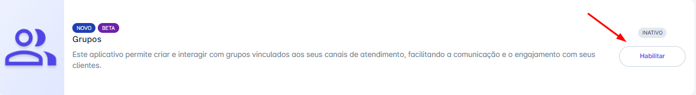
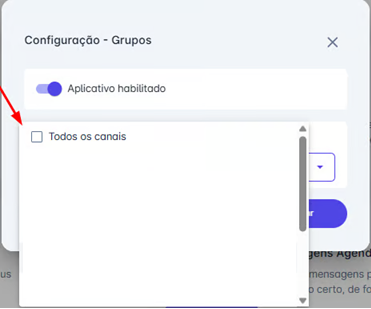

# Habilitar o App

## Para Habilitar a Funcionalidade

### Passo 1: Acessar Mais Apps

Na tela inicial, clique no menu **“Apps”** em seguida clique na opção **“Mais apps”.**

### Passo 2: Habilitar Grupos

Localize o aplicativo "Grupos" e clique em habilitar.

### Passo 3: Selecione os Canais

* Após habilitar o aplicativo, o sistema exibirá o campo **"Canais de Atendimento"**.
* Neste passo, você deve selecionar em quais dos seus canais a funcionalidade de Grupos estará ativa. Você pode selecionar um ou mais canais.
* Ao finalizar, clique em "Salvar" para concluir a configuração.

