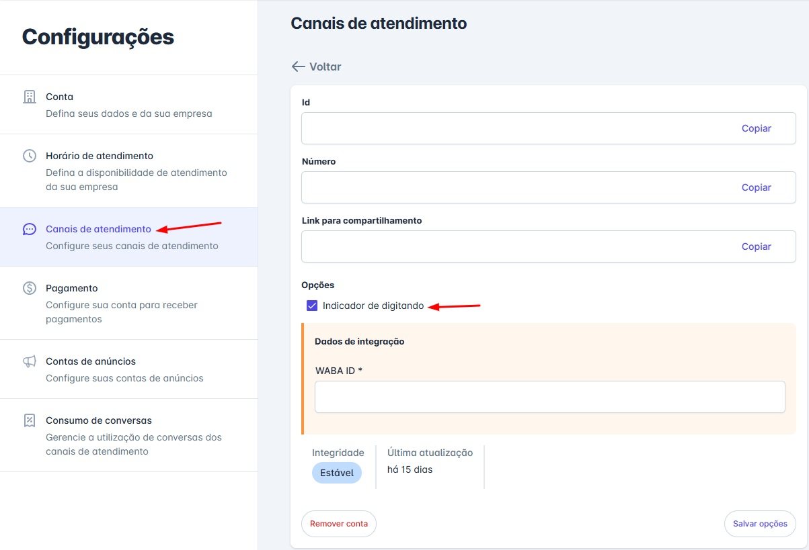

# Indicador de Digitando

A comunicação fluida é a chave para uma boa experiência do cliente. O indicador de "digitando..." é um pequeno detalhe que faz uma grande diferença, informando ao usuário que sua mensagem foi recebida e que uma resposta está a caminho.

Esta funcionalidade foi criada para reduzir a incerteza e a ansiedade do cliente durante a espera, especialmente ao interagir com um Agente de IA. Ao ativá-la, você torna a conversa mais natural e transparente, seja com um robô ou com um atendente humano.

## Como Habilitar a Funcionalidade

A ativação é simples e feita por canal, dando a você total controle sobre a experiência. Siga os passos abaixo:

### Passo 1: Acesse as Configurações de Canais

No menu de **Ajustes -> Contas**, acesse a aba **Canais de Atendimento**.

### Passo 2: Selecione o Canal WhatsApp

Na sua lista de canais, localize e clique para editar o canal WhatsApp desejado (esta função é exclusiva para **API Oficial** e **Z-API**).

### Passo 3: Ative o Indicador

Na tela de edição, localize a seção “Opções” e marque a caixa de seleção **“Indicador de digitando”**, como mostrado na imagem abaixo.

### Passo 4: Salve as Alterações

Role até o final da página e clique em “Salvar opções” para aplicar a nova configuração. A partir deste momento, o indicador estará ativo para todas as mensagens enviadas por este canal.

::: tip Como vem por padrão?
Em novos canais de **API Oficial** ela vem **marcada** e em canais **Z-API**, esta opção virá **desmarcada** por padrão.
:::

## Entendendo o Comportamento do Indicador

É importante notar que o comportamento do indicador de "digitando..." varia conforme o tipo de API do WhatsApp utilizada.

### Para Agentes de IA

O objetivo é mostrar ao cliente que o sistema está "pensando" e processando a resposta.

* **API Oficial:** O indicador aparece DURANTE todo o processamento da IA (duração de até 25 segundos).
* **Z-API:** O indicador aparece por um breve momento APÓS o processamento da IA, pouco antes de a resposta ser enviada (duração de 5 segundos).
  * Ao habilitar, todas as mensagens serão **atrasadas** em 5 segundos após o tempo de segurança (se habilitado), para que o indicador seja mostrado para o contato.

### Para Atendentes Humanos

O objetivo é mostrar que o atendente está ativamente digitando uma resposta.

* **API Oficial:** O indicador aparece assim que o atendente começa a digitar na caixa de texto (duração de até 25 segundos).
* **Z-API:** O indicador aparece após o envio da mensagem e tempo de segurança (quando ativo) por 5 segundos.
  * Ao habilitar, todas as mensagens serão **atrasadas** em 5 segundos após o tempo de segurança (se habilitado), para que o indicador seja mostrado para o contato.
