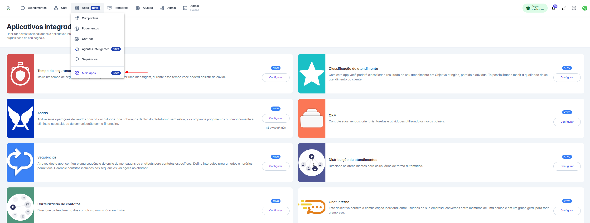
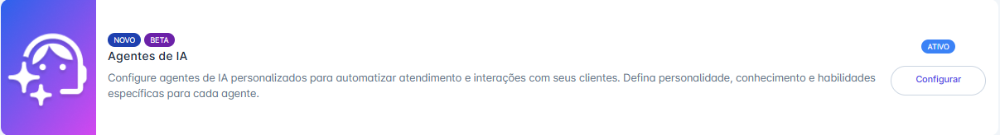
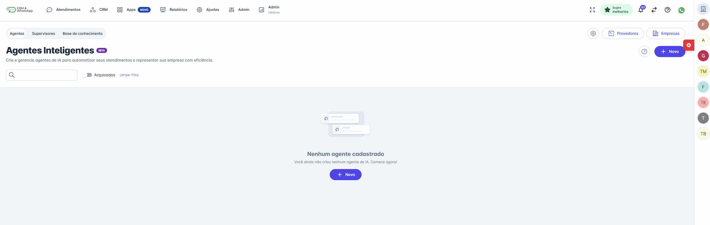
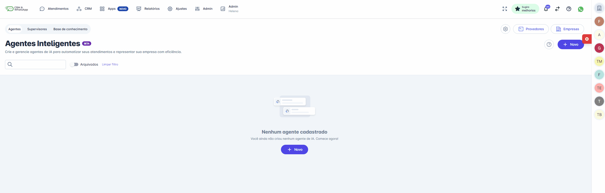

# Novo Agente

Criar um Agente de IA é o primeiro passo para transformar a maneira como sua empresa se comunica, permitindo automatizar atendimentos e oferecer suporte inteligente 24/7. Este artigo é o seu guia completo, detalhando o processo de ponta a ponta para configurar e lançar seu primeiro assistente virtual.

Abordaremos desde as configurações iniciais de ativação da funcionalidade em sua conta até os passos essenciais de cadastro das informações do seu negócio e a conexão com um provedor de IA. Ao final deste guia, você terá um agente funcional e pronto para ser treinado com habilidades e uma base de conhecimento para começar a interagir com seus clientes.

::: tip Pré-requisitos
* Ter acesso a plataforma com perfil de administrador ou Atendente.
* Habilitar a funcionalidade na plataforma.
:::

## Para Habilitar a Funcionalidade

### Passo 1: Acessar Mais Apps

Na tela inicial, clique no menu **“Apps”** em seguida clique na opção **“Mais apps”.**

### Passo 2: Habilitar Agentes de IA

Localize o aplicativo "Agentes de IA" e clique em habilitar.

## Como Criar um Novo Agente

Siga os passos abaixo para configurar e criar seu primeiro Agente de IA. Antes de iniciar a criação do agente em si, é fundamental preparar o ambiente com duas configurações essenciais: **as informações da sua empresa e o provedor de IA.**

### Passo 1: Acesse a Funcionalidade

No menu principal, clique em “Apps” e, em seguida, na opção “Agentes Inteligentes”. Você será direcionado para a tela de configuração.

### Passo 2: Configurações Essenciais

Para que seu agente funcione corretamente, primeiro precisamos dar a ele um contexto sobre o seu negócio e conectá-lo a um provedor de inteligência artificial.

#### A. Cadastre as Informações da Empresa

Esta etapa alimenta a IA com informações sobre o seu negócio, garantindo que as respostas sejam alinhadas à sua marca.

1. Na tela inicial, dentro da seção **“Informações sobre a Empresa”**, clique no botão “Adicionar empresa”.
2. Preencha os campos do formulário para dar contexto ao agente:
   * **Nome da empresa:** O nome do seu negócio.
   * **Setor de atuação:** A indústria em que você opera (ex: Automotivo, Varejo).
   * **Principais produtos/serviços:** O que sua empresa oferece.
   * **Diferenciais da empresa / Proposta de valor:** O que torna sua empresa única.
   * **Público-alvo:** Quem são seus clientes ideais.
3. Clique em “Salvar” para concluir.

#### B. Adicione um Provedor de IA

Agora, vamos conectar a plataforma ao serviço de IA que será o "cérebro" do seu agente (como o ChatGPT).

1. Na seção **“Provedores”**, clique em “Adicionar provedor”.
2. Preencha as informações de conexão:
   * **Provedor:** Selecione o modelo de IA na lista (ex: ChatGPT).
   * **Chave da API:** Insira a sua chave de API secreta fornecida pelo provedor.
   * **Nome:** Dê um apelido para essa configuração, facilitando a identificação (ex: “GPT-4 Principal”).
3. Clique em “Salvar”.

### Passo 3: Inicie a Criação do Agente

Com a empresa e o provedor devidamente configurados, você está pronto para criar seu primeiro agente! Clique no botão “+ Novo” na área "Nenhum agente cadastrado" e siga para a tela de criação.

Na tela de configuração, preencha as informações fundamentais do seu novo agente:

#### A. Dê um Nome ao Agente

O primeiro passo é nomear seu agente. Clique sobre o título "Novo agente de IA" e digite um nome de fácil identificação, como “Agente de Vendas” ou “Suporte Nível 1”.

#### B. Associe o Provedor e a Empresa

Agora, conecte as configurações que você criou nos passos anteriores:

* **Provedor:** No campo "Provedor", selecione na lista o provedor de IA que você cadastrou (ex: "GPT").
* **Empresa:** No campo "Empresa", selecione o perfil do negócio que este agente irá representar.

#### C. Defina a Personalidade do Agente

No campo “Personalidade do Agente”, você dará as instruções centrais de como a IA deve se comportar. Descreva o tom de voz, a identidade e a função principal dele. Este é um dos campos mais importantes para garantir que o agente atue conforme o esperado.

> *Exemplo:* `Você é um agente de atendimento da empresa Teste. Seu nome é John. Seja sempre cordial e prestativo.`

#### D. Salve as Configurações

Após preencher essas informações iniciais, clique no botão “Salvar” no canto superior direito da tela.

### Pronto! Seu Agente Foi Criado!

Você será redirecionado para a tela principal, onde seu novo agente aparecerá listado. Agora ele está pronto para ter suas Habilidades e Base de Conhecimento configuradas.

