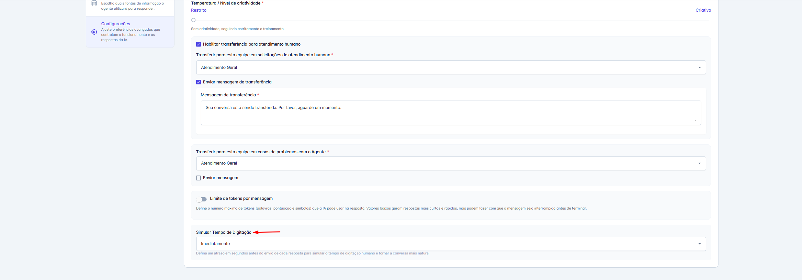
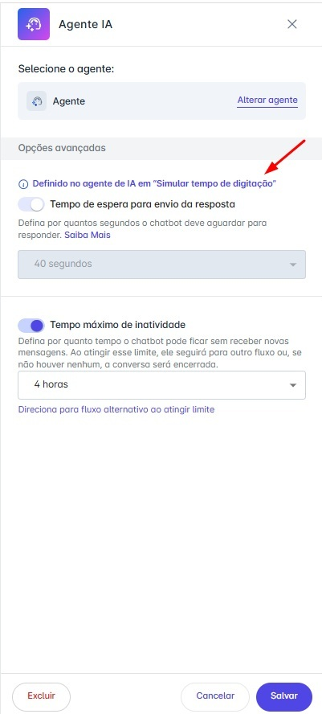

# Simular Tempo de Digitação

A velocidade instantânea das respostas de um Agente de IA, embora eficiente, pode quebrar a naturalidade de uma conversa, deixando claro para o cliente que ele está falando com um robô. Para resolver isso, lançamos uma série de atualizações focadas em humanizar essa interação e dar a você, administrador, um controle muito mais preciso e intuitivo sobre o timing do seu chatbot.

Esta atualização introduz a **Simulação do Tempo de Digitação** e aprimora a forma como as configurações de tempo são gerenciadas em toda a plataforma.

## 1. Como Configurar a Simulação de Digitação no Agente de IA

O recurso principal desta atualização permite que você adicione um pequeno atraso antes de cada resposta do Agente de IA, simulando o tempo que uma pessoa levaria para digitar.

**Passo a passo para configurar:**

1. Acesse seu Agente de IA e vá para a aba **“Configurações”**.
2. Localize o novo campo **“Simular Tempo de Digitação”**.
3. Selecione na lista o tempo de atraso desejado. As opções são:
   * **Imediatamente (Padrão):** Mantém o comportamento de resposta instantânea.
   * **1 a 10 segundos:** Incrementos de um segundo.
   * **15 a 40 segundos:** Incrementos de cinco segundos.

Uma vez configurado, o Agente de IA aguardará o tempo definido antes de enviar a mensagem, exibindo o indicador de "digitando" (se estiver ativo no canal) para criar uma experiência muito mais fluida e natural.

## 2. Configuração Centralizada: A Conexão entre o Agente e o Chatbot

Para evitar duplicidade e garantir consistência, o tempo de espera do nó de Agente de IA no construtor de chatbot (Builder) agora é herdado diretamente da configuração principal do agente.

**Como funciona na prática:**

Ao usar um nó de Agente de IA ou Supervisor de IA em um fluxo de chatbot, você notará que o campo **“Tempo de espera para envio da resposta”** agora está desabilitado. Ele apenas reflete o valor que você definiu em **"Simular Tempo de Digitação"** no agente correspondente.

Isso cria uma "fonte única da verdade", simplificando o gerenciamento e garantindo que o comportamento do seu agente seja o mesmo em todos os fluxos onde ele for utilizado. Para todos os outros nós que não são de IA, o campo continua funcionando normalmente.

## 3. Melhorias Adicionais no Controle de Tempo do Chatbot

Para complementar essa nova funcionalidade, também aprimoramos os campos de controle de tempo em todos os nós do chatbot, tornando-os mais claros e flexíveis.

* **Nomenclatura Mais Clara e Intuitiva:**
  * O antigo campo **"Tempo máximo de tolerância"** foi renomeado para **"Tempo de espera antes da resposta do chatbot".**
  * O antigo campo **"Tempo máximo"** foi renomeado para **"Tempo máximo de inatividade"**.
* **Maior Flexibilidade com Limite Estendido:**
  * O limite do campo "Tempo de espera antes da resposta do chatbot" foi aumentado de **10** para **40** segundos, oferecendo mais espaço para o usuário terminar de digitar antes que o fluxo prossiga.
