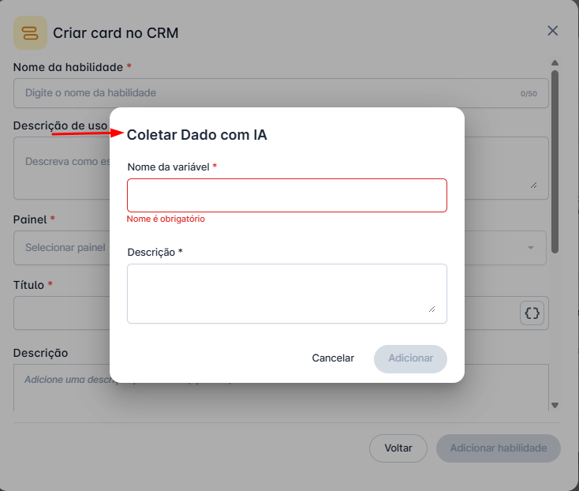
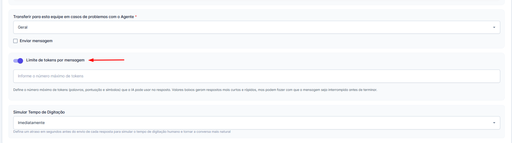
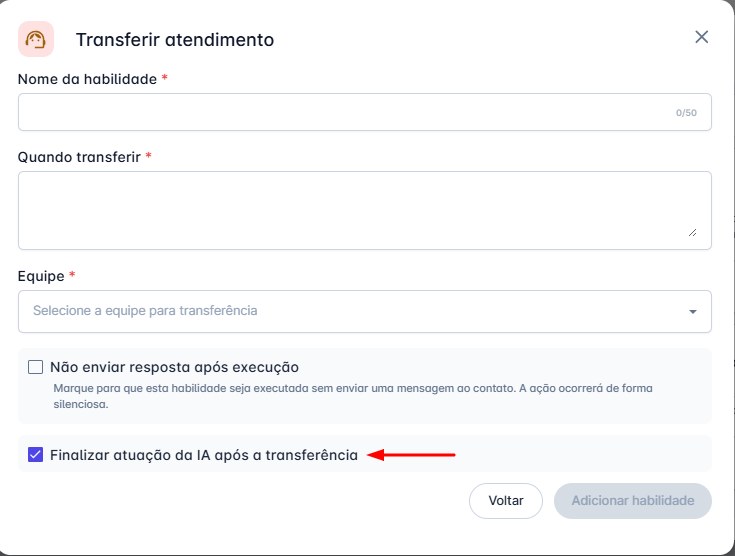
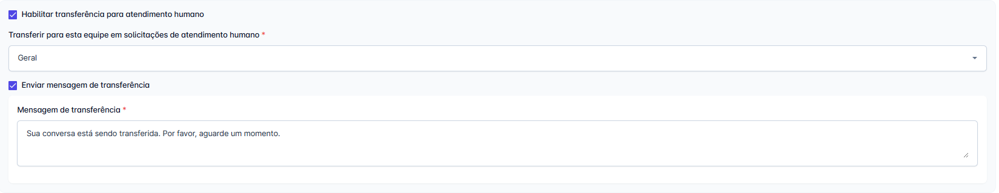
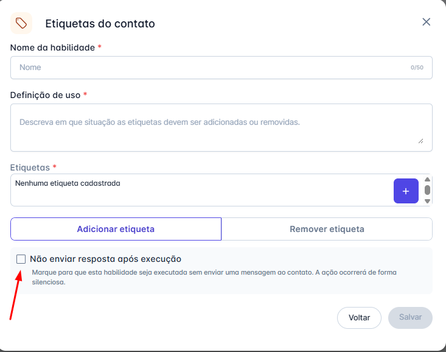

# V.07

## Novidades dos Agentes de IA: Versão V.07

A versão V.07 dos Agentes de IA chegou, trazendo uma revolução em controle, flexibilidade e inteligência. Com foco em dar a você, administrador, ferramentas mais poderosas para moldar o comportamento da IA, esta atualização introduz funcionalidades essenciais que aprimoram desde a coleta de dados até a execução de automações complexas.

Explore abaixo as cinco principais novidades que levarão seus agentes a um novo patamar de eficiência.

---

### 1. Coleta de Dados Mais Inteligente

Aprimoramos a forma como a IA coleta dados em suas habilidades. Antes, a análise era focada no nome do parâmetro e no contexto geral da conversa. Agora, a descrição do parâmetro é interpretada de forma integrada, tornando a IA muito mais eficiente para entender exatamente o que precisa ser coletado.

* **Principal Benefício:** A precisão na coleta de informações aumenta significativamente. Quanto mais clara e detalhada for a sua descrição, mais assertiva será a IA ao extrair o dado correto, reduzindo erros e ambiguidades.
* **Ação Recomendada:** Revise as descrições dos seus parâmetros atuais. Adicionar detalhes, exemplos ou o formato esperado irá potencializar o desempenho da IA.

---

### 2. Refine as Respostas da IA: Novo Controle de Limite de Tokens

Para oferecer maior controle sobre a comunicação do seu Agente de IA, implementamos o campo **"Limite de tokens por mensagem"** nas configurações do agente.

* **Como funciona:** Neste campo, você pode definir o número máximo de "tokens" (unidades de texto) que a IA poderá usar para formular uma resposta. Por padrão, o campo vem desabilitado, e ao ativá-lo, é necessário definir um limite mínimo de 50 tokens.
* **⚠️ Ponto de Atenção:** O limite de tokens não se aplica apenas à resposta final, mas a todas as operações internas do modelo, como consultas à base de conhecimento e APIs. Um limite muito baixo pode impedir que o agente encontre a informação correta para responder.
* **Dica de Uso:** Valores baixos (ex: 100) geram respostas mais curtas e diretas, enquanto valores altos (ex: 700) permitem respostas mais detalhadas.

---

### 3. Automação Avançada: Decida se a IA Continua Atuando Após Transferir

A habilidade de **"Transferir atendimento"** foi aprimorada com a opção **"Finalizar atuação da IA após a transferência"**. Agora, você tem total controle sobre o comportamento do agente após um transbordo.

* **Como Funciona?**
  * ✅ **Caixa MARCADA (Padrão):** A IA transfere o atendimento e encerra sua participação na conversa, como sempre funcionou.
  * 🔲 **Caixa DESMARCADA:** A IA transfere o atendimento para a fila, mas permanece ativa na conversa para continuar coletando informações ou executar outras tarefas.

---

### 4. Controle Total sobre a Transferência Humana

Reestruturamos a função de transferência para atendimento humano nas Configurações do agente, oferecendo um conjunto de controles avançados para você decidir se, quando e como a transferência deve ocorrer.

* **Habilitar/Desabilitar a Transferência:** Um controle principal para ligar ou desligar completamente a possibilidade de transbordo.
* **Controle da Mensagem de Aviso:** Um segundo checkbox para decidir se o cliente será notificado sobre a transferência.
* **Mensagem Personalizável:** Um campo de texto para você editar o aviso padrão ou criar sua própria mensagem de transferência.

---

### 5. Execução Silenciosa: Realize Ações em Segundo Plano

Introduzimos a opção de "Execução Silenciosa" em todas as habilidades do Agente de IA com o checkbox **"Não enviar resposta após execução"**.

* **Como Funciona?**
  * 🔲 **Caixa DESMARCADA (Padrão):** A IA executa a habilidade e envia uma mensagem de confirmação ao cliente.
  * ✅ **Caixa MARCADA:** A IA executa a habilidade de forma silenciosa, sem enviar nenhuma resposta. Perfeito para ações de bastidores, como aplicar uma etiqueta ou atualizar um CRM.

