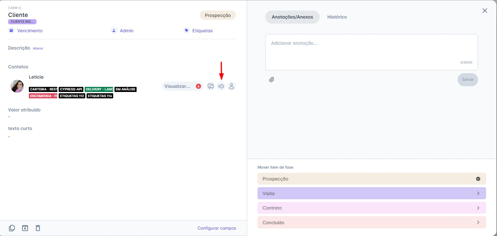
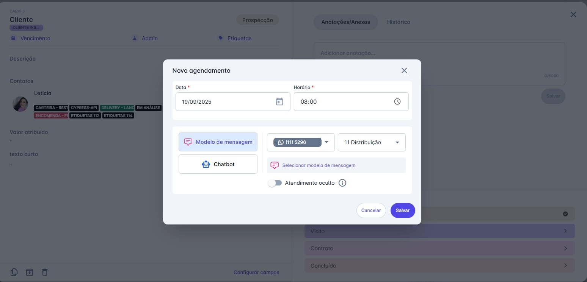

# Agendamentos pelo CRM

## Como Agendar uma Mensagem Diretamente pelo Card do CRM

Você pode programar o envio de uma mensagem para o futuro sem sair da visualização do seu funil de negócios. Siga os passos abaixo:

### Passo 1: Acesse o Card do Contato

* Navegue até CRM → Painéis e abra o card do cliente para o qual deseja agendar a mensagem.

### Passo 2: Inicie o Agendamento

* Na seção "Contatos" dentro do card, clique no novo ícone de agendamento (representado por um relógio 🕙) ao lado do nome do contato.

### Passo 3: Preencha os Detalhes do Envio

* A janela "Novo agendamento" será aberta. Preencha os seguintes campos:
  * **Data e Horário:** Defina quando a mensagem deverá ser enviada.
  * **Conteúdo:** Escolha se deseja enviar um Modelo de mensagem ou iniciar um Chatbot.
  * **Canal e Equipe:** Selecione a origem do disparo.

### Passo 4: Salve para Confirmar

* Após preencher as informações, clique em "Salvar" para confirmar o agendamento.

::: tip Novo Indicador Visual para Mensagens Agendadas
Para facilitar a identificação de contatos que possuem mensagens agendadas, adicionamos um novo indicador visual diretamente no card do CRM.

**Como Funciona:**

Na seção de "Contato" dentro de um card, você verá um novo ícone de relógio (🕙). A cor deste ícone mudará dinamicamente para te dar informações rápidas sobre os agendamentos daquele contato, sem que você precise abrir a aba de detalhes.

O que cada cor significa:

* **Ícone Cinza:** Indica que o contato não possui nenhuma mensagem agendada.
* **Ícone Azul:** Indica que o contato possui uma ou mais mensagens agendadas para o futuro.
* **Ícone Amarelo/Laranja:** Serve como um alerta, indicando que o contato possui uma ou mais mensagens agendadas para serem enviadas hoje.
:::
