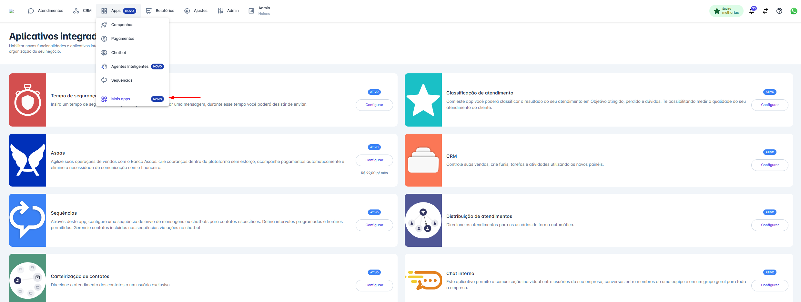
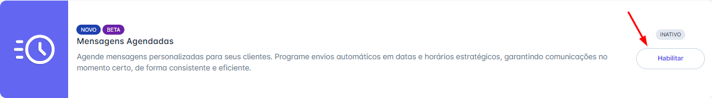
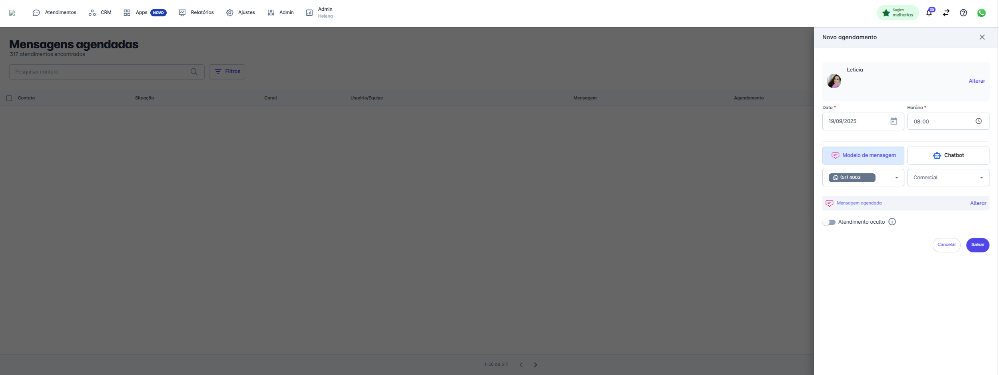
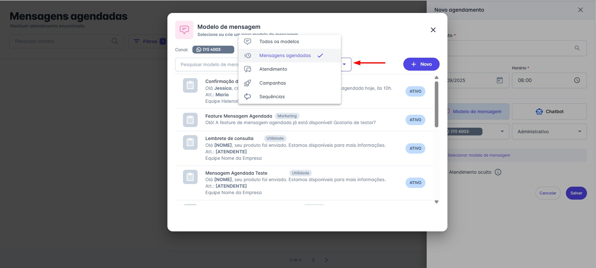
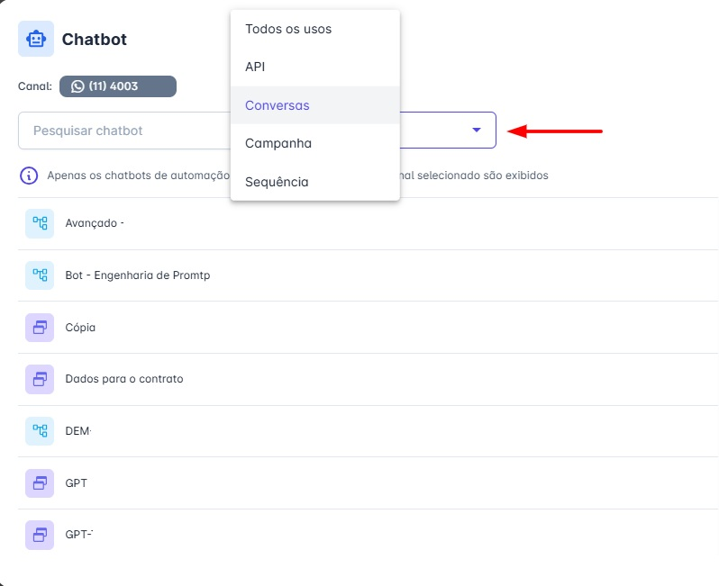
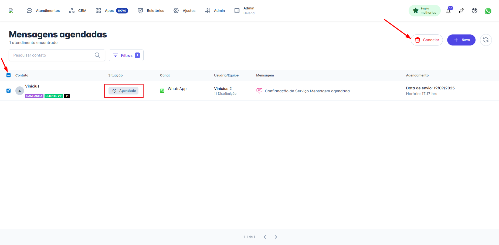
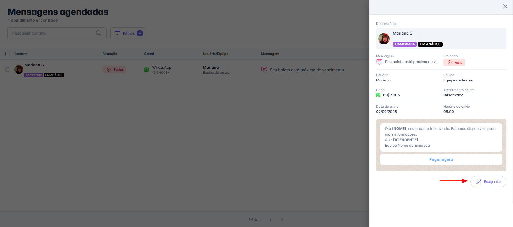

# Como Gerenciar os Agendamentos

É uma nova ferramenta que permite que você programe o envio de mensagens para uma data e hora específicas no futuro, diretamente pela nossa plataforma.

## Principais Funcionalidades

Com ela, você pode:

* **Agendar:** Criar uma nova mensagem e definir exatamente quando ela deve ser enviada.
* **Gerenciar:** Consultar, atualizar e cancelar agendamentos a qualquer momento.
* **Automatizar:** Integrar o agendamento aos seus próprios sistemas através de uma nova API dedicada.

::: tip Pré-requisitos
* Ter acesso a plataforma com perfil de administrador ou Atendente.
* Habilitar a funcionalidade na plataforma.
:::

## Para Habilitar a Funcionalidade

### Passo 1: Acessar Mais Apps

Na tela inicial, clique no menu **“Apps”** em seguida clique na opção **“Mais apps”.**

### Passo 2: Habilitar Mensagens Agendadas

Localize o aplicativo "Mensagens Agendadas" e clique em habilitar.

## Como Agendar uma Mensagem

Siga os passos abaixo para programar o envio de uma nova mensagem.

### Passo 1: Acesse a Funcionalidade

* No menu principal, clique em “Apps” e, em seguida, na opção “Mensagens Agendadas”.

### Passo 2: Crie um Novo Agendamento

* Na tela de "Mensagens Agendadas", clique no botão "+ Novo" para abrir o formulário de agendamento.

### Passo 3: Defina os Detalhes do Envio

* Preencha as informações principais:
  * **Contato:** Para quem a mensagem será enviada.
  * **Data e Horário:** Quando a mensagem será enviada.

### Passo 4: Escolha o Conteúdo

* Selecione o que será enviado. Você pode optar por um Modelo de Mensagem aprovado ou iniciar um Chatbot.

### Passo 5: Defina a Origem

* Por fim, escolha por qual Canal e a partir de qual Equipe a mensagem será disparada.

### Passo 6: Configure a Visibilidade (Opcional)

* Utilize a opção "Atendimento Oculto" se desejar que o agendamento seja criado nos bastidores, sem gerar um atendimento visível nas filas. É ideal para envios informativos que não exigem acompanhamento do atendente.

::: warning Regras de Visualização de Canais e Equipes
Ao agendar uma mensagem, os canais e equipes que você pode selecionar dependem do seu perfil de usuário:

* **Atendente:** Visualiza e seleciona apenas os canais e equipes dos quais faz parte.
* **Supervisor de Equipe:** Visualiza e seleciona os canais e equipes dos quais faz parte e também das equipes que supervisiona.
* **Administrador:** Visualiza e seleciona todos os canais e todas as equipes da conta.
:::

::: tip Dica: Flexibilidade na Escolha do Modelo
Para agilizar sua busca, a janela de seleção de modelos já vem filtrada para exibir, por padrão, apenas os modelos do tipo "Mensagens Agendadas".

No entanto, caso precise, você pode utilizar qualquer outro modelo existente em sua conta. Para isso, basta clicar no filtro no topo da janela e selecionar "Todos os modelos" ou o tipo específico que deseja encontrar.
:::

::: tip Dica: Flexibilidade na Escolha do Chatbot
Para agilizar sua busca, a janela de seleção de chatbots já vem pré-filtrada para exibir, por padrão, apenas os chatbots do tipo "Conversas".

Caso precise, você pode usar o filtro para encontrar qualquer outro chatbot ativo na sua conta. Basta clicar no campo e selecionar "Todos os usos" ou o tipo específico que deseja.
:::

## Como Cancelar uma Mensagem Agendada

Siga os passos abaixo para cancelar o envio de uma ou mais mensagens que já foram agendadas.

### Passo 1: Selecione as Mensagens

* Na tela de `Apps → Mensagens Agendadas`, marque a caixa de seleção ao lado de uma ou mais mensagens que você deseja cancelar.

### Passo 2: Acione o Cancelamento

* Com as mensagens selecionadas, clique no botão "Cancelar", localizado no topo da lista.

### Passo 3: Confirme a Ação

* Um pop-up de confirmação será exibido, informando quantas mensagens serão canceladas. Clique em "Cancelar Envios" para concluir o processo.

Após a confirmação, o status da mensagem será alterado para "Cancelado".

::: warning Regra Importante: Status do Agendamento
Somente agendamentos com a situação "Agendado" podem ser cancelados.

Para agendamentos com outros status (como "Entregue", "Falha" ou "Cancelado"), a caixa de seleção ficará desabilitada, impedindo o cancelamento.
:::

## Como Reagendar uma Mensagem

Siga os passos abaixo para editar e reagendar uma mensagem que já foi criada.

### Passo 1: Acesse os Detalhes do Agendamento

* Na tela de `Apps → Mensagens Agendadas`, passe o mouse sobre o agendamento que deseja alterar para abrir o painel de detalhes.

### Passo 2: Inicie o Reagendamento

* No painel de detalhes, clique no botão "Reagendar".

### Passo 3: Edite e Confirme as Informações

* O modal "Editar agendamento" será aberto, permitindo que você altere os detalhes, como a data e a hora do envio.
* Após fazer os ajustes necessários, clique em "Salvar" para confirmar o reagendamento.

::: warning Regra Importante: Status Válidos para Reagendamento
Somente agendamentos com uma das seguintes situações podem ser reagendados:

* Agendado
* Falha
* Cancelado

Para mensagens com outros status, a opção de reagendar não estará disponível.
:::

## Como Utilizar os Filtros

Para encontrar agendamentos específicos, utilize a função de filtros para refinar sua busca.

### Passo 1: Acesse a Janela de Filtros

* Na tela de `Apps → Mensagens Agendadas`, clique no botão "Filtros", localizado ao lado da barra de pesquisa, para abrir a janela de opções.

### Passo 2: Aplique os Critérios Desejados

* Você pode refinar sua busca utilizando um ou mais dos seguintes campos:
  * **Situação:** Filtre pelo status atual do agendamento (ex: "Agendado", "Falha", "Cancelado").
  * **Canal:** Exibe apenas agendamentos de um canal específico.
  * **Equipe:** Mostra apenas os agendamentos de uma equipe específica.
  * **Usuário:** Filtra pelos agendamentos de um usuário em particular.
  * **Período:** Defina um intervalo de datas para encontrar agendamentos criados dentro daquele período.

### Passo 3: Execute e Limpe a Busca

* **Aplicar Filtro:** Após selecionar seus critérios, clique em "Aplicar filtro" para que a lista seja atualizada com os resultados.
* **Limpar Filtro:** Para remover todos os filtros aplicados e voltar à visualização completa, clique em "Limpar filtro".

::: tip Regras de Visualização por Perfil
O acesso à lista de mensagens agendadas é hierárquico, ou seja, o que cada usuário vê depende do seu nível de permissão na plataforma. As regras são as seguintes:

* **Atendente:** Pode visualizar e gerenciar apenas os agendamentos que ele mesmo criou.
* **Supervisor de Equipe:** Pode visualizar e gerenciar seus próprios agendamentos e também todos os agendamentos criados pelos membros das equipes que ele supervisiona.
* **Administrador:** Possui acesso total e pode visualizar e gerenciar todos os agendamentos de todos os usuários da conta, sem restrições.
:::
