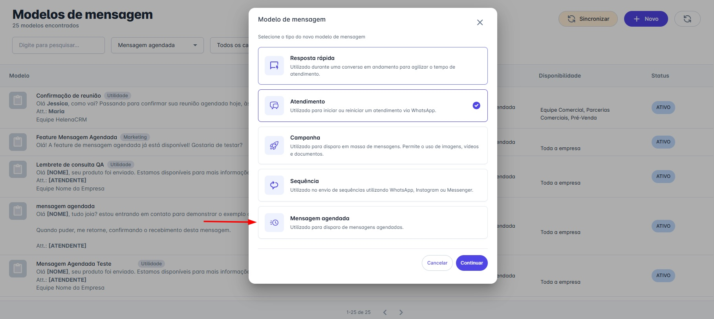

# Modelo para Mensagens Agendadas

## Como Criar um Modelo para Mensagens Agendadas

Agora você pode criar e organizar modelos de mensagem exclusivos para a funcionalidade de agendamento, facilitando a gestão das suas comunicações programadas.

Siga os passos abaixo:

### Passo 1: Acesse a Tela de Modelos

* No menu principal, navegue até **Ajustes** e clique em **Modelos de Mensagem**.

### Passo 2: Inicie a Criação

* Na tela "Modelos de mensagem", clique no botão **"+ Novo"**.

### Passo 3: Selecione o Tipo "Mensagem Agendada"

* Na janela que se abrir, selecione a nova opção **"Mensagem agendada"**. Clique em "Continuar".

### Passo 4: Configure seu Modelo

* Preencha as informações do seu modelo como de costume: defina um nome, escreva o conteúdo da mensagem e configure os parâmetros necessários.

### Passo 5: Salve o Modelo

* Após finalizar a configuração, clique em **"Salvar"**. Seu novo modelo estará pronto para ser utilizado na funcionalidade de Mensagens Agendadas.

