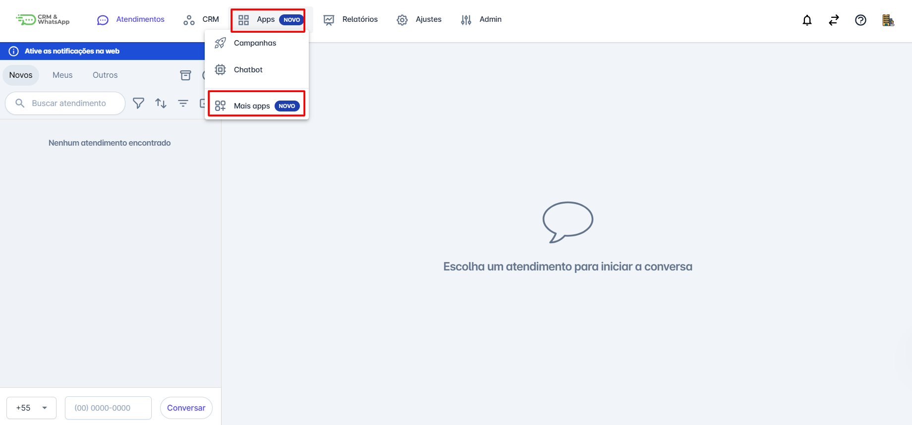
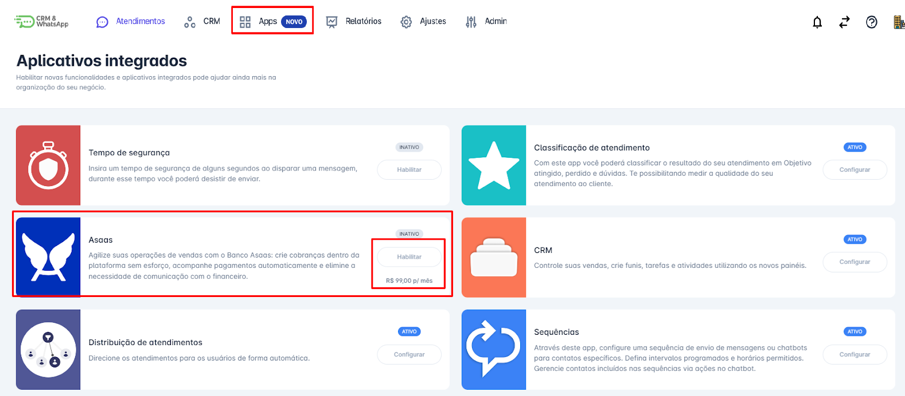
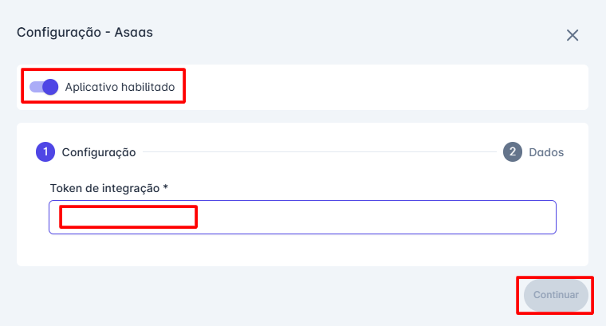
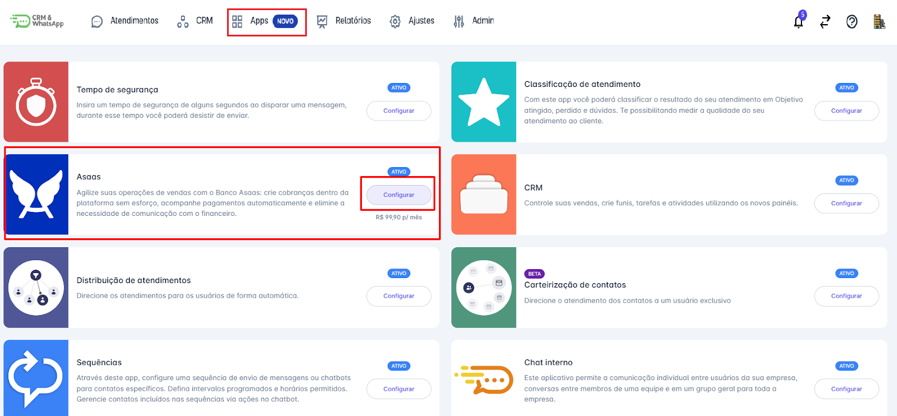
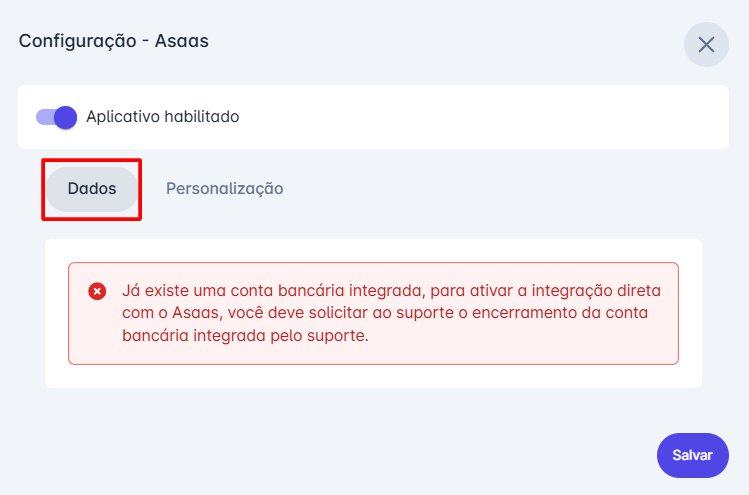
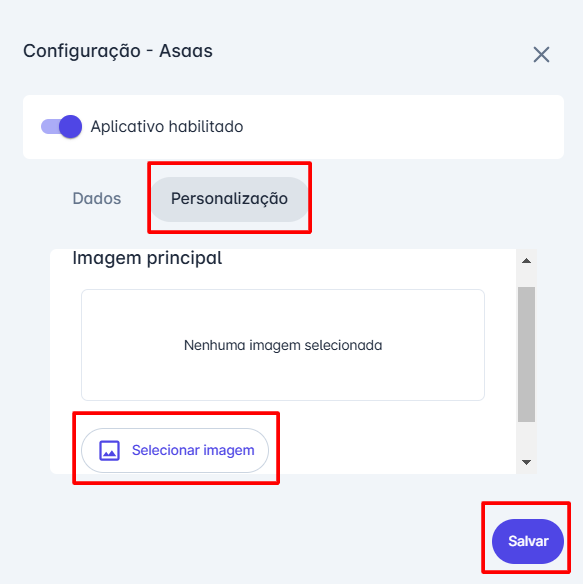

# Ativar App de pagamento

Este guia oferece uma visão detalhada sobre como **ativar** e **configurar** o aplicativo de pagamento na **plataforma**, permitindo que sua empresa aproveite ao máximo essa funcionalidade para **otimizar suas operações financeiras** e **simplificar a gestão de cobranças**.

::: tip Pré-requisitos
* **Acessar a conta** na **plataforma** com perfil de **Administrador**.
* Possuir uma **conta ativa no Banco Asaas**.
* Ter em mãos o **Token de Ativação** fornecido pelo Banco Asaas.
:::

## Passo 1: Acessar Apps

Na tela inicial, acesse o menu **"Apps"**. Um menu de opções será exibido; clique em **"Mais Apps"**.

## Passo 2: Habilitar Asaas

Na tela de **aplicativos integrados**, clique na opção **"Habilitar Asaas"**. O valor dessa funcionalidade é de **R$99,00 por mês**.

## Passo 3: Configurar Token

Uma janela de configuração será aberta. Clique na opção **"Aplicativo Habilitado"**. Em seguida, insira o **Token de Integração** fornecido pelo Banco Asaas. Por fim, clique em **"Continuar"** para concluir a configuração.

## Passo 4: Configuração e Personalização

Quando a integração for concluída, a tela de **aplicativos** indicará que a funcionalidade **Asaas** está ativa. Você poderá **configurar a conta** e **personalizar a imagem**; para isso, basta clicar em **"Configurar"**.

## Passo 5: Dados e Imagem

Na opção **"Dados"**, qualquer alteração de conta ou encerramento deve ser feito diretamente com o **Banco Asaas**. Já na opção **"Personalização"**, é possível adicionar uma imagem: basta selecionar a imagem desejada e clicar em **"Salvar"**.

::: info Considerações Adicionais
* Toda negociação de **taxas** e **valores** relacionados às cobranças da conta deve ser realizada diretamente com o **Banco Asaas**.
:::
