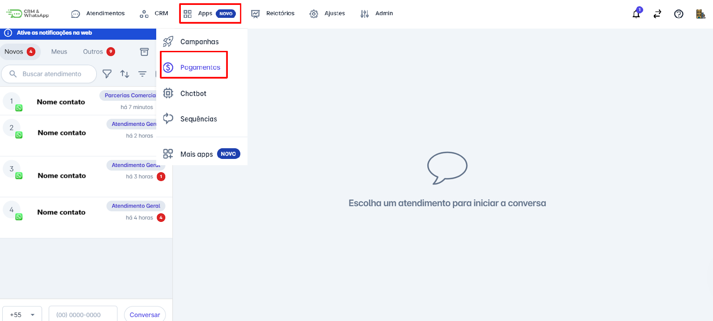
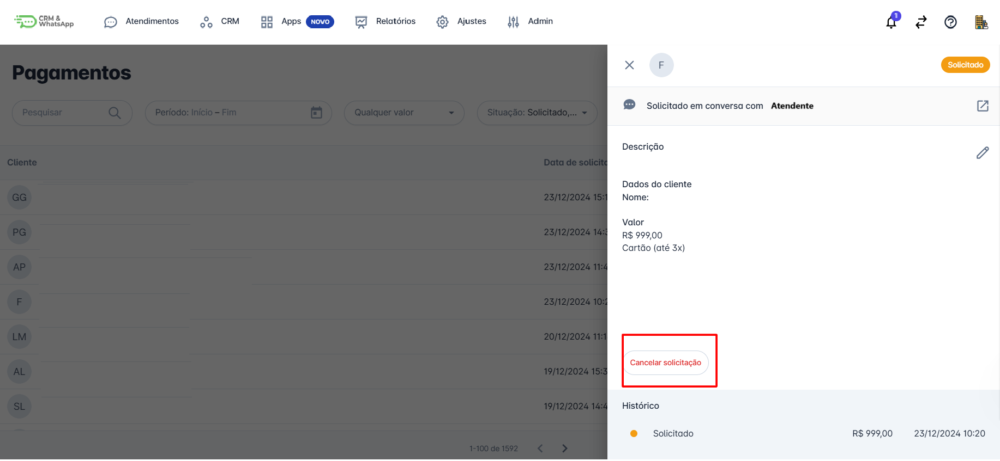
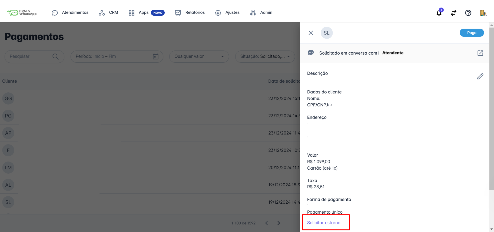
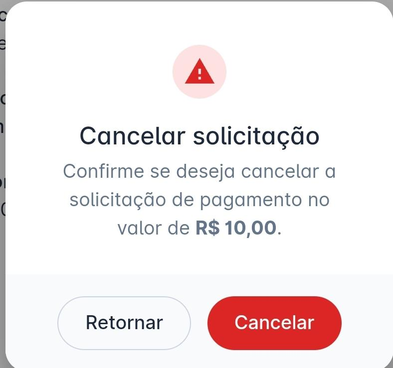
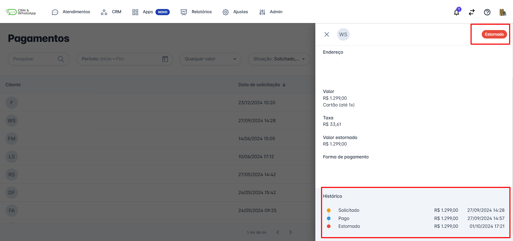

# Cancelar Estornar pagamento

**Cancelar** ou **estornar** um pagamento pode ser necessário em diversas situações, como **cobranças erradas** ou **cancelamento de serviços**. A **plataforma** oferece um processo simplificado para garantir que essas operações sejam realizadas de maneira **eficiente** e **segura**.

::: tip Pré-requisitos
* **Acessar a conta** na **plataforma** com perfil de **Administrador**.
* Ter a **funcionalidade de pagamentos habilitada** na plataforma.
:::

## Passo 1: Acessar Pagamentos

Na tela inicial, acesse o menu **"Apps"**. Um menu de opções será exibido; clique em **"Pagamentos"**.

## Passo 2: Selecionar Pagamento

Para **cancelar** uma solicitação de pagamento, ela deve estar com **status de "Solicitado"**. Já para **estorno**, o pagamento precisa estar com **status de "Pago"**.

Clique no pagamento que deseja **cancelar** ou **estornar**. Na parte inferior da tela, aparecerá a opção **"Cancelar Solicitação"** ou **"Solicitar Estorno"**, conforme o caso.

## Passo 3: Confirmar Operação

Ao clicar em **"Cancelar"** ou **"Estornar"**, um **popup de confirmação** será exibido.

## Passo 4: Verificar Histórico

Clique em **"Cancelar"** ou **"Estornar"** e, em seguida, aparecerá no **histórico da cobrança** o **cancelamento** ou a **solicitação de estorno**.

::: info Considerações Adicionais
* Toda **movimentação financeira** é realizada na **conta do Banco Asaas** cadastrada na plataforma.
:::
