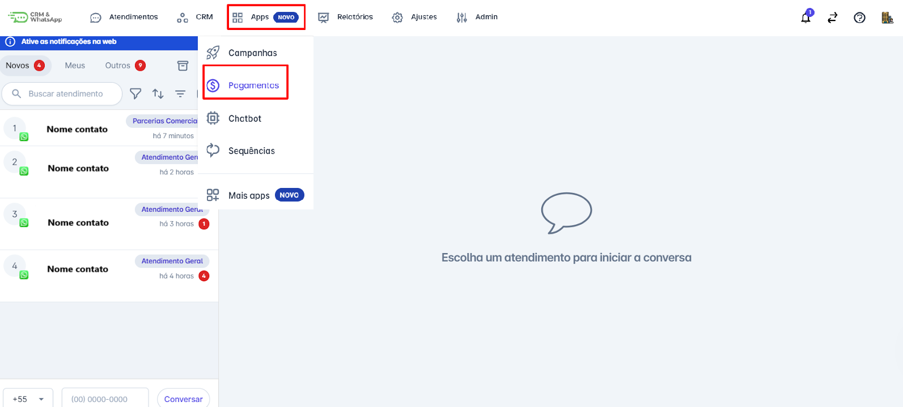
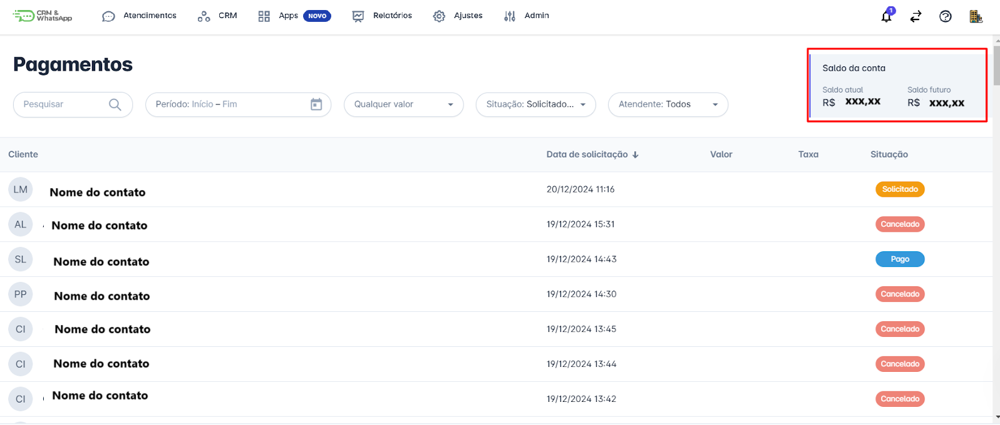
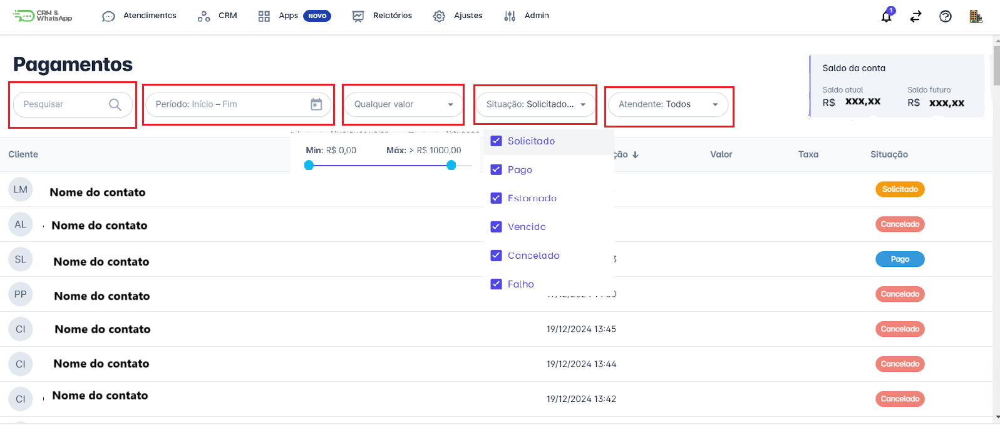
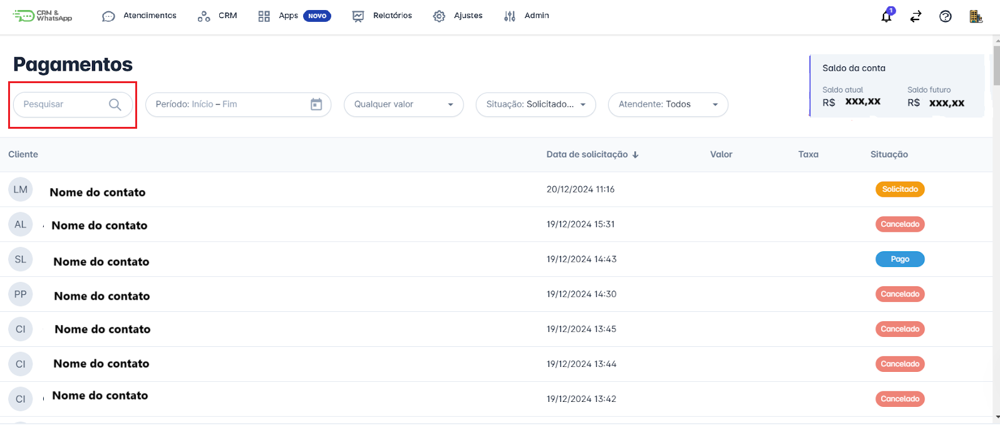
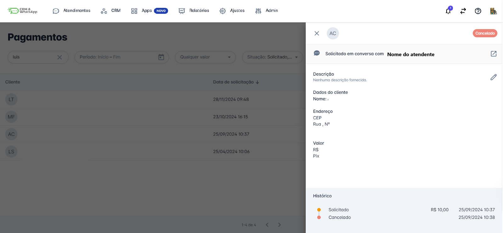

# Consultar pagamento

**Consultar pagamentos** é uma parte essencial da gestão financeira na **plataforma**. Este guia oferece instruções detalhadas sobre como **acessar** e **revisar** os pagamentos, garantindo que você possa monitorar todas as transações de forma eficaz e manter o controle financeiro da sua empresa.

::: tip Pré-requisitos
* **Acessar a conta** na **plataforma** com perfil de **Administrador**.
* Ter a **funcionalidade de pagamentos habilitada** na plataforma.
:::

## Passo 1: Acessar Pagamentos

Na tela inicial, acesse o menu **"Apps"**. Um menu de opções será exibido; clique em **"Pagamentos"**.

## Passo 2: Visão Geral e Filtros

Na tela que se abrirá, você terá uma **visão geral** das solicitações de pagamento. No canto superior direito, será exibido o **saldo da conta** (saldo atual e saldo futuro). Além disso, você poderá utilizar diversos **filtros** para localizar uma cobrança específica.

## Passo 3: Resultados

A lista de **resultados** será atualizada automaticamente com base nos **filtros** aplicados.

## Passo 4: Detalhes do Pagamento

Clique em um pagamento específico para visualizar os **detalhes completos**, incluindo **data**, **valor**, **método de pagamento**, **status** e outras informações relevantes. É possível **editar** o campo **descrição** clicando no ícone .

::: info Considerações Adicionais
* Na aba de **detalhes do pagamento**, é possível abrir a **conversa** em que a cobrança foi solicitada.
:::
