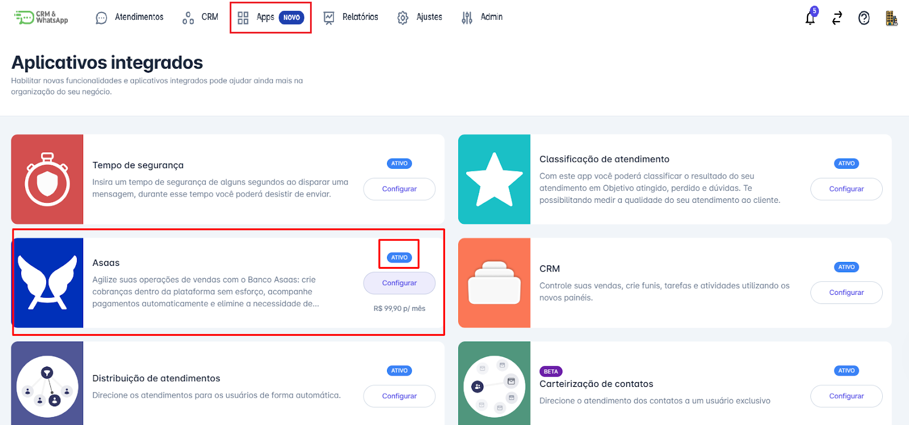
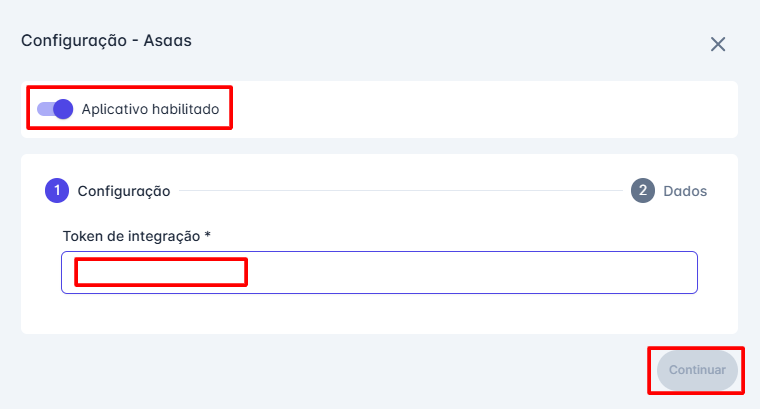
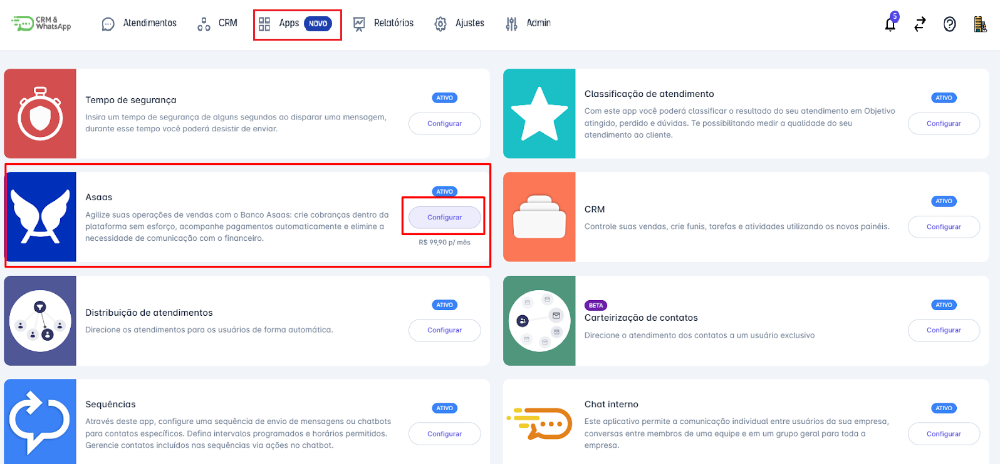
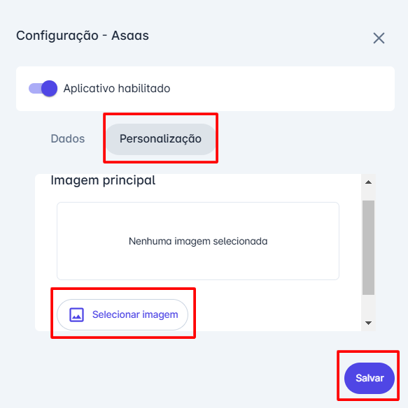

# Integrar com banco Asaas

Integrar a **plataforma** com o **Banco Asaas** possibilita uma gestão financeira mais eficiente, automatizando processos de cobrança e simplificando o controle de pagamentos. Este guia oferece instruções detalhadas para **visualizar integrações existentes** e **configurar a integração com o Banco Asaas** na **plataforma**, ajudando sua empresa a otimizar processos e melhorar o acompanhamento financeiro.

::: tip Pré-requisitos
* **Acesso à conta** na **plataforma** com perfil de **Administrador**.
* **Habilitar a funcionalidade de pagamentos** na plataforma.
* Possuir uma **conta ativa no Banco Asaas**.
* Ter em mãos o **Token de ativação** fornecido pelo Banco Asaas.
:::

## Passo 1: Acessar Apps

Na tela inicial, acesse o menu **"Apps"**. Um menu de opções será exibido; em seguida, clique em **"Mais Apps"** e selecione a opção **"Asaas"**.

## Passo 2: Configurar Token

Clique em **"Configurar"** para abrir a janela de configuração. Ative a opção **"Aplicativo Habilitado"**. Em seguida, insira o **Token de Integração** fornecido pelo Banco Asaas. Por fim, clique em **"Continuar"** para concluir a configuração.

## Passo 3: Configuração e Personalização

Quando a integração for concluída, a tela de aplicativos exibirá a indicação de que a funcionalidade **Asaas** está ativa. Para configurar a conta e personalizar a imagem, clique em **"Configurar"**.

## Passo 4: Dados e Imagem

Na opção **"Dados"**, alterações de conta ou encerramento devem ser realizadas diretamente com o **Banco Asaas**. Já na opção **"Personalização"**, é possível adicionar uma imagem: selecione a imagem desejada e clique em **"Salvar"**.

::: info Considerações Adicionais
* Toda negociação de **taxas** e **valores** relacionados às cobranças da conta deve ser realizada diretamente com o **Banco Asaas**.
:::
