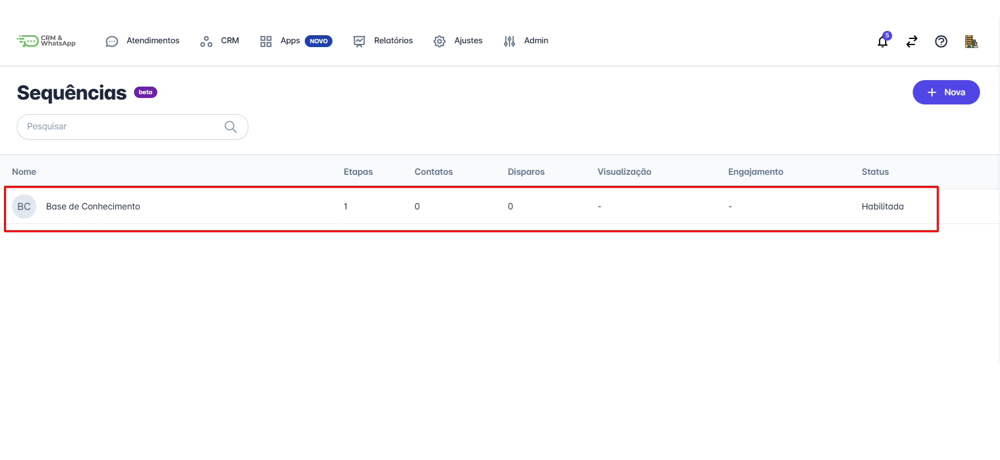
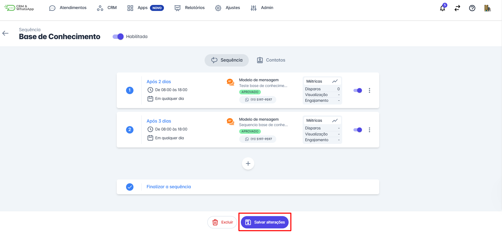

# Adicionar etapa

Adicionar **etapas** na sequência de envio de mensagens ou **chatbots** é uma funcionalidade poderosa da **plataforma**, que permite **automatizar** e **personalizar** o contato com seus clientes de forma organizada e eficaz. Este guia fornecerá instruções detalhadas sobre como adicionar uma **nova etapa** em uma sequência existente, garantindo que sua **comunicação continue fluindo** sem interrupções.

::: tip Pré-requisitos
* **Ter acesso à plataforma** com perfil de **Administrador**.
* **Ter uma sequência de mensagens** ou **chatbots** já criada na plataforma.
* Garantir que as **mensagens do tipo sequência** estejam aprovadas na plataforma.
* **Ter um bot de automação** previamente configurado na plataforma.
:::

## Passo 1: Acessar Sequências

Na aba **"Apps"**, selecione a opção **"Sequências"**.

## Passo 2: Selecionar Sequência

Encontre e clique na **sequência** à qual deseja adicionar uma **nova etapa**.

## Passo 3: Adicionar Nova Etapa

Clique no botão **"+"**, geralmente localizado no final da lista de etapas. Um painel será exibido para **configurar a nova etapa**.

## Passo 4: Configurar Etapa

Clique em **"+" Adicionar Etapa** e configure a **Nova Etapa**:

* **Ação da Etapa**: Escolha a ação que será realizada nesta etapa (envio de mensagem, ação no chatbot, etc.).
* **Conteúdo da Mensagem**: Escreva o conteúdo da mensagem que será enviada nesta etapa. Utilize parâmetros dinâmicos para personalizar a mensagem (ex.: **[NOME]**, **[DATA]**).
* **Intervalo de Tempo**: Defina o intervalo de tempo após o qual esta etapa será acionada em relação à etapa anterior (ex.: 1 dia, 3 horas).
* **Horários Permitidos**: Especifique os horários permitidos para o envio da mensagem, garantindo que as comunicações não sejam enviadas em horários inadequados.

Ao final, clique em **"Salvar"**.

## Passo 5: Salvar Alterações

Revise se suas **etapas de sequência** estão de acordo com sua proposta e, em seguida, clique em **"Salvar Alterações"**.

::: info Considerações finais
* A inclusão e exclusão de **contatos nas sequências** é feita de forma **manual**.
* Como se trata de uma **mensagem ativa** enviada para um ou mais contatos, ela será **cobrada pela Meta**.
:::
