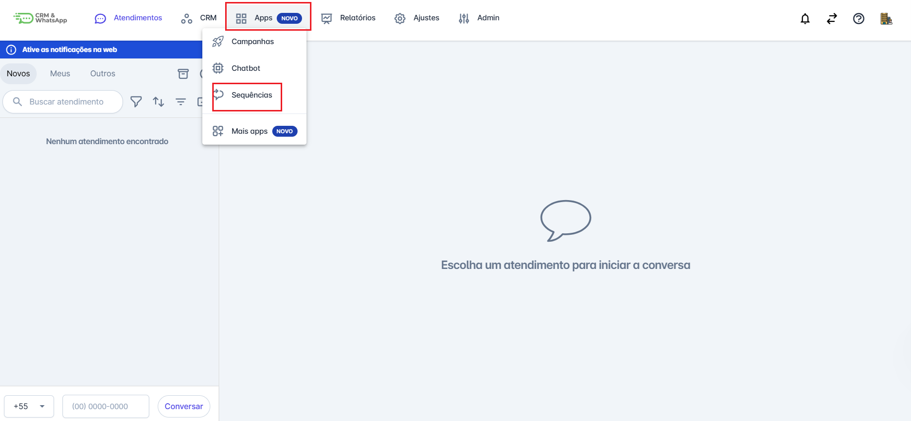
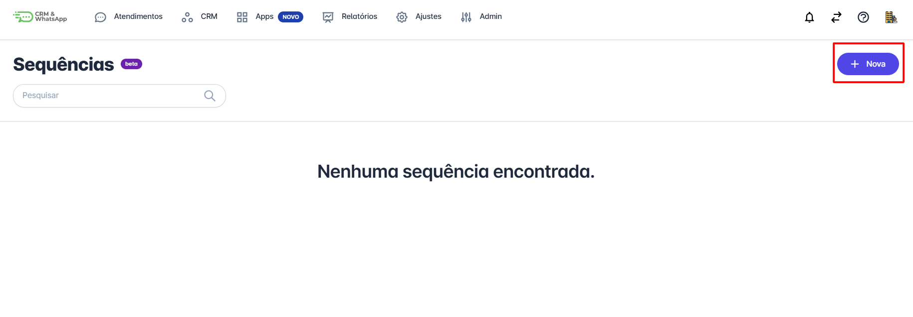
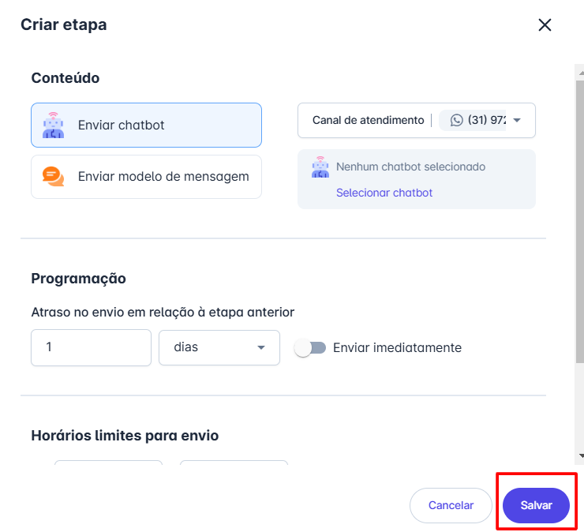
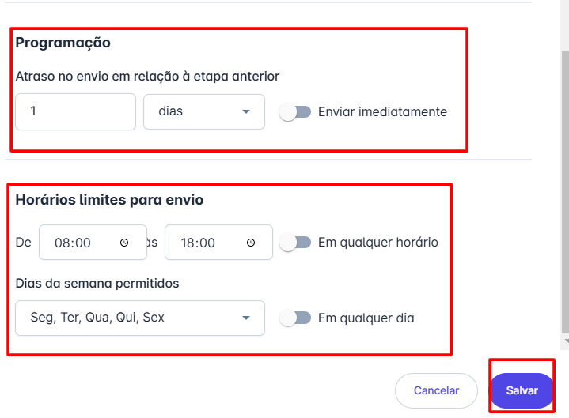

# Criar sequência

A criação de **sequências** na **plataforma** é uma maneira eficaz de **automatizar** e **gerenciar a comunicação** com seus clientes. Com as sequências, você pode programar uma série de mensagens para serem enviadas em **intervalos específicos**, garantindo que seus clientes recebam as informações certas no momento ideal.

::: tip Pré-requisitos
* **Acessar a plataforma** com perfil de **Administrador**.
* Definir claramente o **objetivo da sequência** e os **recursos necessários**.
* Garantir que as **mensagens do tipo sequência** estejam aprovadas na plataforma.
* Ter um **bot de automação** previamente configurado na plataforma.
:::

## Passo 1: Acessar Sequências

Na aba **"Apps"**, selecione a opção **"Sequências"**.

## Passo 2: Nova Sequência

Selecione a opção **"Nova"** para criar uma **nova sequência**.

## Passo 3: Nomear Sequência

Um formulário será aberto para que você adicione o **nome da sequência**. Insira o nome desejado e clique no botão **"Continuar"**.

## Passo 4: Configurar Sequência

Você será direcionado para a **página de configuração da sequência**. Clique no botão **"+"** para adicionar um **novo passo** à sequência.

## Passo 5: Configurar Etapa

Uma janela será aberta para configurar uma **etapa da sequência**. O primeiro passo é selecionar o **canal** que será utilizado. Em seguida, decida se deseja enviar um **chatbot** ou um **modelo de mensagem** e selecione a opção desejada. Neste exemplo, será utilizado um **modelo de mensagem**.

## Passo 6: Programação e Horários

Em seguida, preencha os seguintes campos:

* **Programação**: Selecione o intervalo de tempo, em relação ao último envio, para que a próxima mensagem seja enviada.
* **Horários Limites para Desvio**: Insira os horários permitidos para o envio das informações.

Após definir todas as configurações, clique no botão **"Salvar"**.

::: info Considerações finais
* A inclusão e exclusão de **contatos nas sequências** é realizada de forma **manual**.
* Como se trata de uma **mensagem ativa** enviada para um ou mais contatos, haverá cobrança pela **Meta**.
:::
