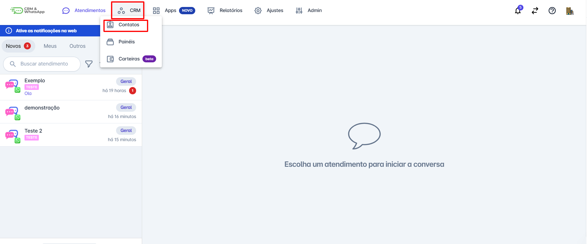
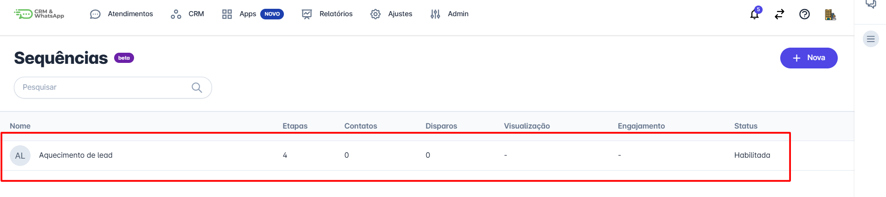
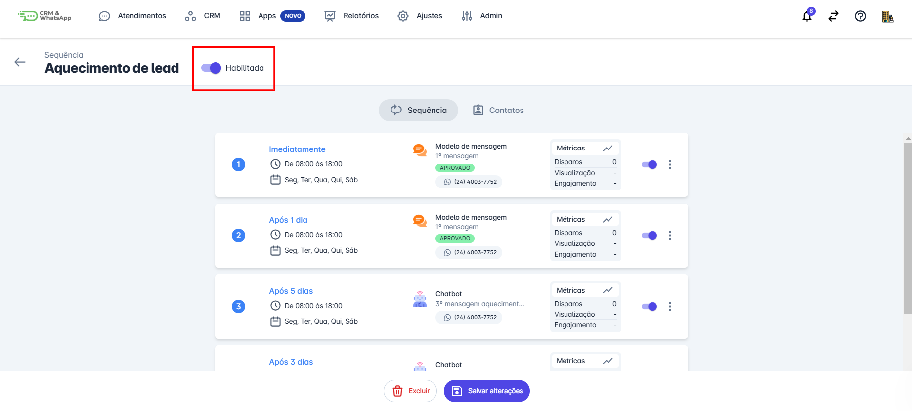
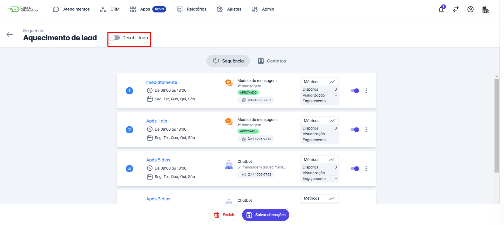
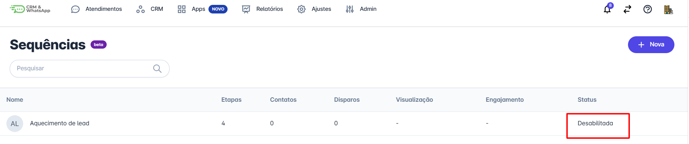
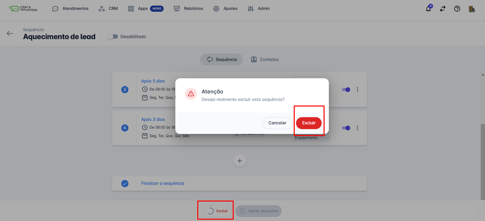

# Desabilitar / Excluir sequência

Desabilitar ou excluir uma sequência na a plataforma é uma tarefa essencial para garantir que sequências desnecessárias ou obsoletas sejam removidas, mantendo sua plataforma organizada e eficiente. Este guia fornecerá instruções detalhadas sobre como desabilitar e excluir sequências na a plataforma.

::: tip Pré-requisitos
* Ter acesso à plataforma.
* Ter uma sequência ativa com contatos inseridos.
:::

## Passo 1: Acessar Sequências

Na aba de Apps, selecione a opção **"Sequências"**.

## Passo 2: Selecionar Sequência

Encontre a sequência na qual deseja desabilitar ou excluir e clique sobre ela.

## Passo 3: Desabilitar Sequência

Clique no botão **"Sequências"** e as informações da sequência serão exibidas. Para desabilitar a sequência basta desligar a chave localizada ao lado do nome da sequência.

## Passo 4: Salvar Alterações

A opção aparecerá como desabilitada e em seguida clique em **salvar alterações**.

## Passo 5: Reabilitar Sequência

Após seguir esses passos, a tela exibirá conforme a imagem abaixo. Caso deseje habilitar a sequência novamente, basta repetir o processo clicando em **"Habilitar"**.

## Passo 6: Excluir Sequência

Para excluir uma sequência, selecione a sequência que deseja excluir e clique no botão **excluir** localizado no fim da página. Surgirá um popup de confirmação, clique novamente em **excluir**.

::: info Considerações finais
* Habilitar e desabilitar uma sequência é uma ação que pode ser desfeita.
* A exclusão de uma sequência é uma ação que **não pode ser desfeita**.
:::
