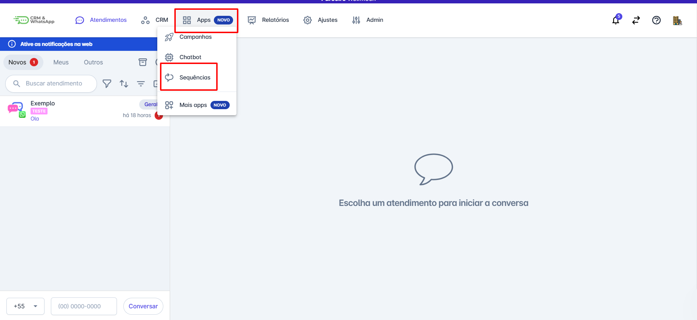

# Finalizar sequência

Finalizar uma sequência na plataforma é uma ação importante para encerrar campanhas de automação ou séries de mensagens que não são mais necessárias. Este guia fornecerá instruções detalhadas sobre como finalizar uma sequência, garantindo que as comunicações automáticas sejam adequadamente encerradas.

::: tip Pré-requisitos
* Ter acesso à plataforma com perfil de administrador.
* Ter uma sequência de mensagens ou chatbots já criada na plataforma.
* Ter mensagens do tipo sequência aprovadas na plataforma.
* Ter um bot de automação já definido na plataforma.
:::

## Passo 1: Acessar Sequências

Na aba de Apps, selecione a opção **"Sequências"**.

## Passo 2: Adicionar Etapa de Finalização

No momento em que você insere uma nova etapa, a plataforma automaticamente adiciona a etapa de finalizar a sequência.

Veja na imagem abaixo:

::: info Considerações finais
* Incluir e excluir contatos nas sequências é feito de forma manual.
* Como se trata de uma mensagem ativa enviada para um ou mais contatos ela será cobrada pela META.
:::
