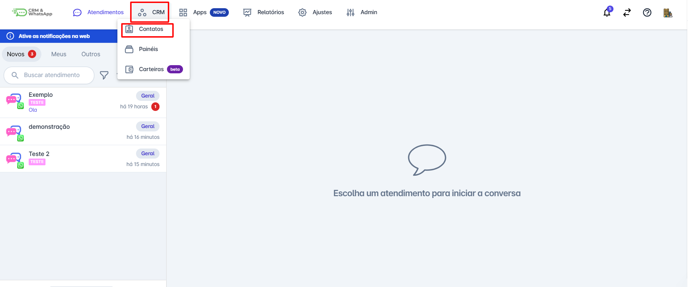
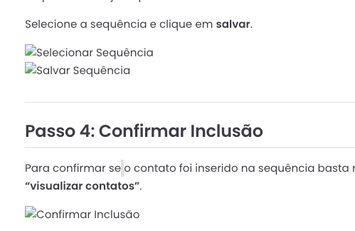
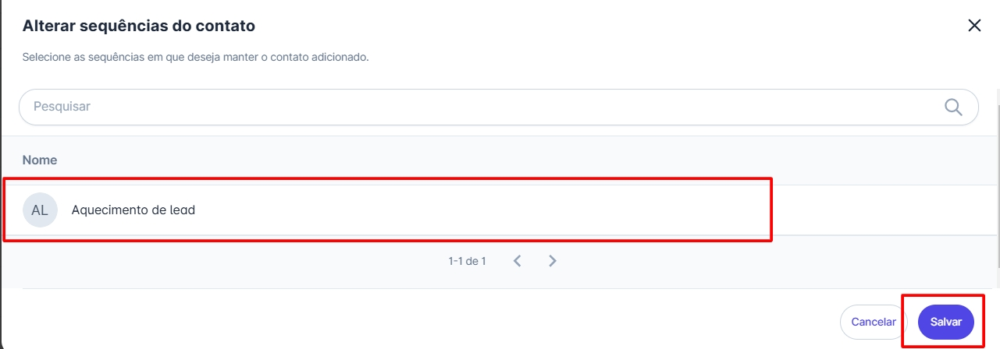
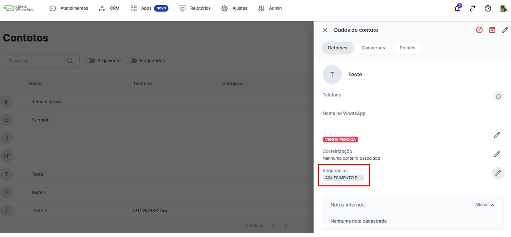
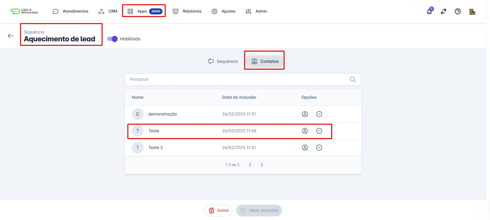

# Incluir contato na sequência

Inserir contatos em uma sequência na a plataforma é uma tarefa fundamental para garantir que suas campanhas automatizadas alcancem o público certo. Este guia fornecerá instruções detalhadas sobre como adicionar contatos a uma sequência, permitindo que você mantenha uma comunicação constante e eficaz com seus clientes.

::: tip Pré-requisitos
* Ter acesso à plataforma.
* Ter uma sequência de mensagens ou chatbots já criada na plataforma.
:::

## Passo 1: Acessar Contatos

Na tela inicial, clique no menu **CRM** e em seguida clique na opção **Contatos**.

## Passo 2: Selecionar Contato

Selecione o contato que deseja inserir em uma sequência e clique sobre ele. Uma aba com os detalhes do contato se abrirá na lateral direita.

## Passo 3: Adicionar à Sequência

Clique no ícone  ao lado da opção **"Sequências"** e um popup se abrirá, permitindo que você selecione a sequência desejada para o contato.

Selecione a sequência e clique em **salvar**.

## Passo 4: Confirmar Inclusão

Para confirmar se o contato foi inserido na sequência basta realizar os passos do tutorial **“visualizar contatos”**.

::: info Considerações finais
* Incluir e excluir contatos nas sequências é feito de forma **manual**.
* A inclusão e exclusão de contatos em uma sequência também pode ser feita diretamente nos detalhes do contato. Inclusive durante um atendimento.
:::
