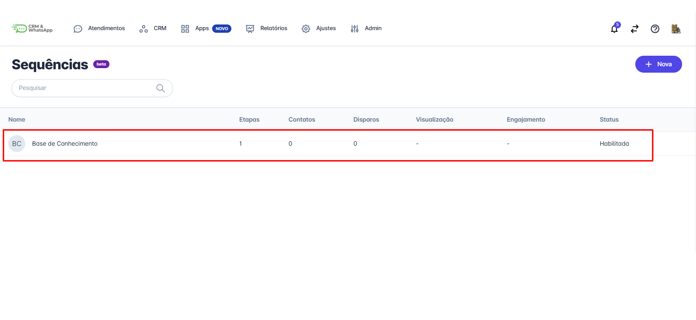
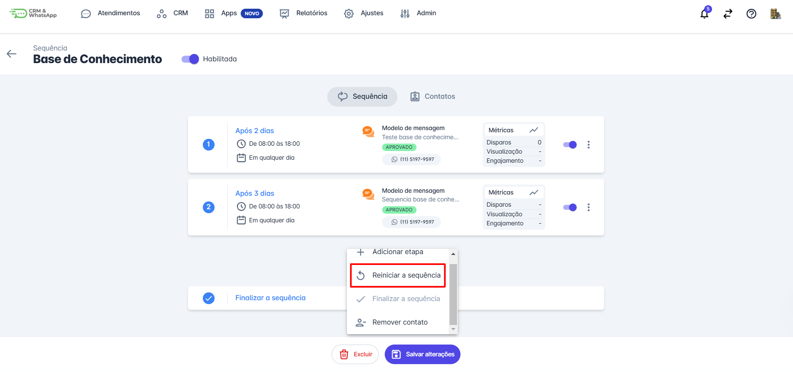
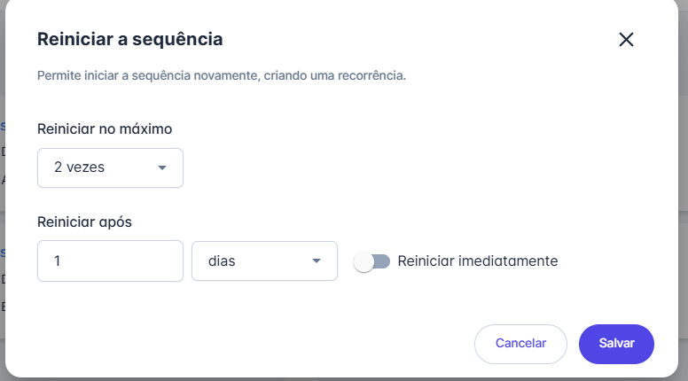
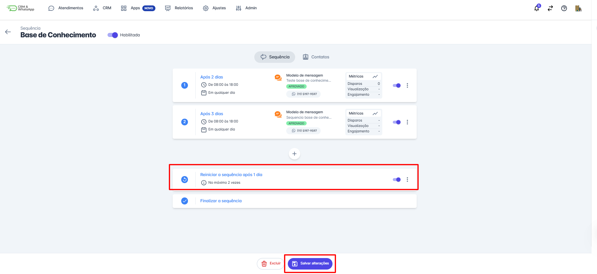

# Reiniciar sequência

A funcionalidade de **reiniciar uma sequência** na **plataforma** é essencial para garantir que os contatos recebam as mensagens sequenciais adequadas, especialmente em casos de **interrupção** ou **ajuste na comunicação**. Este guia detalhará o processo de **reiniciar uma sequência**, assegurando que a **automação continue de forma eficaz** e sem interrupções.

::: tip Pré-requisitos
* **Ter acesso à plataforma** com perfil de **Administrador**.
* **Ter uma sequência de mensagens** ou **chatbots** já criada na plataforma.
* Garantir que as **mensagens do tipo sequência** estejam aprovadas na plataforma.
* **Ter um bot de automação** previamente configurado na plataforma.
:::

## Passo 1: Acessar Sequências

Na aba **"Apps"**, selecione a opção **"Sequências"**.

## Passo 2: Selecionar Sequência

Encontre e clique na **sequência** que você deseja **reiniciar**.

## Passo 3: Reiniciar Sequência

Clique no botão **"+"**, localizado no final da lista de etapas. Um menu de opções será exibido; clique na opção **"Reiniciar a sequência"**.

## Passo 4: Configurar Reinício

Uma nova aba se abrirá, permitindo configurar a **quantidade máxima de vezes** que a sequência poderá ser reiniciada e o **intervalo de tempo** entre cada reinício. Após definir essas configurações, clique no botão **"Salvar"**.

## Passo 5: Salvar Alterações

Certifique-se de que suas **etapas de sequência** estejam alinhadas com a proposta desejada. Após revisar, clique em **"Salvar Alterações"**.

::: info Considerações finais
* A inclusão e exclusão de **contatos nas sequências** é feita de forma **manual**.
* Como se trata de uma **mensagem ativa** enviada para um ou mais contatos, ela será **cobrada pela Meta**.
:::
