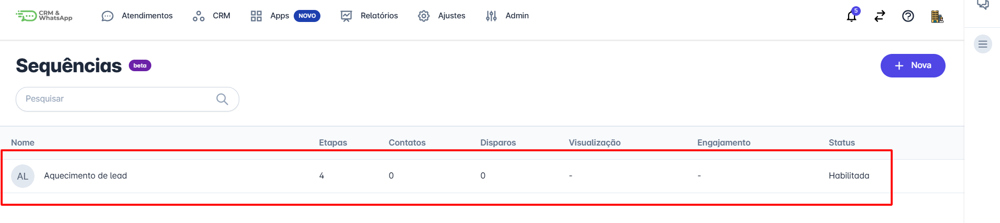
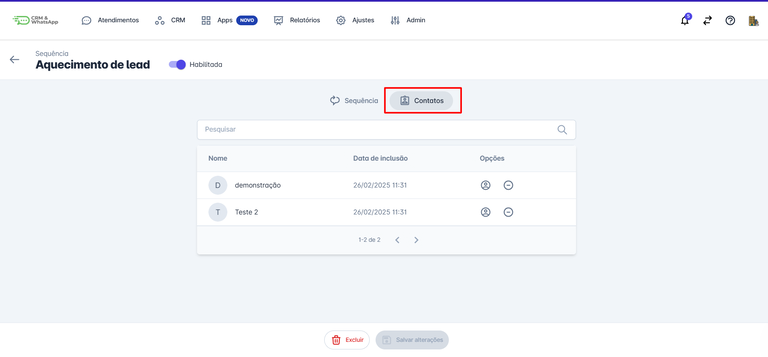
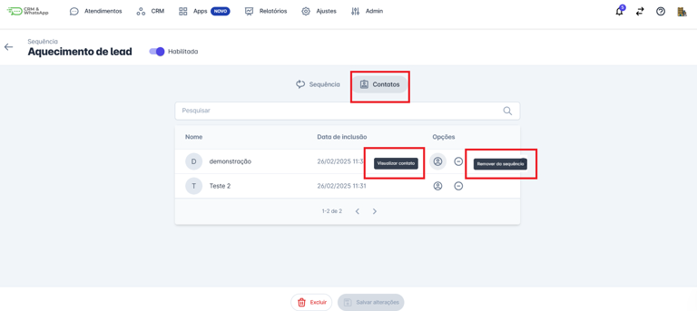

# Visualizar contatos

Este guia fornecerá instruções detalhadas sobre como visualizar os contatos que estão atualmente incluídos em uma sequência, permitindo um controle mais preciso das suas comunicações.

::: tip Pré-requisitos
* Ter acesso à plataforma.
* Ter uma sequência ativa com contatos inseridos.
:::

## Passo 1: Acessar Sequências

Na aba de Apps, selecione a opção **"Sequências"**.

## Passo 2: Selecionar Sequência

Encontre a sequência na qual deseja visualizar os contatos inseridos e clique sobre ela.

## Passo 3: Lista de Contatos

Clique no botão **"Contatos"** e a lista dos contatos inseridos nesta sequência será exibida.

## Passo 4: Detalhes e Remoção

Nessa tela é possível visualizar os dados do contato ou remover o contato da sequência.

::: info Considerações finais
* Incluir e excluir contatos nas sequências é feito de forma **manual**.
* A inclusão e exclusão de contatos em uma sequência também pode ser feita diretamente nos detalhes do contato.
:::
