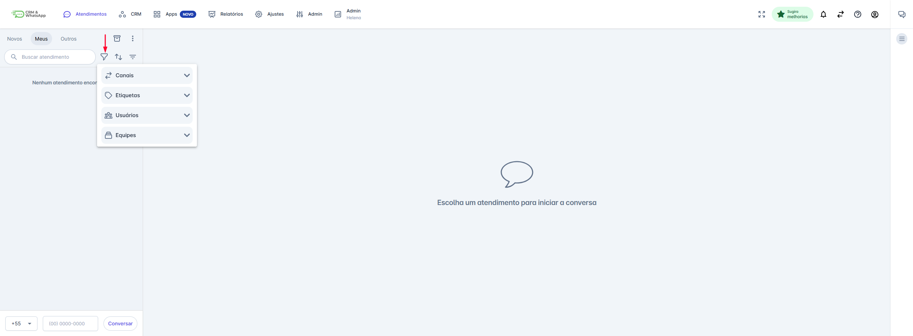
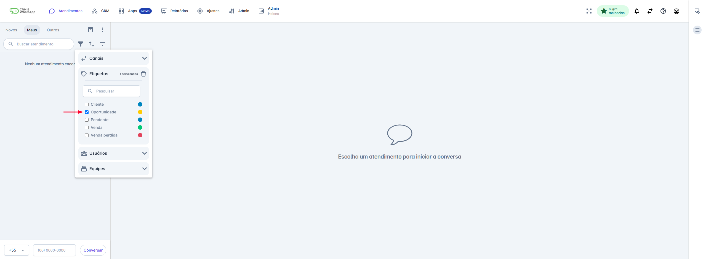
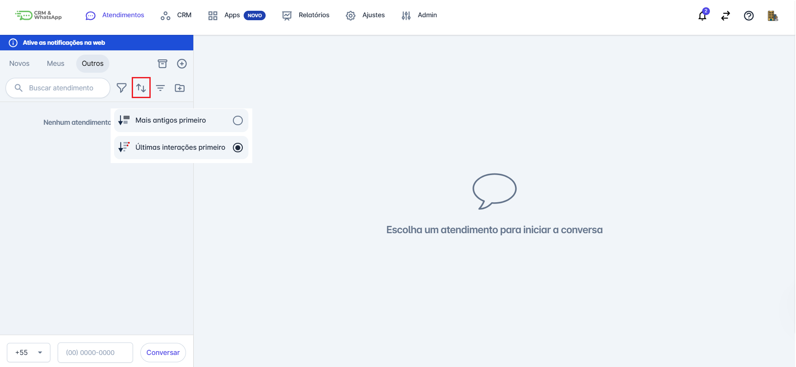
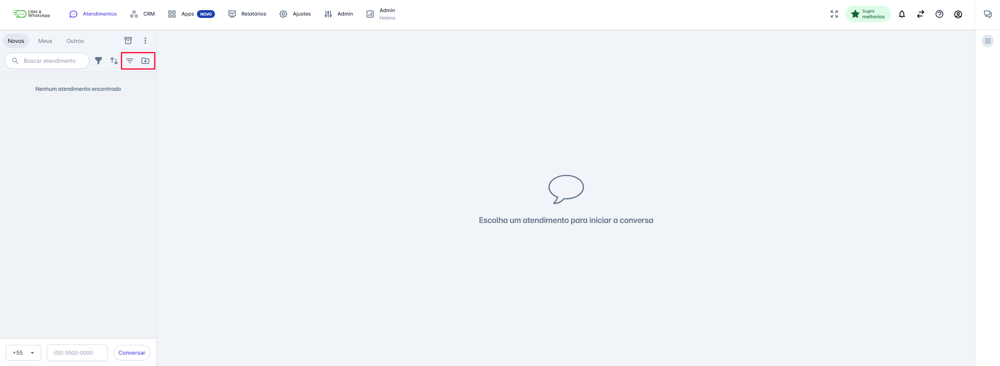
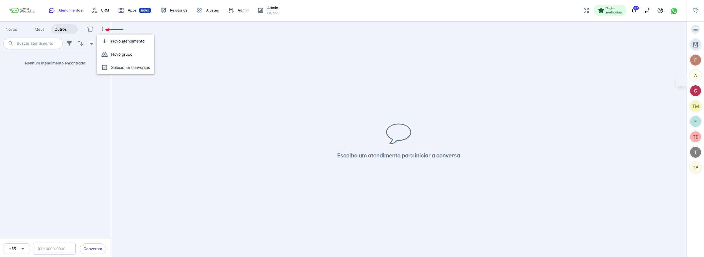

# Abas, Filtros e Ações em Massa

Este guia oferece uma visão completa sobre as funcionalidades de abas, filtros e opções adicionais, permitindo que você gerencie suas conversas de forma mais eficiente, otimize o trabalho e garanta que nenhuma comunicação importante seja perdida.

## 1. Visão Geral: As Abas de Atendimento

Na tela inicial da plataforma, ao clicar em "Atendimentos", você encontra três abas principais para classificar o fluxo de trabalho:

| Aba    | Propósito                                                                                                                                        | Quem Visualiza                         |
| ------ | ------------------------------------------------------------------------------------------------------------------------------------------------ | -------------------------------------- |
| Novos  | Conversas que acabaram de chegar e ainda não foram iniciadas por nenhum atendente. São os contatos aguardando o primeiro atendimento.            | Todos os usuários com permissão.       |
| Meus   | Conversas que você iniciou ou que foram atribuídas a você. É sua fila de trabalho pessoal para acompanhamento e resposta.                        | Apenas o usuário logado (você).        |
| Outros | Conversas iniciadas por outros usuários que pertencem à sua equipe. Permite acompanhar, dar suporte ou assumir conversas em andamento da equipe. | Usuários que pertencem à mesma equipe. |

## 2. Funções de Busca e Filtragem

A área de Atendimentos oferece filtros e ordenação para ajudar a localizar e gerenciar conversas de forma eficiente. Os ícones de filtro e ordenação estão localizados acima da lista de atendimentos.

### 2.1. Aplicando Filtros (Ícone do Funil)

Clique no ícone de Filtro (o funil) para abrir o menu de opções. Você pode filtrar os atendimentos de acordo com as seguintes categorias:

* **Canais:** Filtre por números, Messenger ou Instagram.
* **Etiquetas:** Filtre por *tags* aplicadas aos contatos (Ex: Cliente, Oportunidade, Teste).
* **Usuários:** Filtre por atendentes específicos.
* **Equipes:** Filtre por equipes específicas.

**Como Aplicar:**

1. Clique na seta (▼) do filtro desejado (ex: Etiquetas).
2. Selecione a(s) opção(ões) desejada(s) (Ex: Marque a caixa "Oportunidade").
3. O filtro é aplicado automaticamente ao clicar fora do menu. O ícone de filtro correspondente ficará escuro quando estiver ativo.

### 2.2. Ordenação de Atendimentos

Clique no ícone de Ordenação para reordenar a lista:

* **Mais antigos primeiro:** Exibe os atendimentos em ordem cronológica crescente.
* **Últimas interações primeiro:** Exibe os atendimentos com as interações mais recentes no topo.

Você pode **ordenar os atendimentos** para facilitar a organização e priorização. Para isso:

1. Clique no **ícone de ordenação**.
2. Um menu com as opções será exibido:
   * **Mais antigos primeiro**: Exibe os atendimentos em ordem cronológica crescente.
   * **Últimas interações primeiro**: Exibe os atendimentos com as interações mais recentes no topo.

### 2.3. Exibição Rápida

Utilize os botões de filtro rápido para visualizações específicas:

* **Mensagens Não Lidas:** Filtra a lista automaticamente, mostrando apenas as mensagens que você ainda não leu.
* **Apenas Meus Atendimentos:** Atualiza a lista para mostrar somente os atendimentos que estão sob sua responsabilidade (equivalente à aba "Meus").

## 3. Outras Opções (Novo Atendimento, Novo Grupo e Ações em Lote)

O menu de "Outras Opções" (acessível pelo ícone de três pontos próximo às abas) oferece funcionalidades para criar novas interações e, principalmente, gerenciar múltiplas conversas de uma só vez:

* **Novo Atendimento:** Inicia uma conversa com um contato existente ou novo.
* **Novo Grupo:** Cria um novo grupo de conversa dentro da plataforma.
* **Selecionar Conversas (Ações em Lote):** Permite selecionar múltiplas conversas para aplicar uma ação em massa (Transferir, Concluir, etc.).

### 3.1. Utilizando Ações em Lote ("Selecionar Conversas")

A funcionalidade **"Selecionar Conversas"** permite que você aplique uma ação única (em lote) a vários atendimentos ao mesmo tempo, otimizando seu fluxo de trabalho.

**Como Usar:**

1. Clique no ícone de "Outras Opções" (⋮).
2. Clique em "Selecionar Conversas". Checkboxes aparecerão ao lado de cada atendimento.
3. Selecione as conversas desejadas.
4. O menu de ações em lote aparecerá, exibindo as opções contextualmente apropriadas para a aba atual.
5. Clique na ação desejada para aplicá-la a todos os itens selecionados.

| Aba de Atendimento | Ações em Lote Disponíveis                                              | Propósito Principal                                  |
| ------------------ | ---------------------------------------------------------------------- | ---------------------------------------------------- |
| Novos              | • Transferir • Concluir Atendimento                                 | Direcionamento e finalização da fila de espera.      |
| Meus               | • Marcar como lida/Não Lida • Transferir • Concluir              | Gerenciamento e finalização da sua própria fila.     |
| Outros             | • Transferir • Concluir Atendimento                                 | Intervenção e organização de atendimentos da equipe. |

::: info Considerações Adicionais (Perfis de Supervisão)
Tem permissão para **visualizar todos os atendimentos das equipes** que integra. Pode interagir na conversa, assumir, transferir e concluir atendimentos de outros membros da equipe.
:::
