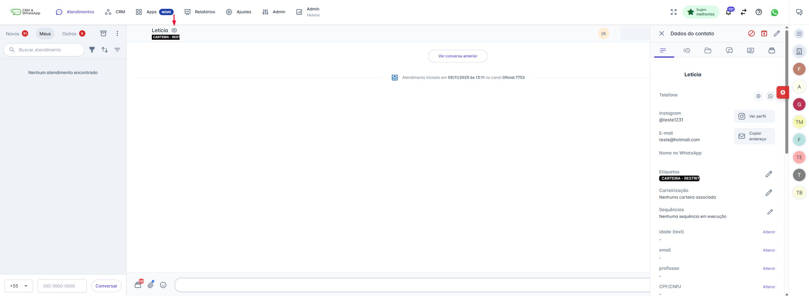
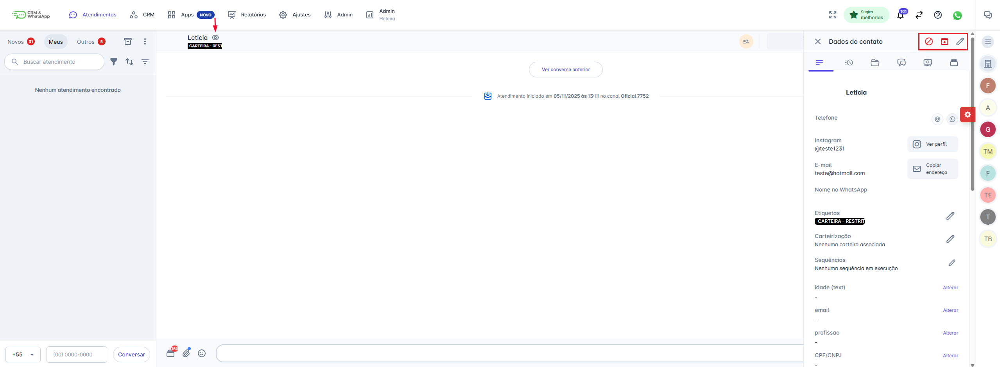
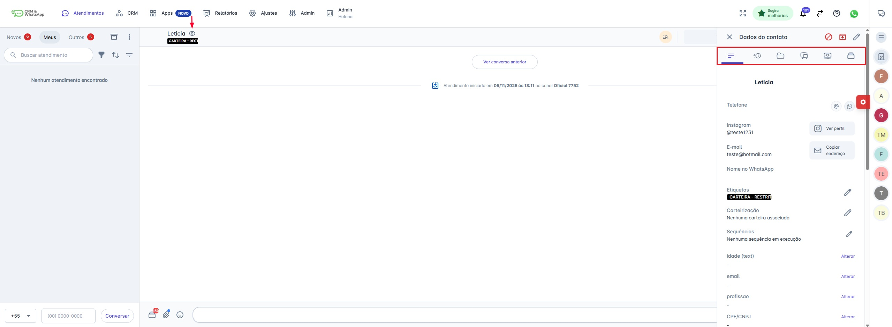

# Dados do Contato e Gestão Rápida

O Painel de Dados do Contato oferece uma visão detalhada e funcionalidades de gestão essenciais para otimizar a organização e a segmentação dos seus contatos diretamente na tela de atendimento.

## 1. Abertura do Painel e Ações Rápidas

### 1.1. Abrindo o Painel

Para acessar, estando dentro de um atendimento, localize e clique no ícone Dados do Contato (⊙) no canto superior direito da tela. O painel se expandirá na lateral direita.

### 1.2. Ações de Gestão (Ícones Superiores)

Na barra superior do painel, você encontra ícones de ações rápidas para gerenciar o status do contato:

* **Arquivar Contato:** Move o contato para a seção de arquivados. O contato será reativado e um novo atendimento será iniciado caso ele envie uma nova mensagem, fazendo com que ele retorne às filas da plataforma.
* **Bloquear Contato:** Impede a recepção de novas mensagens enviadas por este contato. Nenhuma interação futura dele será registrada ou aparecerá nas filas de atendimento da plataforma.
* **Editar Contato:** Abre o modo de edição dos campos.

## 2. Visão Detalhada: Abas do Contato

O painel é organizado em várias abas, cada uma oferecendo informações e funcionalidades específicas sobre o histórico e o status do contato.

### 2.1. Detalhes

Esta é a aba principal, exibindo todas as informações do cadastro:

* **Campos Pré-Existentes:** Nome, Telefone, E-mail, Instagram, Etiquetas, Sequências Ativas e Notas Internas.
* **Campos Personalizados:** Permite visualizar e editar quaisquer campos adicionais que sua equipe tenha criado. *Lembre-se: campos personalizados são replicados automaticamente para todos os demais contatos.*

**Edição:** Para editar qualquer campo, clique no ícone de lápis ou vá até o botão "Editar" na barra superior, faça as alterações e clique em "Salvar".

### 2.2. Mensagens Agendadas

Aqui você pode visualizar todas as mensagens que foram agendadas para serem enviadas a este contato no futuro. É possível gerenciar (editar ou cancelar) esses agendamentos diretamente nesta aba.

### 2.3. Arquivos

Esta aba funciona como um repositório, exibindo todos os arquivos, mídias e links já trocados neste histórico de conversas. Você pode utilizar o campo de busca e o filtro de tipo (Documento, Link, Mídia) para localizar rapidamente um item.

### 2.4. Conversas

Nesta aba, você visualiza um histórico consolidado de todas as interações e atendimentos (atuais e passados) realizados com este contato em diferentes canais.

### 2.5. Painéis

É possível ver em quais Painéis de acompanhamento este contato está atrelado. Você pode acessar o painel completo facilmente, basta clicar sobre o item listado.

### 2.6. Pagamentos

A aba Pagamentos oferece uma visão rápida e consolidada de todo o histórico financeiro e transacional deste contato.

Você pode acompanhar:

* **Histórico de Valores:** A lista completa de todos os pagamentos e transações associadas ao contato.
* **Status Financeiro:** O status atualizado de cada transação (como "Vencido", "Pago", "Pendente", etc.), permitindo que você identifique rapidamente pendências financeiras durante o atendimento.

