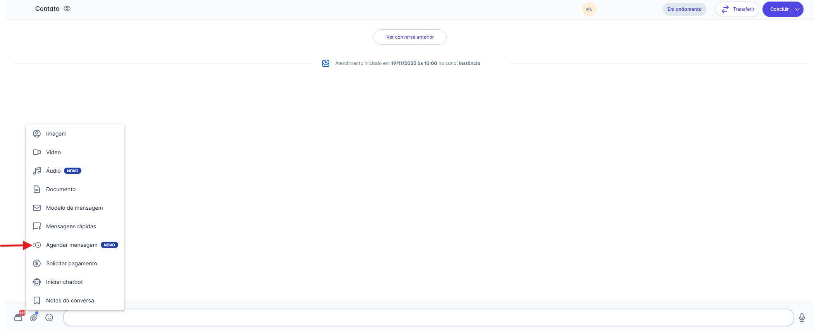
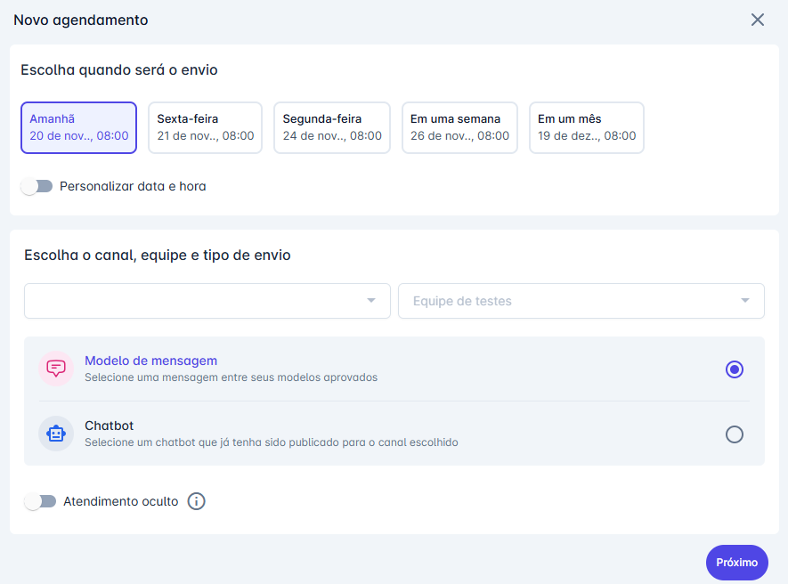
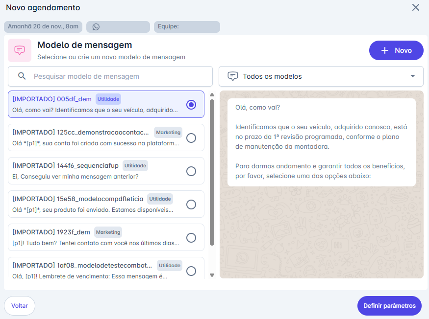
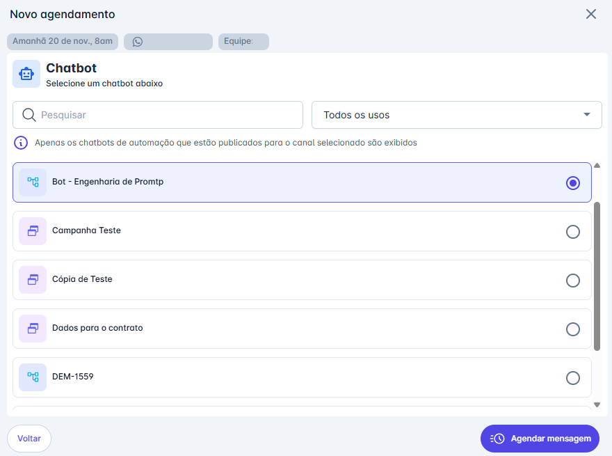
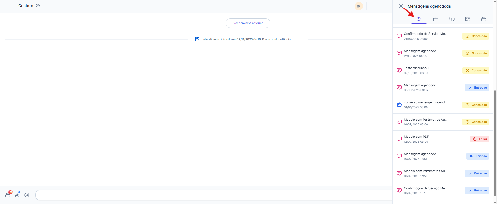

# Agendar Mensagem

Você pode programar o envio de uma mensagem ou o início de um chatbot para o futuro sem sair da tela de conversa do cliente. Este atalho é ideal para programar follow-ups, enviar lembretes ou continuar um fluxo de automação.

## Passo 1: Acessar a Funcionalidade

* Na tela de Atendimentos, abra a conversa do contato para o qual deseja agendar uma mensagem.
* Na barra de digitação, clique no **ícone de Anexo** (📎).
* No menu de opções que será exibido, escolha **"Agendar Mensagem".**

## Passo 2: Definir a Data e o Conteúdo

Na janela "Novo agendamento" que será aberta, preencha os seguintes campos:

1. **Escolha quando será o envio:**
   * **Datas Pré-Definidas:** O sistema exibe automaticamente sugestões de datas e horários. Estas sugestões são baseadas nos horários de expediente configurados em `Ajustes > Conta > Horário de atendimento`.
   * **Personalizar Data e Hora:** Se preferir, ative a chave "Personalizar data e hora" para selecionar livremente qualquer data e horário.
2. **Escolha o tipo de envio:**
   * Selecione se deseja enviar um **"Modelo de mensagem"** ou iniciar um **"Chatbot"**.
3. Clique em **"Próximo"**.

::: tip Praticidade
Ao agendar a partir de um atendimento, o sistema preenche automaticamente o Canal e a Equipe com os dados da conversa atual, tornando o processo mais rápido e prático.
:::

## Passo 3: Selecionar o Conteúdo e Agendar

Após clicar em "Próximo", você será direcionado para a tela de seleção de conteúdo:

### Caso tenha escolhido "Modelo de mensagem":

1. Selecione o modelo desejado na lista
2. Clique em **"Definir parâmetros"**.
3. Preencha as variáveis do modelo (se houver) e clique em **"Agendar mensagem"**.

::: warning ⚠️ Nota: Permissão para o botão "+ Novo"
O botão **"+ Novo"**, que permite criar um novo modelo de mensagem diretamente desta tela, é visível para todos os perfis de usuários.
:::

### Caso tenha escolhido "Chatbot":

1. Selecione o chatbot desejado na lista
2. Clique em **"Agendar mensagem"** para finalizar.

## Consultando Agendamentos do Contato

A plataforma permite que você consulte facilmente o histórico de todas as mensagens que foram programadas, enviadas ou que falharam para um contato, tudo sem sair da tela da conversa.

### Passo 1: Abrir o Painel de Informações

1. Com o atendimento do contato selecionado, clique no **ícone de "Detalhes"** no cabeçalho da conversa.
2. O painel lateral de informações do contato será aberto.

### Passo 2: Acessar a Aba de Agendamentos

1. No painel lateral, clique no ícone da aba **"Mensagens agendadas"** (representado por um relógio 🕙)

### Passo 3: Consultar o Histórico

1. A lista exibirá todos os agendamentos feitos para aquele contato.
2. Você poderá ver o status de cada agendamento (ex: Enviado, Entregue, Cancelado, Falha) diretamente na lista.

### Passo 4: Detalhar ou Reagendar (Opcional)

1. Clique sobre um agendamento na lista para abrir uma nova janela com todos os detalhes daquela mensagem.
2. Se o agendamento tiver um status que permite a edição (como "Falha" ou "Cancelado"), o botão **"Reagendar"** estará disponível para você nesta tela de detalhes.

