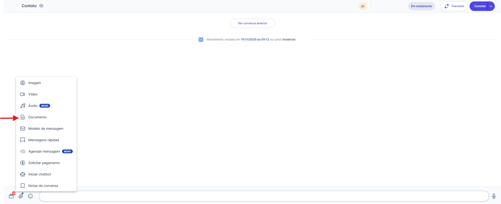
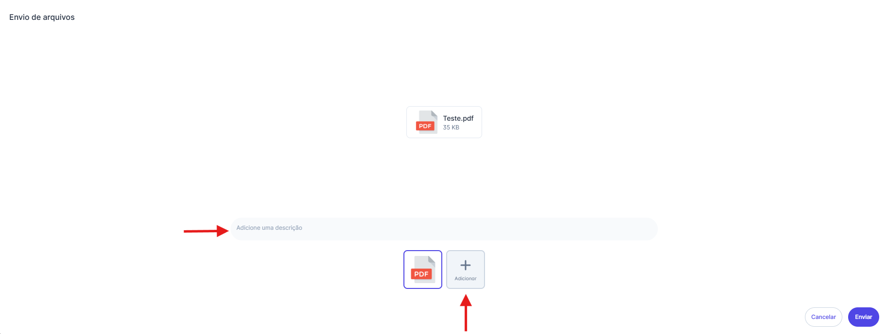
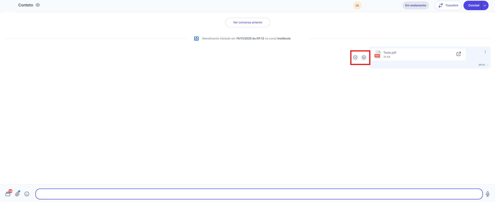
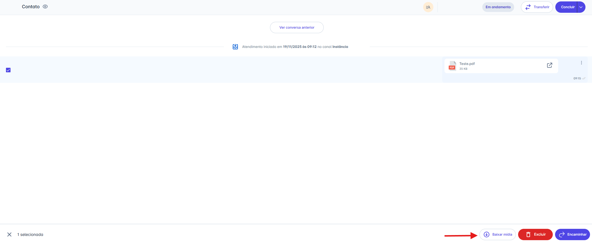
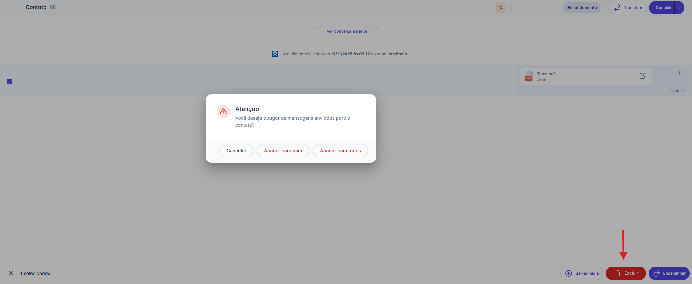
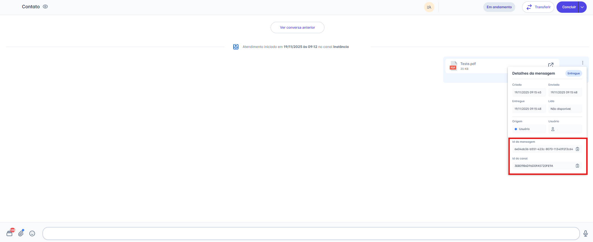
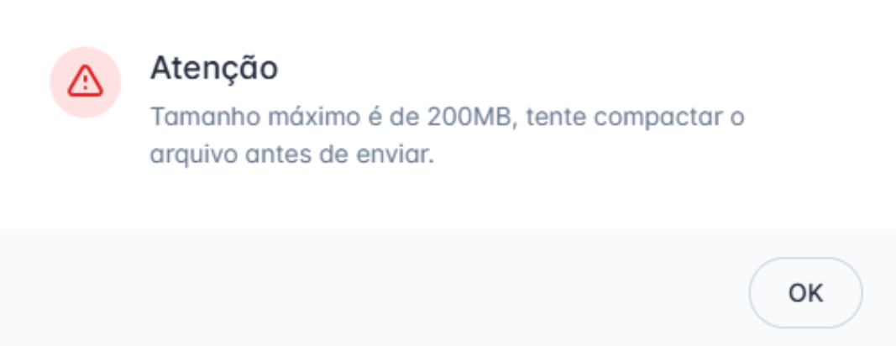

# Enviar Documento

Enviar documentos é uma funcionalidade essencial para compartilhar propostas, faturas, contratos ou qualquer arquivo importante durante a conversa. Este artigo guiará você pelo passo a passo de como anexar e, em seguida, como gerenciar esses documentos.

## Passo 1: Acessar a Opção de Anexo

1. Na tela de Atendimentos, selecione a conversa para a qual deseja enviar o documento.
2. Na barra de digitação, clique no **ícone de Anexo** (📎).
3. No menu de opções que será exibido, escolha **"Documento".**

## Passo 2: Selecionar e Enviar o Arquivo

1. Sua pasta de arquivos local (no computador) será aberta.
2. Selecione o(s) documento(s) que você deseja enviar.
3. **Opcional:** Antes de enviar, você pode **adicionar uma descrição (legenda)** no campo que aparece abaixo da pré-visualização do documento.
4. Clique em "Abrir".
5. O arquivo será carregado e enviado ao contato, ficando disponível para visualização e download.

## Passo 3: Gerenciando Mídias Enviadas

Após o documento ser enviado, você terá várias opções para interagir com ele:

### Ações na Mensagem

* **Abrir:** Você pode clicar diretamente no nome do arquivo para abri-lo em uma nova aba do navegador ou clicar no ícone **"Abrir"** (`↗`) para o mesmo efeito.
* **Baixar:** Clique no ícone de download (↓) para salvar o arquivo em seu computador

### Ações de Seleção

Você também pode selecionar uma ou mais mensagens de mídia clicando na caixa de seleção (checkbox) que aparece no canto. Ao fazer isso, uma barra de ações surgirá na parte inferior da tela com as seguintes opções:

* **Baixar mídia:** Faz o download de todos os itens selecionados.
* **Encaminhar:** Envia as mídias selecionadas para outra conversa.
* **Excluir:** Remove as mídias selecionadas.

### Excluindo uma Mensagem

Ao clicar em **"Excluir"** na barra de ações, um pop-up de confirmação será exibido. Você terá duas opções:

1. **Apagar para mim:** Remove a mensagem apenas da sua visualização.
2. **Apagar para todos:** Remove a mensagem para você e para o contato **(Nota: Esta opção está disponível apenas para canais da API Não Oficial).**

### Detalhes da Mensagem (Avançado)

Clicando no menu de três pontos (`...`) ao lado da mensagem, você pode acessar os **"Detalhes da mensagem"**.

* Este painel mostra o status de entrega (Criado, Enviado, Entregue, Lido).
* Para usuários com perfil de **Administrador**, esta tela também exibe o **"ID da mensagem"** e o **"ID do canal"**, informações úteis para auditoria e integrações.

## Regras de Formato e Tamanho por Canal

O envio de documento segue regras específicas de formato e limite de tamanho, que variam de acordo com o canal utilizado:

### 1. Canais API Oficial e API não Oficial

| Restrição                     | Detalhes                                                                                                         |
| ----------------------------- | ---------------------------------------------------------------------------------------------------------------- |
| **Formatos Suportados**       | `.txt`, `.xls`, `.xlsx`, `.doc` ,`.docx` , `.ppt` , `.pptx` e `.pdf`.                                           |
| **Limite Máximo**             | 100 MB                                                                                                           |
| **Comportamento por Tamanho** | Se o arquivo for maior que 100 MB, o comportamento será diferente (veja o tópico *Validação do Tamanho* abaixo). |

### 2. Canal Messenger

As regras da Meta para o Messenger diferem das do WhatsApp. Em vez de listar extensões de documentos específicas (como `.pdf` ou `.docx`), a Plataforma do Messenger generaliza todos os documentos sob um único tipo: `file`.

Na prática, isso significa que **qualquer formato de documento comum é suportado**, desde que respeite o limite de tamanho. Isso inclui arquivos de texto (`.txt`), PDFs (`.pdf`) e pacotes de escritório como Word (`.doc`, `.docx`), Excel (`.xls`, `.xlsx`) e PowerPoint (`.ppt`, `.pptx`).

| Restrição                     | Detalhes                                                                                                        |
| ----------------------------- | --------------------------------------------------------------------------------------------------------------- |
| **Formatos Suportados**       | `.txt`, `.xls`, `.xlsx`, `.doc` ,`.docx` , `.ppt` , `.pptx` e `.pdf`.                                          |
| **Limite Máximo**             | 25 MB                                                                                                           |
| **Comportamento por Tamanho** | Se o arquivo for maior que 25 MB, o comportamento será diferente (veja o tópico *Validação do Tamanho* abaixo). |

## Validação do Tamanho de Arquivo

O sistema adapta o formato de envio de documentos para garantir a entrega, seguindo as seguintes regras:

### API Oficial e API não Oficial

[Consulte aqui todas as regras oficiais da Meta](https://developers.facebook.com/docs/whatsapp/cloud-api/messages/document-messages)

| Tamanho do Arquivo        | Forma de Envio                                                           |
| ------------------------- | ------------------------------------------------------------------------ |
| **Até 100 MB**            | O documento é enviado no seu formato original.                           |
| **Entre 100 MB e 200 MB** | O documento é enviado como um link para que o contato faça o *download*. |
| **Acima de 200 MB**       | O envio não será realizado.                                              |

### Messenger

[Consulte aqui todas as regras oficiais da Meta](https://developers.facebook.com/docs/messenger-platform/reference/send-api?locale=pt_BR)

| Tamanho do Arquivo       | Forma de Envio                                                           |
| ------------------------ | ------------------------------------------------------------------------ |
| **Até 25 MB**            | O documento é enviado no seu formato original.                           |
| **Entre 25 MB e 100 MB** | O documento é enviado como um link para que o contato faça o *download*. |
| **Acima de 200 MB**      | O envio não será realizado.                                              |

### Instagram

[Consulte aqui todas as regras oficiais da Meta](https://developers.facebook.com/docs/messenger-platform/instagram/features/attachment-upload)

O Instagram **não possui suporte nativo** para o envio de arquivos de documento (como `.pdf` ou `.docx`).

Para contornar essa limitação, nossa plataforma converte automaticamente o documento em um **link seguro para download** e o envia ao contato.

Dessa forma, o envio é suportado para **qualquer formato de documento** (PDF, DOC, XLS, TXT, etc.), desde que respeite o limite de tamanho.

| Tamanho do Arquivo  | Forma de Envio                                                           |
| ------------------- | ------------------------------------------------------------------------ |
| **Até 200 MB**      | O documento é enviado como um link para que o contato faça o *download*. |
| **Acima de 200 MB** | O envio não será realizado.                                              |

**Mensagem de Alerta:** Caso o limite de 200 MB seja excedido, o usuário receberá o aviso: "Tamanho máximo permitido é de 200 MB. Tente compactar o arquivo antes de enviar."

::: warning 💡 Nota: Enviando Arquivos em Qualidade Original
Ao contrário das opções "Imagem", "Vídeo" ou "Áudio", a função **"Anexar -> Documento"** não aplica nenhuma compressão ou otimização.

Use esta opção sempre que precisar enviar um arquivo (seja uma imagem, vídeo, áudio ou PDF) em seu **formato e qualidade originais (Hi-Fi).**
:::
