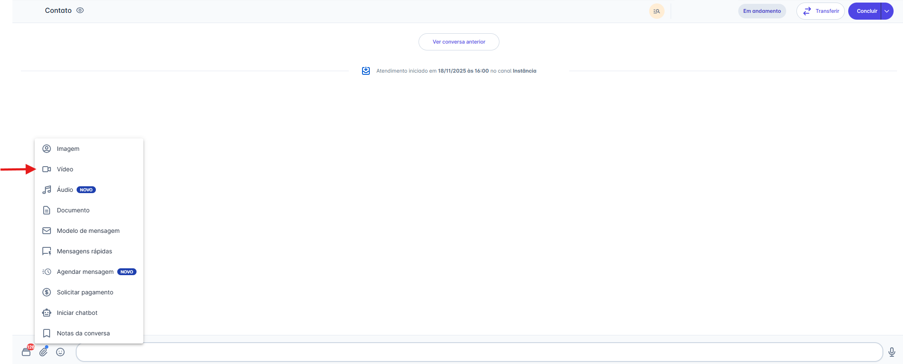
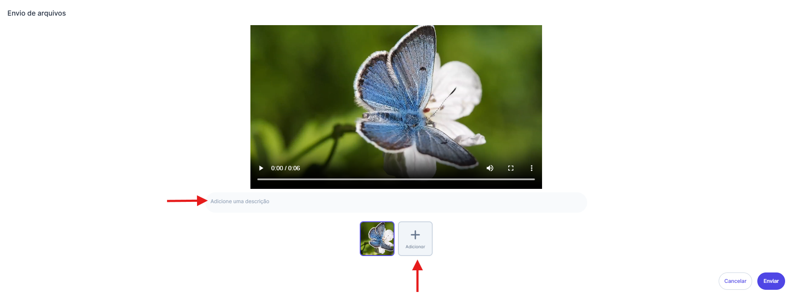
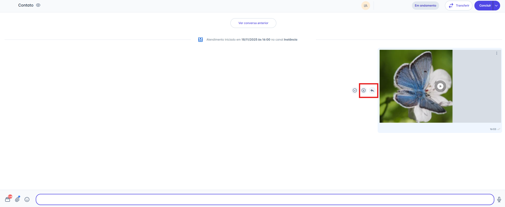
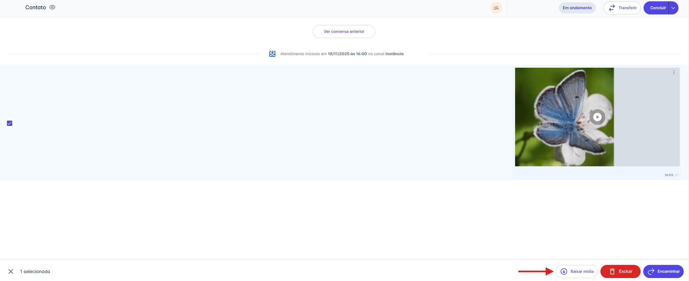
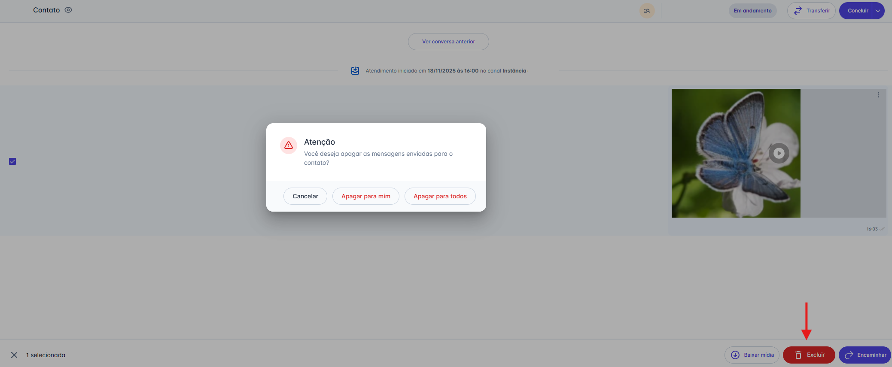
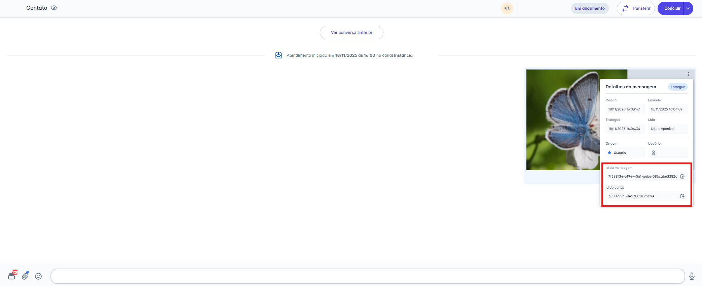

# Enviar Vídeo

Enviar **vídeos** na plataforma é uma funcionalidade essencial para enriquecer a comunicação e fornecer suporte **visual** dinâmico. Este artigo guiará você pelo passo a passo de como enviar vídeos durante um atendimento e, em seguida, como gerenciar essas mídias.

## Passo 1: Acessar a Opção de Anexo

1. Na tela de Atendimentos, selecione a conversa para a qual deseja enviar o vídeo.
2. Na barra de digitação, clique no **ícone de Anexo** (📎).
3. No menu de opções que será exibido, escolha **"Vídeo".**

## Passo 2: Selecionar e Enviar o Arquivo

1. Sua pasta de arquivos local (no computador) será aberta.
2. Selecione o(s) vídeo(s) que você deseja enviar.
3. **Opcional:** Antes de enviar, você pode **adicionar uma descrição (legenda)** no campo que aparece abaixo da pré-visualização do vídeo
4. Clique em "Abrir".
5. O vídeo será carregado e enviado ao contato, ficando disponível para visualização e download.

## Passo 3: Gerenciando Mídias Enviadas

Após o vídeo ser enviado, você terá várias opções para interagir com a mensagem diretamente na tela de atendimento:

### Ações ao Passar o Mouse

Ao passar o mouse sobre a mensagem de mídia, duas ações rápidas aparecem:

* **Responder:** Clique no ícone de seta (↩︎) para citar o vídeo em sua próxima mensagem.
* **Baixar:** Clique no ícone de download (↓) para salvar o arquivo em seu computador

### Ações de Seleção

Você também pode selecionar uma ou mais mensagens de mídia clicando na caixa de seleção (checkbox) que aparece no canto. Ao fazer isso, uma barra de ações surgirá na parte inferior da tela com as seguintes opções:

* **Baixar mídia:** Faz o download de todos os itens selecionados.
* **Encaminhar:** Envia as mídias selecionadas para outra conversa.
* **Excluir:** Remove as mídias selecionadas.

### Excluindo uma Mensagem

Ao clicar em **"Excluir"** na barra de ações, um pop-up de confirmação será exibido. Você terá duas opções:

1. **Apagar para mim:** Remove a mensagem apenas da sua visualização.
2. **Apagar para todos:** Remove a mensagem para você e para o contato **(Nota: Esta opção está disponível apenas para canais da API Não Oficial).**

### Detalhes da Mensagem (Avançado)

Clicando no menu de três pontos (`...`) ao lado da mensagem, você pode acessar os **"Detalhes da mensagem"**.

* Este painel mostra o status de entrega (Criado, Enviado, Entregue, Lido).
* Para usuários com perfil de **Administrador**, esta tela também exibe o **"ID da mensagem"** e o **"ID do canal"**, informações úteis para auditoria e integrações.

## Regras de Formato e Tamanho por Canal

O envio de vídeo segue regras específicas de formato e limite de tamanho, que variam de acordo com o canal utilizado:

### 1. Canais API Oficial e API não Oficial

| Restrição                     | Detalhes                                                                                                        |
| ----------------------------- | --------------------------------------------------------------------------------------------------------------- |
| **Formatos Suportados**       | `.mp4` e `.3gp`                                                                                                 |
| **Limite Máximo**             | 16 MB                                                                                                           |
| **Comportamento por Tamanho** | Se o arquivo for maior que 16 MB, o comportamento será diferente (veja o tópico *Validação do Tamanho* abaixo). |

### 2. Canais Instagram e Messenger

| Restrição                     | Detalhes                                                                                                        |
| ----------------------------- | --------------------------------------------------------------------------------------------------------------- |
| **Formatos Suportados**       | `.mp4`, `.ogg` , `.avi` , `.movi` e `.webm`                                                                     |
| **Limite Máximo**             | 25 MB                                                                                                           |
| **Comportamento por Tamanho** | Se o arquivo for maior que 25 MB, o comportamento será diferente (veja o tópico *Validação do Tamanho* abaixo). |

## Validação do Tamanho de Arquivo

O sistema adapta o formato de envio de vídeos para garantir a entrega, seguindo as seguintes regras:

### API Oficial e API não Oficial

[Consulte aqui todas as regras oficiais da Meta](https://developers.facebook.com/docs/whatsapp/cloud-api/messages/video-messages)

| Tamanho do Arquivo        | Forma de Envio                                                       |
| ------------------------- | -------------------------------------------------------------------- |
| **Até 16 MB**             | O vídeo é enviado no seu formato original.                           |
| **Entre 16 MB e 100 MB**  | O vídeo é enviado como um arquivo                                    |
| **Entre 100 MB e 200 MB** | O vídeo é enviado como um link para que o contato faça o *download*. |
| **Acima de 200 MB**       | O envio não será realizado.                                          |

### Instagram e Messenger

[Consulte aqui todas as regras oficiais da Meta](https://developers.facebook.com/docs/messenger-platform/instagram/features/attachment-upload)

| Tamanho do Arquivo       | Forma de Envio                                                       |
| ------------------------ | -------------------------------------------------------------------- |
| **Até 25 MB**            | O vídeo é enviado no seu formato original.                           |
| **Entre 25 MB e 200 MB** | O vídeo é enviado como um link para que o contato faça o *download*. |
| **Acima de 200 MB**      | O envio não será realizado.                                          |

**Mensagem de Alerta:** Caso o limite de 200 MB seja excedido, o usuário receberá o aviso: "Tamanho máximo permitido é de 200 MB. Tente compactar o arquivo antes de enviar."

::: warning 💡 Nota: Qualidade do Vídeo (Compressão vs. Arquivo Original)
Para atender às regras de compatibilidade da Meta, ao usar a opção **"Anexar -> Vídeo"**, seu arquivo é otimizado. Este processo envolve **compressão**, o que pode reduzir a qualidade visual (diminuindo a resolução ou bitrate), mas garante uma entrega mais rápida e a pré-visualização (player) na conversa.

**Para manter a qualidade original:** Se você precisa enviar um vídeo sem nenhuma perda de qualidade (como um arquivo para edição, uma apresentação ou em alta resolução), utilize a opção **"Anexar -> Documento"**.
:::
