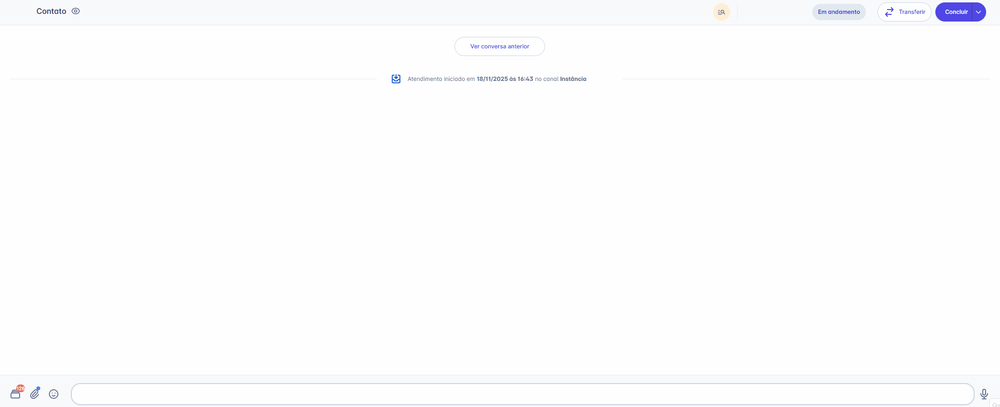
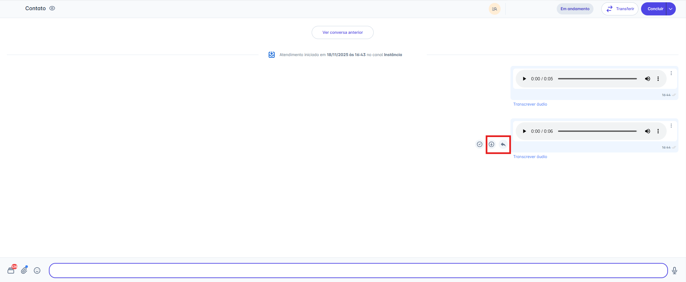
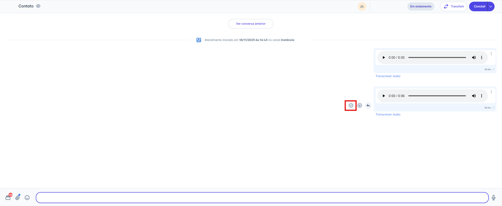
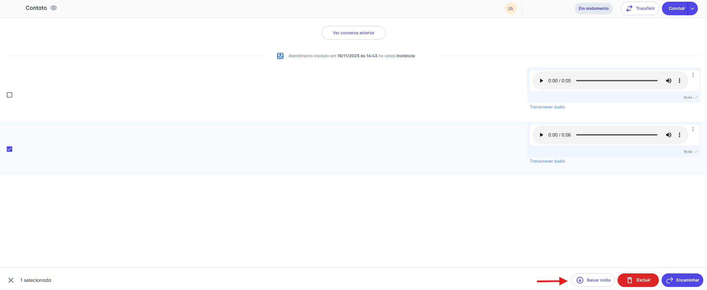
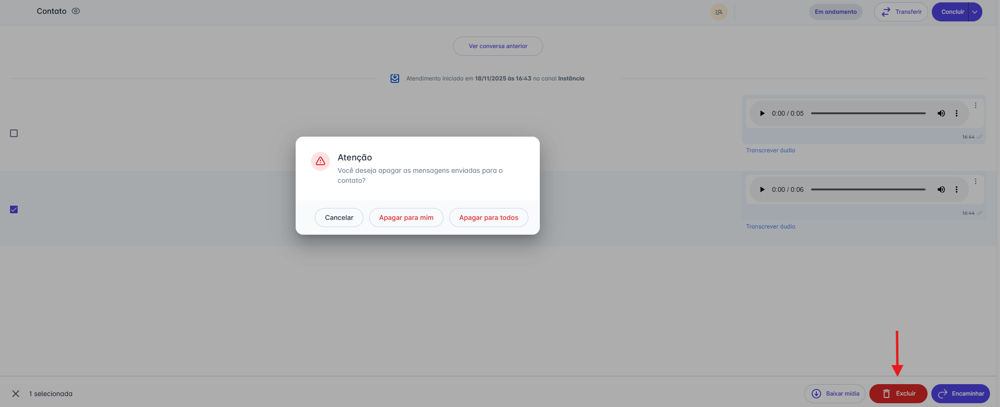
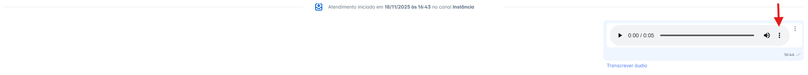
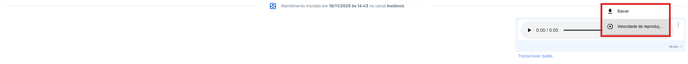
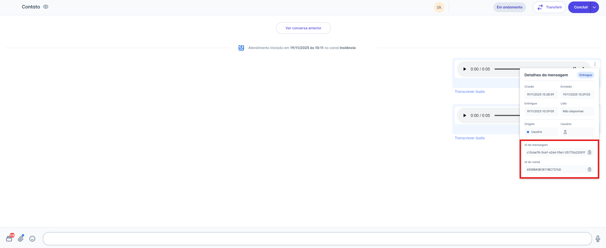

# Gravar Áudio

Para uma comunicação mais ágil e pessoal, você pode gravar mensagens de voz diretamente pela plataforma. Este guia detalha o processo de como usar o microfone do seu dispositivo para capturar e enviar áudios em tempo real, além de mostrar como gerenciar a reprodução desses áudios.

## Passo 1: Iniciar a Gravação

1. Na janela de conversa, localize e clique no **ícone de Microfone** (🎤).
2. Mantenha o botão pressionado para iniciar a gravação da sua mensagem.
3. O ícone de microfone se transformará em um ícone de parar (⏹️).

## Passo 2: Parar e Enviar

1. Solte o botão do mouse ou pare de pressionar o microfone para finalizar a gravação.
2. O sistema processará o áudio. Uma pré-visualização da mensagem de voz aparecerá na barra de digitação.

* Para **ouvir**, clique no **ícone de play** (▶️)
* Para **cancelar**, clique no **ícone de lixeira** (🗑️)
* Para **enviar**, clique no **ícone de enviar** (➤)

## Passo 3: Gerenciando Mídias Enviadas

Após o áudio ser enviado, você terá várias opções para interagir com a mensagem diretamente na tela de atendimento:

### Ações ao Passar o Mouse

Ao passar o mouse sobre a mensagem de mídia, duas ações rápidas aparecem:

* **Responder:** Clique no ícone de seta (↩︎) para citar o áudio em sua próxima mensagem.
* **Baixar:** Clique no ícone de download (↓) para salvar o arquivo em seu computador

### Ações de Seleção

Você também pode selecionar uma ou mais mensagens de mídia clicando na caixa de seleção (checkbox) que aparece no canto. Ao fazer isso, uma barra de ações surgirá na parte inferior da tela com as seguintes opções:

* **Baixar mídia:** Faz o download de todos os itens selecionados.
* **Encaminhar:** Envia as mídias selecionadas para outra conversa.
* **Excluir:** Remove as mídias selecionadas.

### Excluindo uma Mensagem

Ao clicar em **"Excluir"** na barra de ações, um pop-up de confirmação será exibido. Você terá duas opções:

1. **Apagar para mim:** Remove a mensagem apenas da sua visualização.
2. **Apagar para todos:** Remove a mensagem para você e para o contato **(Nota: Esta opção está disponível apenas para canais da API Não Oficial).**

### Mais Opções

Após um áudio ser enviado ou recebido, você pode gerenciá-lo usando o menu "Mais Opções".

1. Localize o áudio na conversa e clique no **ícone de três pontos (`...`)** ao lado do player de áudio.
2. Um menu suspenso aparecerá com as seguintes opções:
   * **Baixar:** Permite salvar o arquivo de áudio (.mp3 ou outro formato) diretamente no seu computador.
   * **Velocidade da reprodução:** Permite otimizar seu tempo. Ao clicar, você pode alterar a velocidade de reprodução do áudio (ex: 1.5x ou 2x).

### Detalhes da Mensagem (Avançado)

Clicando no menu de três pontos (`...`) ao lado da mensagem, você pode acessar os **"Detalhes da mensagem"**.

* Este painel mostra o status de entrega (Criado, Enviado, Entregue, Lido).
* Para usuários com perfil de **Administrador**, esta tela também exibe o **"ID da mensagem"** e o **"ID do canal"**, informações úteis para auditoria e integrações.

::: warning 💡 Nota: Qualidade de Áudio vs. Compatibilidade
Para atender às regras de compatibilidade da Meta, ao usar a opção **"Gravar Áudio"**, seu arquivo é otimizado. Este processo envolve **compressão** e normalização, o que pode causar perda de qualidade, mas garante a entrega rápida como uma mensagem de voz.

**Para manter a qualidade original (Hi-Fi):** Se você precisa enviar um áudio em alta fidelidade, utilize a opção **"Anexar -> Documento".**
:::

::: info Considerações Adicionais

### 1. Perda de Gravação (Estabilidade)

**Atenção à Saída:** Se você sair do atendimento ou navegar para outra tela antes que o envio do áudio seja concluído, a gravação será perdida. Será necessário gravá-la novamente ao retornar à conversa.
:::
