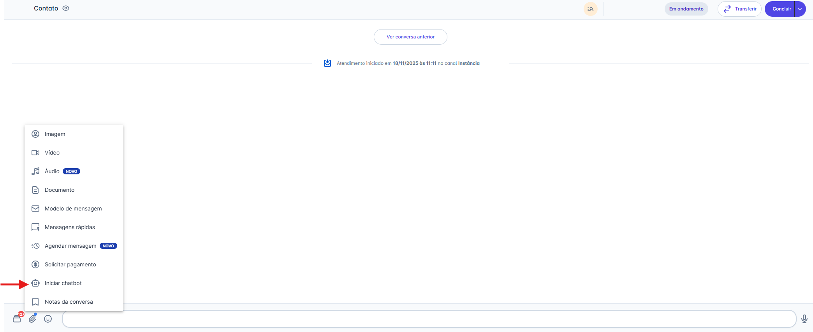
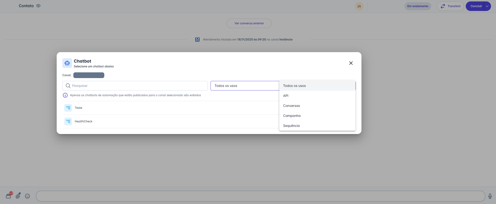
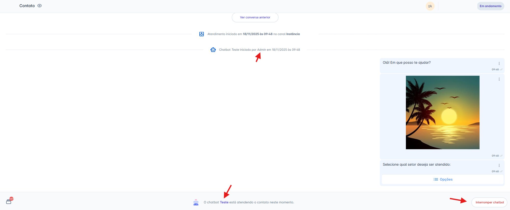
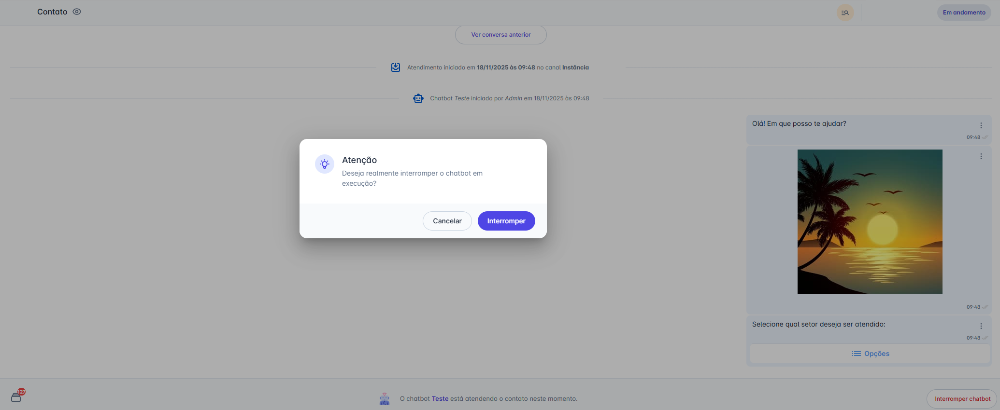
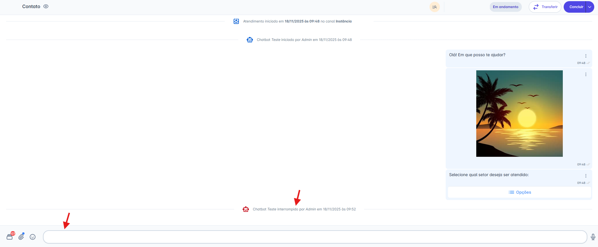
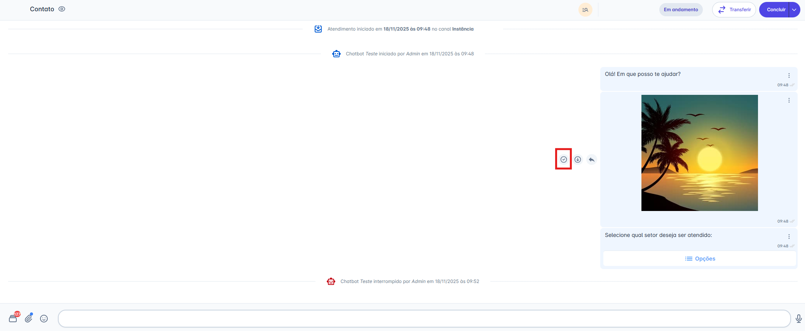
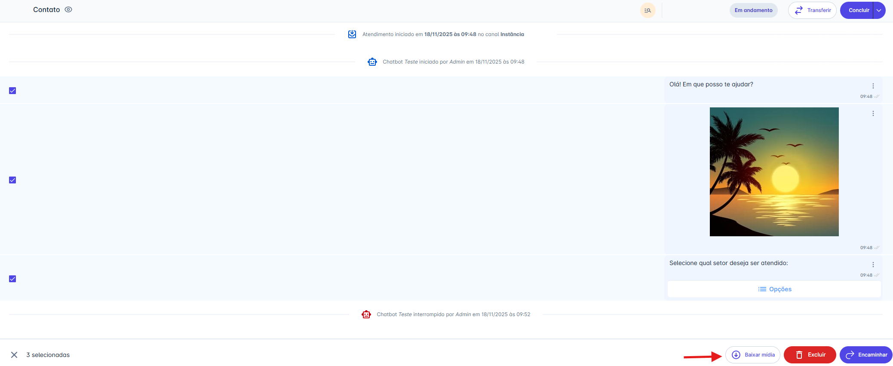
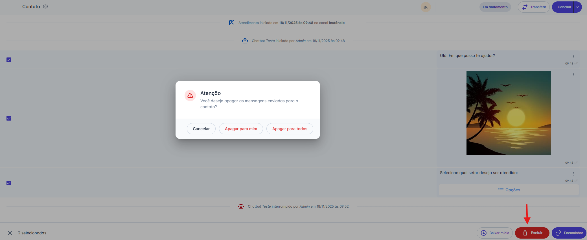
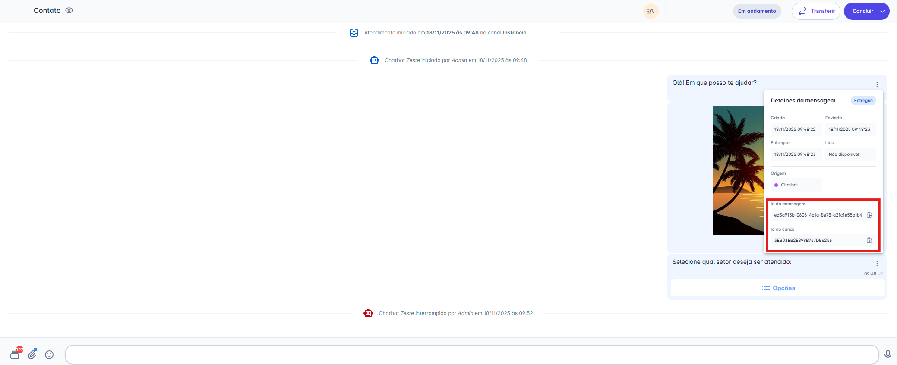

# Iniciar Chatbot

O uso de chatbots contribui para aumentar a eficiência operacional e aprimorar a experiência do usuário, permitindo responder rapidamente a dúvidas frequentes, direcionar clientes aos recursos adequados e executar tarefas simples de forma automática. Dessa forma, os agentes humanos podem focar em atendimentos que exigem análise e intervenção mais complexas.

::: tip Pré-requisitos
* Ter um chatbot do tipo **Automação** previamente criado na plataforma.
:::

## Passo 1: Acessar a Opção de Anexo

1. Com a conversa já iniciada, na tela de **Atendimentos**, selecione a conversa em que deseja enviar o chatbot.
2. Na barra de digitação, clique no **ícone de Anexo** (📎).
3. No menu exibido, selecione a opção **"Iniciar chatbot".**

## Passo 2: Selecionar e Enviar o Chatbot

Ao escolher a opção **Iniciar chatbot**, será aberto uma caixa de seleção para que você selecione o fluxo desejado.

1. Serão exibidos apenas os **chatbots de automação publicados** para o canal do atendimento.
2. A caixa de seleção inclui uma **barra de pesquisa** para localizar o chatbot pelo nome e filtros de uso: **Todos os usos**, **API**, **Conversas**, **Campanha** e **Sequência**.
3. Os chatbots disponíveis serão listados conforme o filtro aplicado.
4. Ao clicar no chatbot desejado, ele será **imediatamente enviado** na conversa e a automação será iniciada.

## Passo 3: Início do Chatbot e Opção de Interromper o Fluxo

1. Após o envio, o chatbot é iniciado automaticamente na conversa.
2. Na mensagem de transição, será exibido **qual usuário iniciou o chatbot**, garantindo rastreabilidade dentro do atendimento.
3. Durante a execução, também ficará disponível a opção **"Interromper fluxo do chatbot"**, permitindo encerrar a automação a qualquer momento.

## Passo 4: Interromper o Fluxo do Chatbot

Ao clicar em **"Interromper fluxo do chatbot"**, será exibido uma mensagem de confirmação.

Ao confirmar a ação clicando em **"Interromper"**:

* A execução do chatbot é imediatamente finalizada.
* O usuário do atendimento pode enviar mensagens normalmente.

## Passo 5: Gerenciando Mensagens Enviadas

Após a mensagem ser enviada, você terá várias opções para interagir com a mensagem diretamente na tela de atendimento:

### Ações ao Passar o Mouse

Ao passar o mouse sobre a mensagem, duas ações rápidas aparecem:

* **Responder:** Clique no ícone de seta (↩︎) para citar a mensagem em sua próxima mensagem.
* **Baixar:** Clique no ícone de download (↓) para salvar o arquivo em seu computador (Disponível apenas para mensagens que contêm arquivos.)

### Ações de Seleção

Você também pode selecionar uma ou mais mensagens clicando na caixa de seleção (checkbox) que aparece no canto. Ao fazer isso, uma barra de ações surgirá na parte inferior da tela com as seguintes opções:

* **Baixar mídia:** Faz o download de todos os itens selecionados (Disponível apenas para mensagens que contêm arquivos.)
* **Excluir:** Remove as mensagens selecionadas.
* **Encaminhar:** Envia as mensagens selecionadas para outra conversa.

### Excluindo uma Mensagem

Ao clicar em **"Excluir"** na barra de ações, um pop-up de confirmação será exibido. Você terá duas opções:

1. **Apagar para mim:** Remove a mensagem apenas da sua visualização.
2. **Apagar para todos:** Remove a mensagem para você e para o contato **(Nota: Esta opção está disponível apenas para canais da API Não Oficial).**

::: warning Restrição de Gerenciamento
Se o chatbot incluir um fluxo que utilize um Modelo de Mensagem, será possível apenas encaminhar a mensagem; não é possível selecionar ou excluir.
:::

### Detalhes da Mensagem (Avançado)

Clicando no menu de três pontos (`...`) ao lado da mensagem, você pode acessar os **"Detalhes da mensagem"**.

* Este painel mostra o status de entrega (Criado, Enviado, Entregue, Lido).
* Para usuários com perfil de **Administrador**, esta tela também exibe o **"ID da mensagem"** e o **"ID do canal"**, informações úteis para auditoria e integrações.

