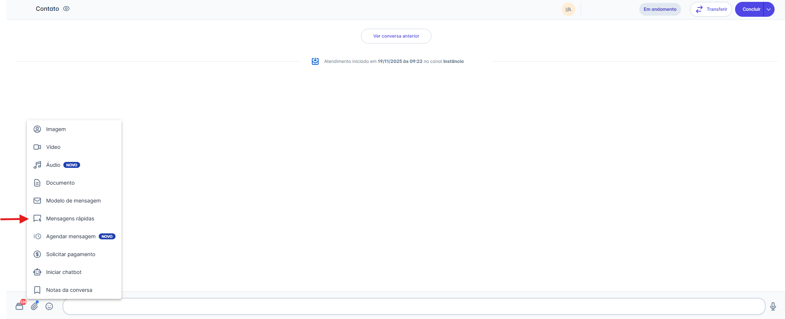
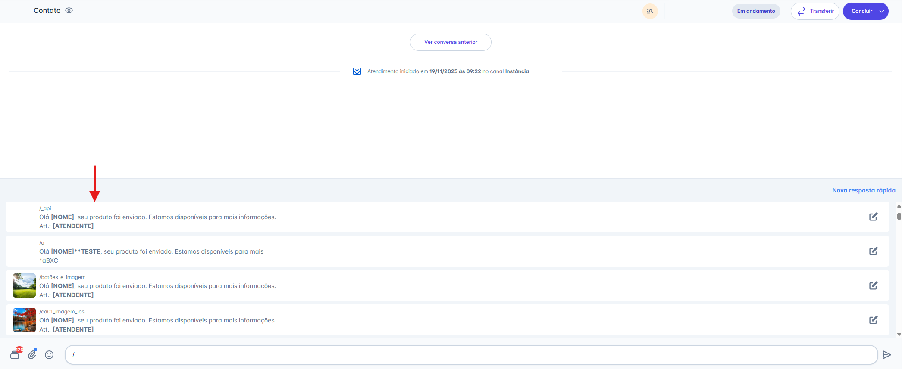
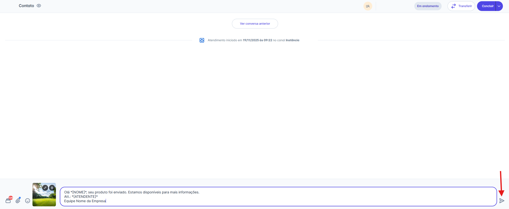
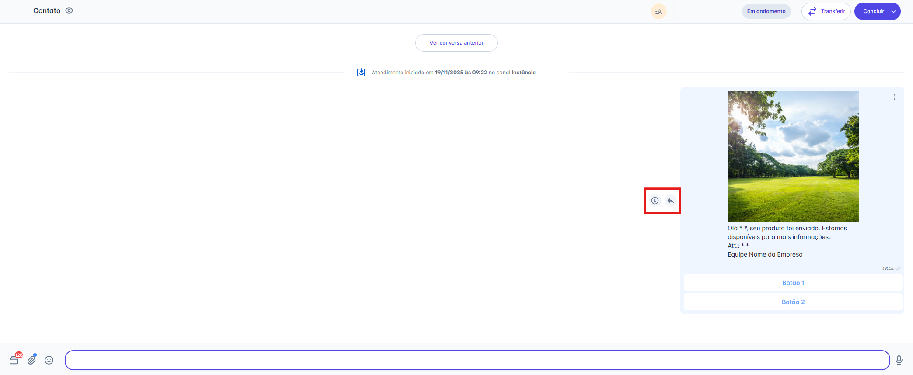
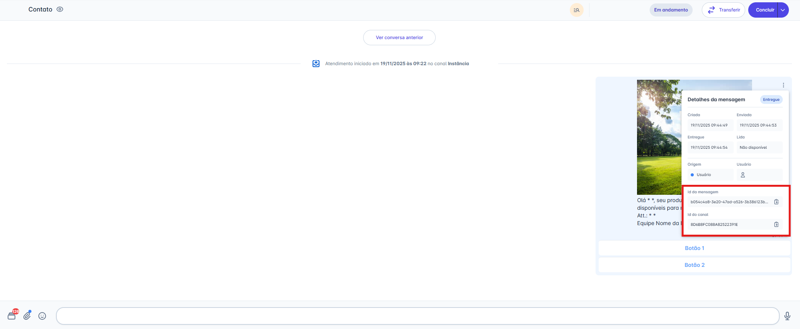
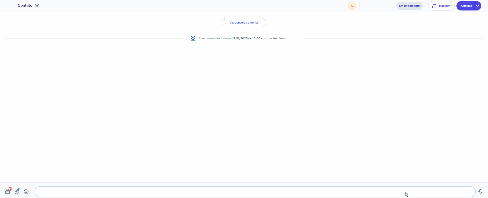

# Mensagens Rápidas

Mensagens rápidas são respostas predefinidas que podem ser inseridas instantaneamente nas conversas. Elas são extremamente úteis para responder perguntas frequentes, fornecer informações padronizadas e economizar tempo nas interações diárias.

::: tip Pré-requisitos
* Modelos de mensagens rápidas já cadastrados na plataforma.
:::

Existem duas formas de acessar e enviar suas mensagens rápidas:

## 1° Usando o Menu de Anexo

### Passo 1: Acessar a Opção de Anexo

1. Na tela de Atendimentos, abra a conversa do contato para o qual deseja enviar o modelo.
2. Na barra de digitação, clique no **ícone de Anexo** (📎).
3. No menu de opções que será exibido, escolha **"Mensagens Rápidas"**

### Passo 2: Selecionar e Enviar a Mensagem

1. Uma janela será aberta listando todas as suas mensagens rápidas.
2. Use a barra de pesquisa ou role a lista para encontrar a resposta desejada.
3. Clique na mensagem que você quer enviar.

4. A mensagem será **automaticamente inserida na barra de digitação**
5. (Opcional) Você pode editar o texto na barra de digitação antes de enviar.
6. Clique no **ícone de Envio** (➤) para enviar a mensagem.

## 2° Usando o Atalho de Barra (/)

Esta é a forma mais ágil de usar a funcionalidade.

### Passo 1: Ativar a Busca por Atalho

1. Na barra de digitação da conversa, digite uma barra (`/`)
2. Uma lista pop-up aparecerá acima da barra, mostrando suas mensagens rápidas.

### Passo 2: Filtrar e Selecionar

1. Continue digitando após a barra para filtrar a lista em tempo real (ex: `/boasvindas`)
2. Clique na mensagem desejada ou use as setas do teclado para selecionar e apertar **Enter**.

### Passo 3: Enviar a Mensagem

1. A mensagem selecionada será **automaticamente inserida na barra de digitação.**
2. (Opcional) Edite o texto se necessário.
3. Clique no **ícone de Envio** (➤)

## Passo 4: Gerenciando Mídias Enviadas

Após a resposta rápida ser enviada, você terá várias opções para interagir com ela:

### Ações na Mensagem

* **Responder:** Clique no ícone de seta (↩︎) para citar o modelo em sua próxima mensagem.
* **Baixar:** Clique no ícone de download (↓) para salvar o arquivo em seu computador

### Detalhes da Mensagem (Avançado)

Clicando no menu de três pontos (`...`) ao lado da mensagem, você pode acessar os **"Detalhes da mensagem"**.

* Este painel mostra o status de entrega (Criado, Enviado, Entregue, Lido).
* Para usuários com perfil de **Administrador**, esta tela também exibe o **"ID da mensagem"** e o **"ID do canal"**, informações úteis para auditoria e integrações.

::: warning ⚠️ Atenção: Regras para Excluir Mensagens
A capacidade de excluir mensagens enviadas depende do seu tipo de canal:

* **Canais API Oficial (Meta):** Devido às regras de conformidade da Meta, **nenhuma mensagem pode ser excluída** (nem mensagens livres, nem Modelos de Mensagem).
* **Canais API Não Oficial:** Você pode excluir mensagens livres, mas **não é possível excluir** mensagens enviadas com uma "Mensagem Rápida".
:::

## Criando e Gerenciando Respostas Rápidas

Antes de enviar, é possível criar novos modelos, visualizar detalhes ou editar respostas existentes através do menu de Mensagens Rápidas

### Para criar uma nova resposta:

1. Clique no botão **Nova resposta rápida**.
2. Preencha os campos obrigatórios e configure os Parâmetros (variáveis dinâmicas como `{{NOME}}` ou `{{ATENDENTE}}`).
3. Salve o cadastro. O modelo ficará imediatamente disponível para uso no chat.

### Para gerenciar uma resposta existente:

Ao clicar sobre um modelo na lista, você abrirá o cartão de detalhes. No rodapé desta janela, utilize as opções:

* **Editar**: Para realizar ajustes no texto ou nos parâmetros.
* **Duplicar**: Para criar uma cópia exata e agilizar a criação de variações.
* **Arquivar**: Para ocultar a resposta da lista ativa sem excluí-la do histórico.
* **Excluir**: Para remover o modelo permanentemente.

::: tip 💡 Nota: Permissões e Limites
* **Permissões:** Qualquer perfil de usuário da plataforma pode criar modelos de mensagens rápidas. Ao criar, você pode definir se o modelo será visível apenas para você, para uma equipe específica ou para todos os usuários da conta.
* **Limites:** Conforme as diretrizes da Meta, existe um limite máximo de 250 modelos por canal. Esse volume considera a soma de todos os tipos criados (incluindo Atendimento, Mensagens Rápidas, Sequências e Campanhas).
:::

::: info Nota sobre Performance e Visualização
Para garantir mais velocidade no carregamento, implementamos um cache inteligente para as Respostas Rápidas.

* **Primeiro Acesso:** Você poderá ver o status *"Sincronizando modelos de mensagem"*. Isso ocorre apenas para salvar os modelos no seu navegador. Os acessos seguintes serão instantâneos.
* **Listagem:** Inicialmente, são exibidas as 100 primeiras respostas. Para visualizar as demais, clique no botão "Carregar mais" ao final da lista.
* **Busca:** Ao alterar o termo de pesquisa, a lista volta automaticamente ao topo para facilitar a visualização dos resultados.
:::
