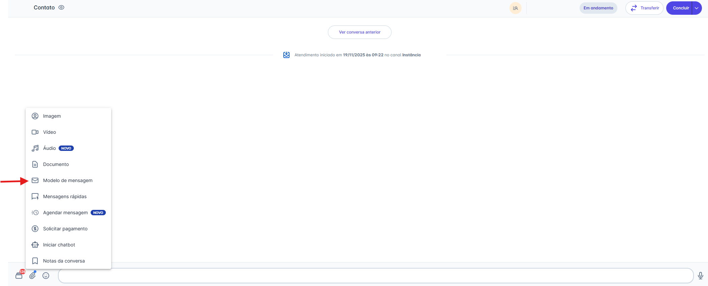
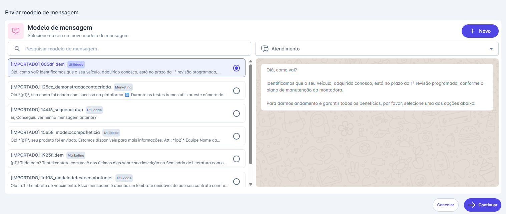
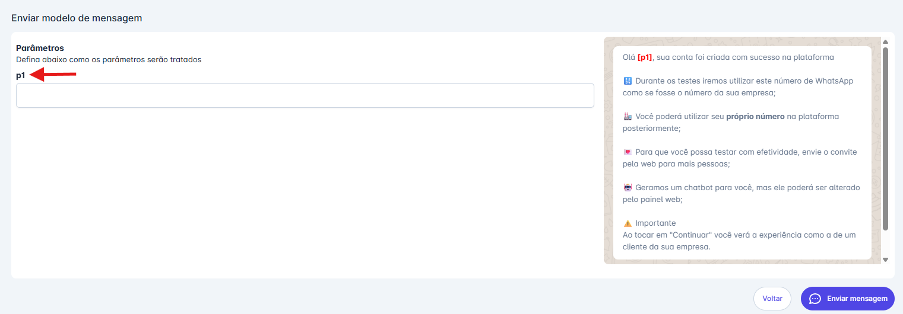
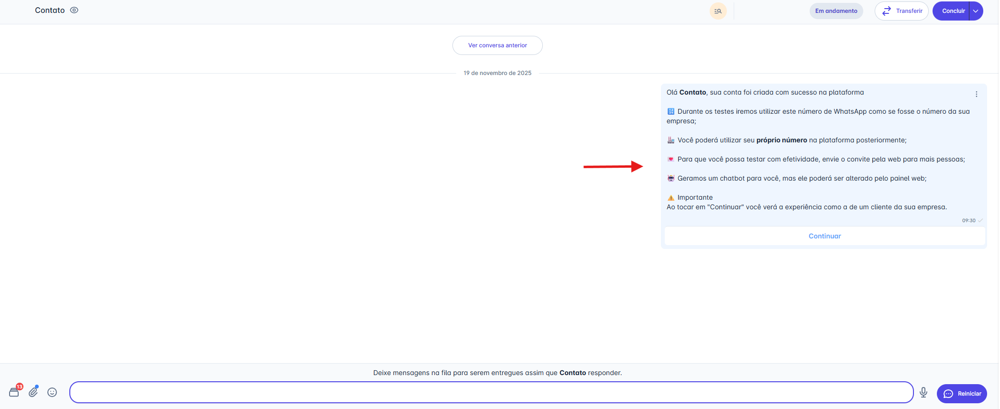
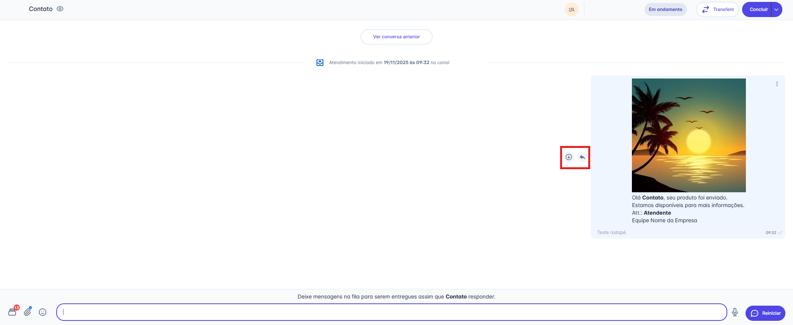
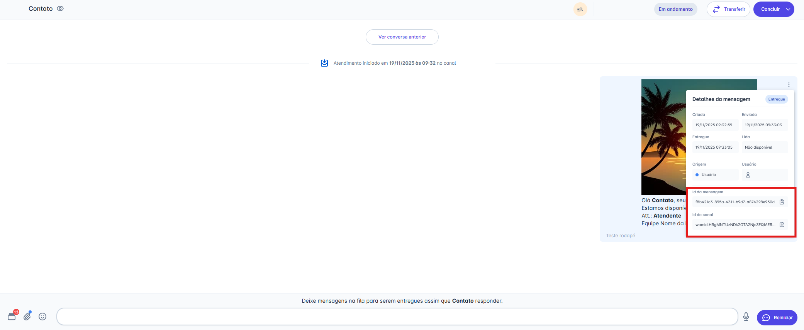

# Modelo de Mensagem

Enviar um Modelo de Mensagem é uma funcionalidade com diferentes propósitos, dependendo do seu tipo de canal:

* **Para Canais API Oficial (Meta/WhatsApp):** Esta é a **única forma permitida** de **iniciar uma conversa** com um contato ou **reiniciar um atendimento** após a janela de 24 horas ter expirado.
* **Para Canais API Não Oficial:** Você **não precisa** de um modelo para iniciar ou reiniciar uma conversa; uma mensagem livre é suficiente.

No entanto, em **ambos os tipos de canal**, você pode usar esta funcionalidade a qualquer momento *durante* um atendimento como um atalho prático para enviar mensagens padronizadas.

::: tip Pré-requisito
Ter, no mínimo, um modelo de mensagem do tipo **Atendimento** cadastrado e ativo na plataforma.
:::

## Passo 1: Acessar a Opção de Anexo

1. Na tela de Atendimentos, abra a conversa do contato para o qual deseja enviar o modelo.
2. Na barra de digitação, clique no **ícone de Anexo** (📎).
3. No menu de opções que será exibido, escolha **"Modelo de mensagem"**

## Passo 2: Selecionar o Modelo

1. Uma janela será aberta listando todos os seus modelos de mensagem aprovados.
2. Você pode usar a barra de "Pesquisar" ou o filtro de tipo (ex: Atendimento) para encontrar o modelo que deseja.
3. Selecione o modelo desejado na lista.
4. Clique em **"Continuar"** (ou "Definir parâmetros").

::: warning ⚠️ Nota: Permissão para o botão "+ Novo"
O botão **"+ Novo"**, que permite criar um novo modelo de mensagem diretamente desta tela, é visível apenas para usuários com perfil de **Administrador**.

Para os demais perfis, este botão não será exibido.
:::

## Passo 3: Preencher os Parâmetros (Se houver)

1. Se o modelo selecionado contiver variáveis (parâmetros, ex: `{{1}}` ou `[p1]`), você será levado a uma tela para preenchê-las.
2. Preencha os campos com as informações do cliente (ex: Nome, número do pedido, etc.).
3. Clique em **"Enviar Mensagem"**.

## Passo 4: Mensagem Enviada

1. O modelo de mensagem será enviado e aparecerá na janela de conversa.
2. Aguarde o contato responder para que a janela de atendimento seja aberta e você possa conversar livremente.

::: tip 💡 Nota: Entendendo a Janela de Atendimento (API Oficial do WhatsApp)
Esta funcionalidade segue as regras da **API Oficial do WhatsApp (Meta)** sobre a janela de 24 horas.

Se você usou o modelo para iniciar ou reiniciar uma conversa, a janela de atendimento (que permite o envio de mensagens livres) só será aberta **quando o contato interagir de alguma forma** (enviando uma resposta, clicando em um botão, etc.).

Se o contato não responder, a janela permanece fechada e você só poderá tentar um novo contato enviando outro Modelo de Mensagem.
:::

## Passo 5: Gerenciando Mídias Enviadas

Após o modelo de mensagem ser enviado, você terá várias opções para interagir com ele:

### Ações na Mensagem

* **Responder:** Clique no ícone de seta (↩︎) para citar o modelo em sua próxima mensagem.
* **Baixar:** Clique no ícone de download (↓) para salvar o arquivo em seu computador

### Detalhes da Mensagem (Avançado)

Clicando no menu de três pontos (`...`) ao lado da mensagem, você pode acessar os **"Detalhes da mensagem"**.

* Este painel mostra o status de entrega (Criado, Enviado, Entregue, Lido).
* Para usuários com perfil de **Administrador**, esta tela também exibe o **"ID da mensagem"** e o **"ID do canal"**, informações úteis para auditoria e integrações.

::: warning ⚠️ Atenção: Regras para Excluir Mensagens
A capacidade de excluir mensagens enviadas depende do seu tipo de canal:

* **Canais API Oficial (Meta):** Devido às regras de conformidade da Meta, **nenhuma mensagem pode ser excluída** (nem mensagens livres, nem Modelos de Mensagem).
* **Canais API Não Oficial:** Você pode excluir mensagens livres, mas **não é possível excluir** mensagens enviadas com um "Modelo de Mensagem" (template).
:::
