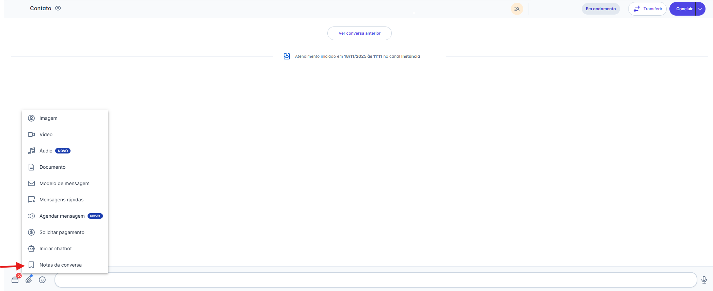
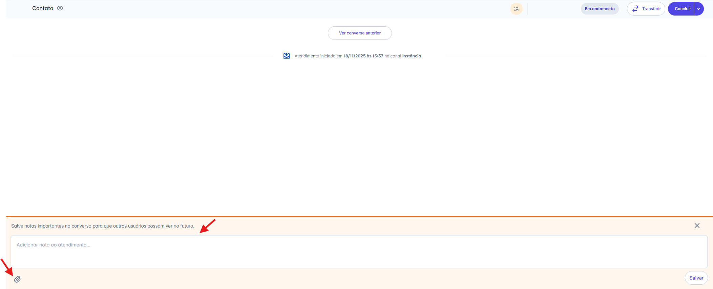
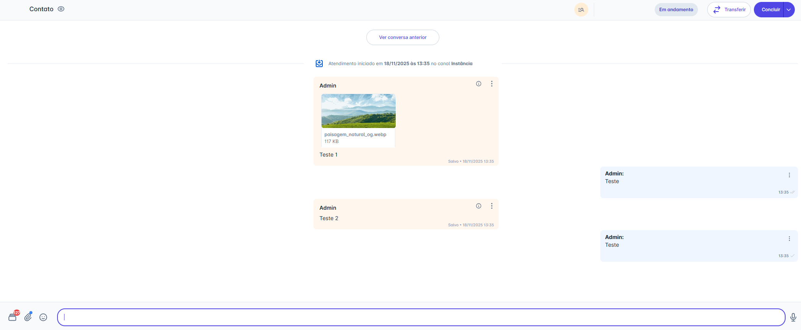
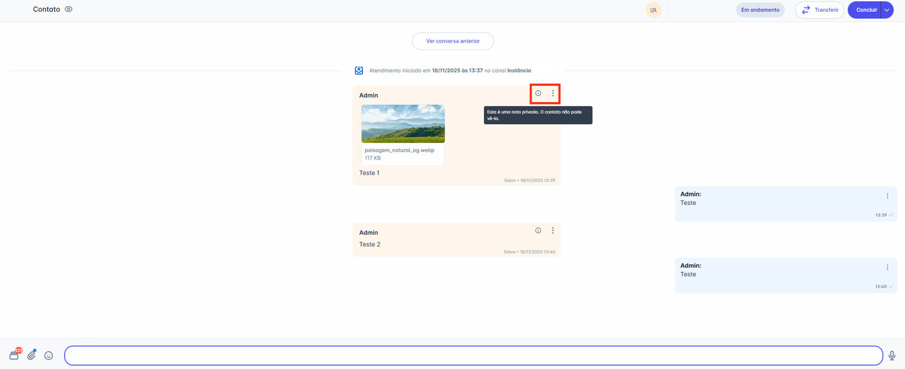
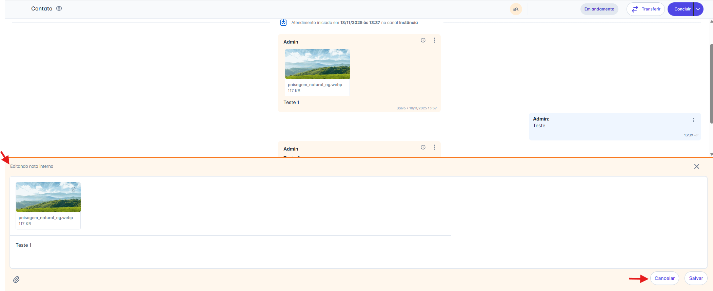
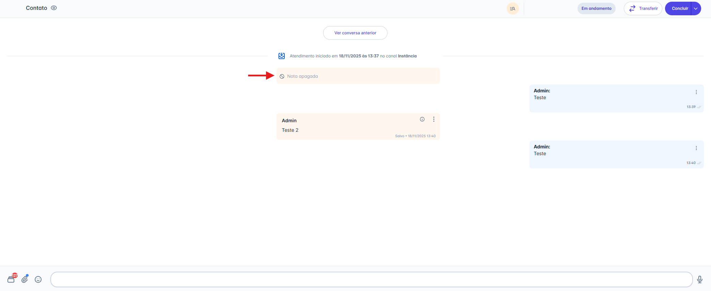

# Notas da Conversa

As **Notas Internas** permitem que os atendentes registrem informações relevantes diretamente na conversa, sem que o cliente tenha acesso. Essa funcionalidade ajuda a organizar o atendimento, facilita a colaboração entre a equipe e mantém um histórico centralizado, garantindo um suporte mais eficiente e transparente.

## Passo 1: Acessar a Opção de Anexo

1. Na tela de Atendimentos, selecione a conversa para a qual deseja adicionar a nota.
2. Na barra de digitação, clique no **ícone de Anexo** (📎).
3. No menu de opções que será exibido, escolha **"Notas da conversa".**

## Passo 2: Escrever e adicionar a nota na conversa

Ao selecionar a opção **Notas da conversa**, será exibida uma barra inferior onde você poderá digitar a nota que deseja registrar no atendimento.

* Na barra, haverá um ícone de **anexo**. Ao clicar nele, serão exibidas as opções **Imagem**, **Vídeo** e **Documento**, permitindo incluir arquivos na nota.

Após escrever e salvar, a nota será imediatamente adicionada e exibida na linha do tempo da conversa.

* As notas seguem a ordem cronológica da conversa, sendo posicionadas exatamente no ponto em que foram registradas.
* Na parte superior da nota, é exibido o nome do usuário que a adicionou.

## Passo 3: Editar ou excluir uma nota

Cada nota exibe dois ícones:

* Um ícone de informação, exibindo a mensagem que a nota é privada e não é visível para o contato.
* O ícone de **três pontos**, que abre as opções **Editar** e **Excluir**.

::: warning Regras de Permissão

**Administrador**
* Pode **excluir qualquer nota**, a qualquer momento.
* Pode **editar apenas as próprias notas**, sem limite de tempo.

**Atendente Supervisor, Atendente e Atendente Restrito**
* Podem **editar ou excluir somente as próprias notas**.
* A edição ou exclusão só é permitida **dentro de até 2 horas** após a criação da nota.
* Após esse prazo, **nenhuma ação** (editar/excluir) é permitida.
:::

### Editar uma nota

Ao selecionar **Editar**, a barra inferior é exibida novamente, permitindo alterar o texto da nota interna.

* Caso haja um arquivo, é possível alterá-lo ou excluí-lo.
* Ao clicar em **Cancelar**, a barra é fechada sem aplicar alterações.
* Ao clicar em **Salvar**, a edição é registrada e a nota é atualizada na conversa.

### Excluir uma nota

Ao selecionar **Excluir**, a nota é removida e substituída pela mensagem "Nota apagada".

