# Solicitar Pagamento

A funcionalidade de solicitação de pagamentos permite agilizar e simplificar o processo de cobrança diretamente pela plataforma. Neste artigo, você encontrará um passo a passo detalhado para solicitar pagamentos durante um atendimento, garantindo maior eficiência e controle sobre suas transações.

::: tip Pré-requisito
* O módulo Asaas precisa estar habilitado e corretamente configurado na plataforma.
:::

## Passo 1: Acessar a Opção de Anexo

1. Na tela de Atendimentos, selecione a conversa em que deseja enviar a solicitação de pagamento.
2. Na barra de digitação, clique no **ícone de Anexo** (📎).
3. No menu exibido, selecione a opção **"Solicitar pagamento".**

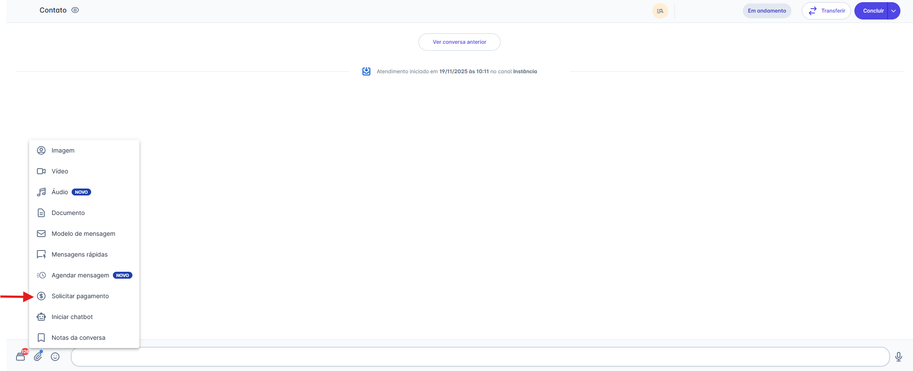

## Passo 2: Configurar o Pagamento

Ao selecionar a opção de solicitação, será aberto um caixa de seleção para preenchimento das informações da cobrança. Ele é dividido em três abas: Pagamento, Dados do cliente e Endereço do cliente.

### Aba: Pagamento

1. Informe o **valor** a ser cobrado.
2. Escolha a **forma de pagamento**:
   * Cartão de crédito (até 9 parcelas)
   * Pix
   * Boleto
3. (Opcional) Adicione uma **descrição** da cobrança.
4. Defina a **data de vencimento/limite** para o pagamento.

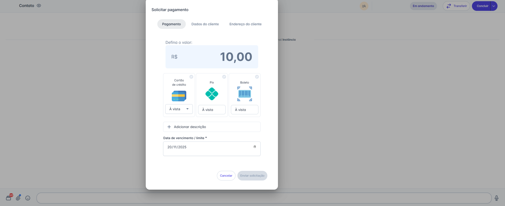

### Aba: Dados do Cliente

1. Se já houver uma solicitação anterior para o mesmo contato, os dados serão carregados automaticamente.
2. Caso deseje, é possível editar as informações clicando em **"Alterar dados"**.
3. Você também pode optar por solicitar que o cliente preencha esses dados no momento do pagamento, marcando o checkbox **"Solicitar dados do cliente no momento do pagamento"**.

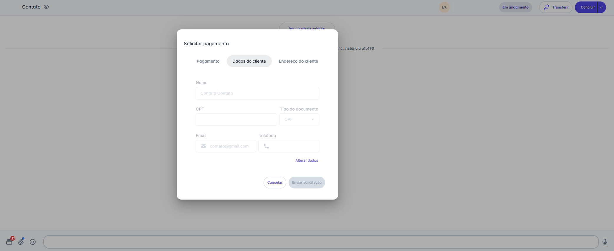

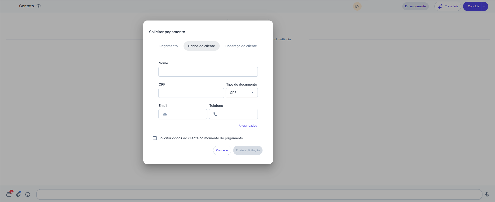

### Aba: Endereço do Cliente

1. Assim como nos dados pessoais, se já houver um endereço utilizado anteriormente, ele será carregado.
2. É possível editar as informações clicando em **"Alterar dados"**.
3. Para permitir que o cliente preencha o endereço no momento do pagamento, marque o checkbox **"Solicitar dados do cliente no momento do pagamento"**.

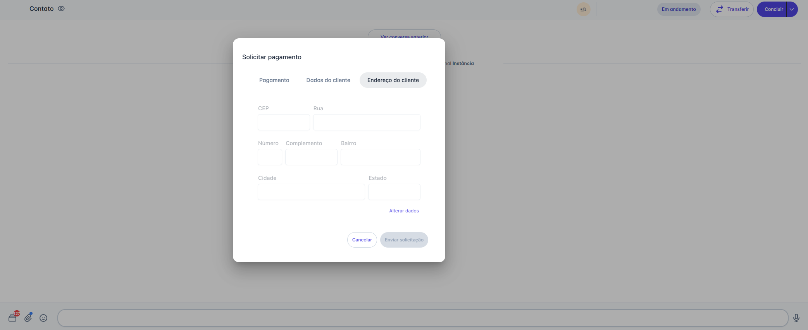

### Finalização da solicitação

Após preencher todos os campos obrigatórios, o botão **"Enviar solicitação"** será habilitado. Basta clicar nele para enviar a cobrança ao contato.

## Passo 3: Visualizar detalhes da solicitação

Após enviada, a mensagem exibirá o status **"Solicitado"** e o botão **"Ver detalhes"**.

Ao clicar em **"Ver detalhes"**, será aberto uma caixa de informação com:

1. Descrição da cobrança
2. Dados do cliente
3. Valor e forma de pagamento
4. Botão **"Cancelar solicitação"**
5. Histórico de ações
6. Botão **"Fechar"**
7. Botão **"Abrir pagamento"**

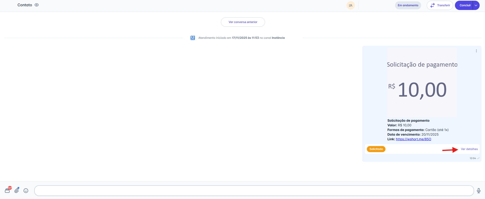

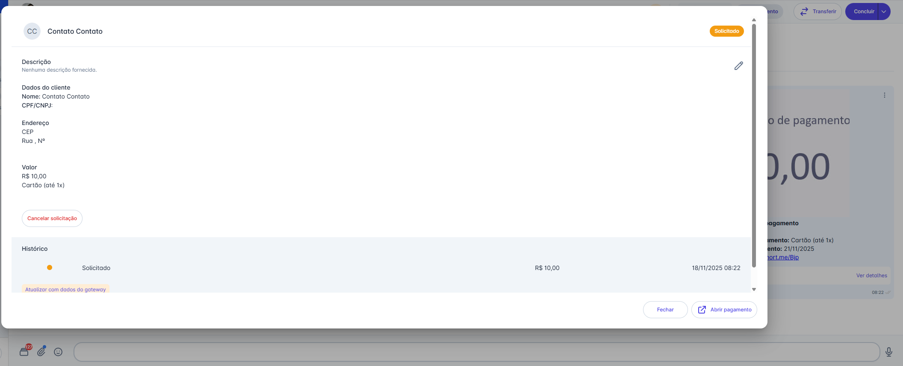

### Botão: Cancelar Solicitação

Ao clicar em **"Cancelar solicitação"**, será exibido uma mensagem de confirmação. Quando confirmado:

* O histórico é atualizado com o registro de cancelamento.
* O status da mensagem passa a ser **"Cancelado"**.
* O link para pagamento exibirá a mensagem **"A solicitação de pagamento foi cancelada"**.

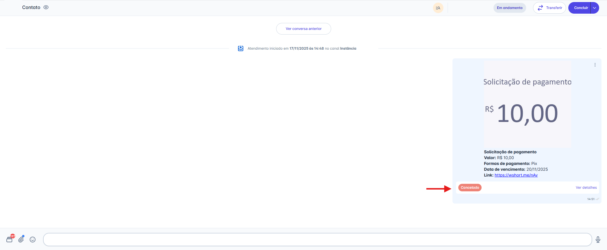

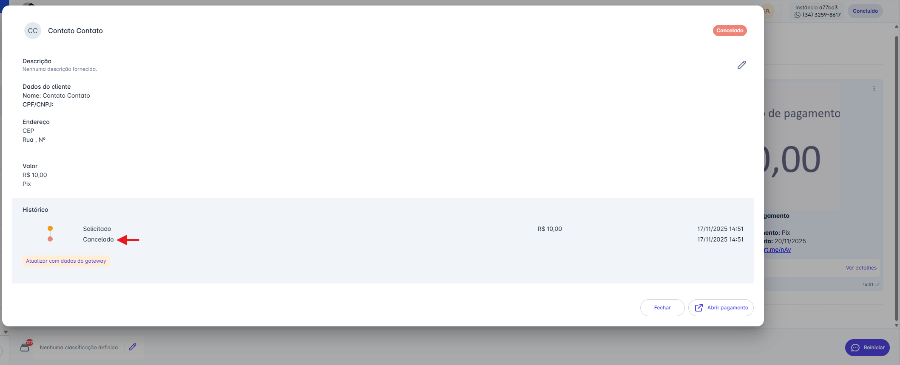

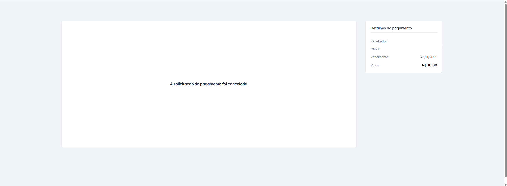

### Botão: Abrir Pagamento

Ao clicar em **"Abrir pagamento"**, duas opções serão exibidas:

* **Abrir aqui** → A tela é atualizada para a página de **Pagamentos**, com o painel lateral mostrando os detalhes da cobrança.
* **Abrir em uma nova aba** → A página de **Pagamentos** será aberta em uma nova aba do navegador.

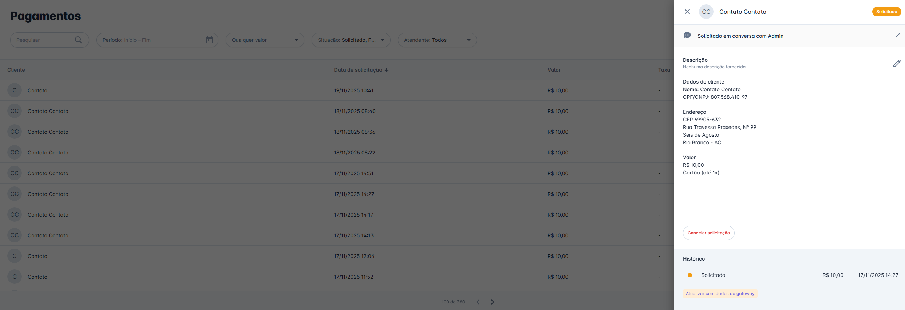

## Visualização do Link de Pagamento

O contato receberá uma mensagem com o link direto para realizar o pagamento. Abaixo estão os fluxos conforme o método escolhido.

### 1. Pagamento com Cartão

1. A primeira tela exibe a seleção da forma de pagamento.
2. Após avançar, o cliente preencherá os dados de **Identificação (nome, CPF/CNPJ, e-mail e telefone)**.
   * Se esses dados foram informados na solicitação, aparecerão preenchidos, mas podem ser alterados.
3. Na etapa seguinte, será solicitado o **endereço**.
   * Assim como os dados de identificação, o endereço também será preenchido automaticamente caso tenha sido informado na solicitação, e o cliente poderá editar se necessário.
4. Por fim, o cliente informará os **dados do cartão de crédito**.
5. Ao clicar em **"Pagar agora"**, o pagamento será processado.

### 2. Pagamento com Pix

1. A primeira tela exibe a seleção da forma de pagamento.
2. Na etapa de Identificação, ele informa **nome** e **CPF/CNPJ** (carregados automaticamente se enviados na solicitação).
3. Ao clicar em **"Pagar com pix"**, será gerado um **QR Code** ou código copia e cola.
4. Assim que o pagamento for confirmado, a página é automaticamente atualizada.

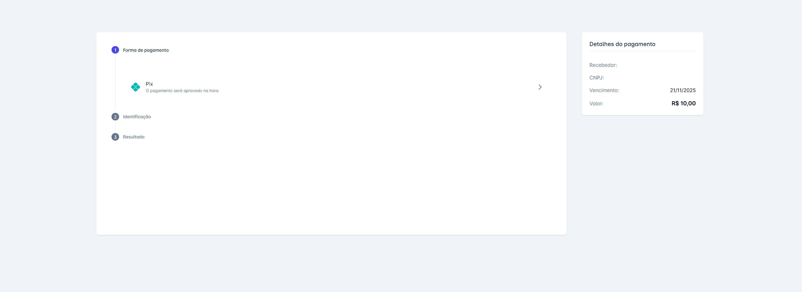

### 3. Pagamento com Boleto

1. O cliente seleciona Boleto como forma de pagamento.
2. Na etapa de Identificação, ele insere **nome** e **CPF/CNPJ** (também preenchidos automaticamente quando disponíveis).
3. Ao clicar em **"Gerar boleto bancário"**, o documento será criado.
4. O cliente poderá clicar em **"Abrir boleto"** para visualizar o PDF em uma nova aba.

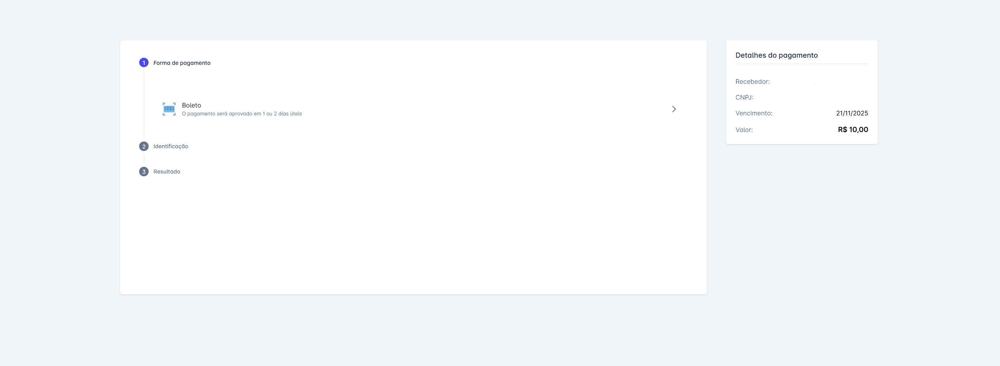

## Passo 4: Gerenciando Pagamentos Enviados

Após a solicitação de pagamento ser enviada, você terá várias opções para interagir com a mensagem diretamente na tela de atendimento:

### Ações ao Passar o Mouse

Ao passar o mouse sobre a mensagem de pagamento, duas ações rápidas aparecem:

* **Responder:** Clique no ícone de seta (↩︎) para citar a solicitação em sua próxima mensagem.
* **Baixar:** Clique no ícone de download (↓) para salvar a imagem da solicitação em seu computador.

### Ações de Seleção

Você também pode selecionar uma ou mais mensagens clicando na caixa de seleção (checkbox) que aparece no canto. Ao fazer isso, uma barra de ações surgirá na parte inferior da tela com as seguintes opções:

* **Baixar mídia:** Faz o download de todos os itens selecionados.
* **Encaminhar:** Envia as mensagens selecionadas para outra conversa.
* **Excluir:** Remove as conversas selecionadas.

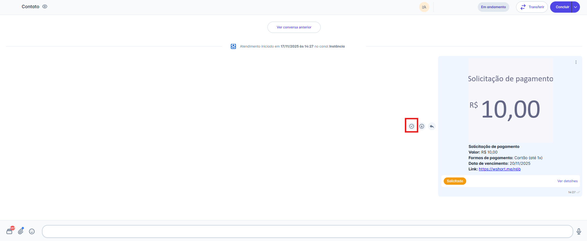

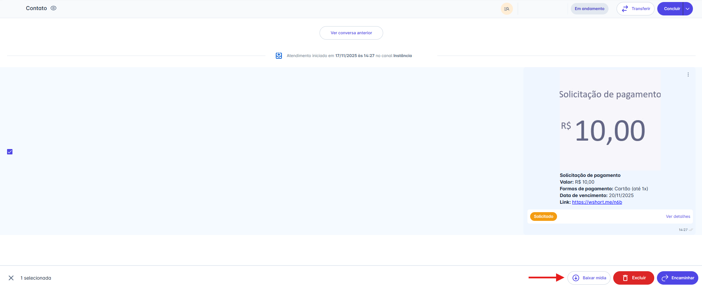

### Excluindo uma Mensagem

Ao clicar em **"Excluir"** na barra de ações, um pop-up de confirmação será exibido. Você terá duas opções:

1. **Apagar para mim:** Remove a mensagem apenas da sua visualização.
2. **Apagar para todos:** Remove a mensagem para você e para o contato **(Nota: Esta opção está disponível apenas para canais da API Não Oficial).**

### Detalhes da Mensagem (Avançado)

Clicando no menu de três pontos (`...`) ao lado da mensagem, você pode acessar os **"Detalhes da mensagem"**.

* Este painel mostra o status de entrega (Criado, Enviado, Entregue, Lido).
* Para usuários com perfil de **Administrador**, esta tela também exibe o **"ID da mensagem"** e o **"ID do canal"**, informações úteis para auditoria e integrações.

::: info Considerações Adicionais
Qualquer negociação relacionada a taxas, tarifas ou valores aplicados às cobranças deve ser realizada diretamente com o **Asaas**, responsável pelo processamento dos pagamentos.
:::
