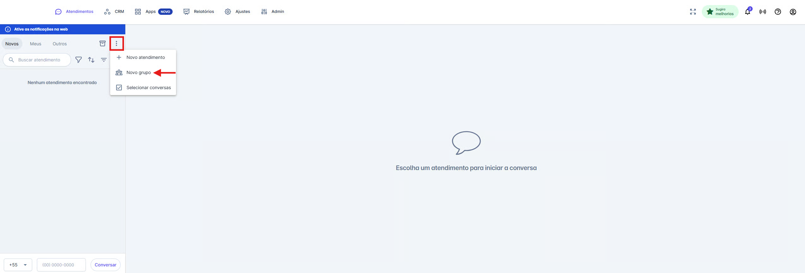
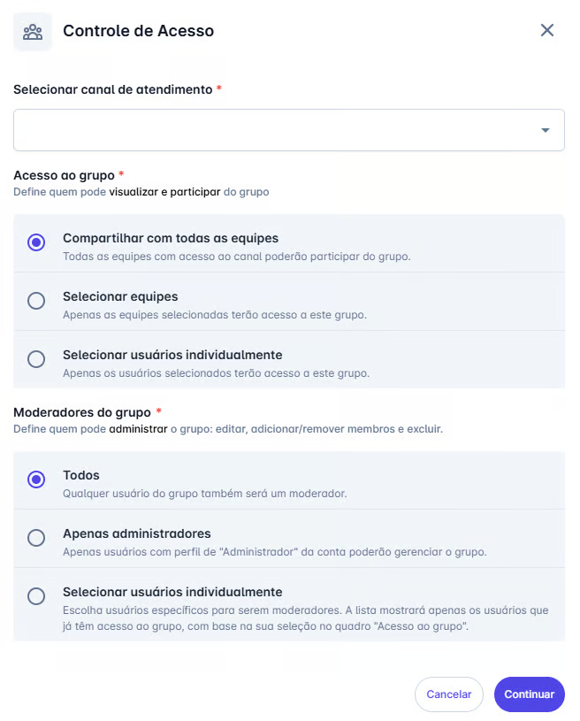
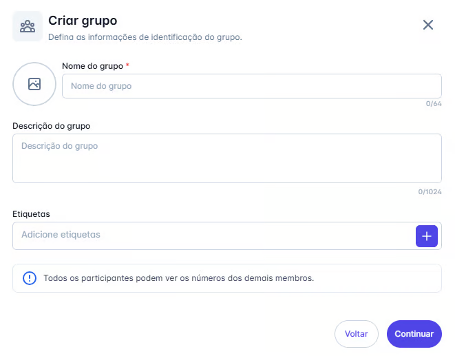
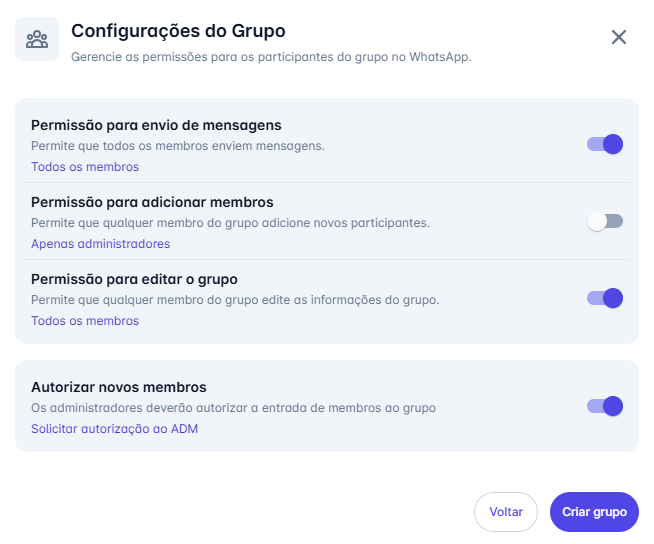
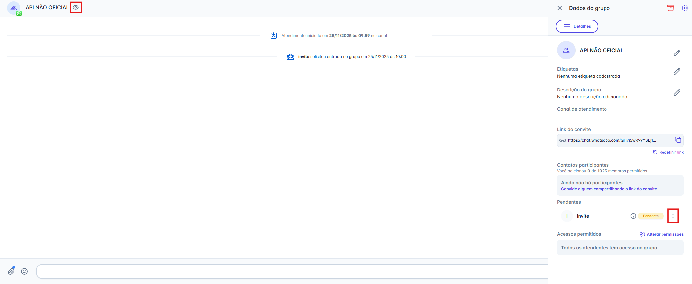
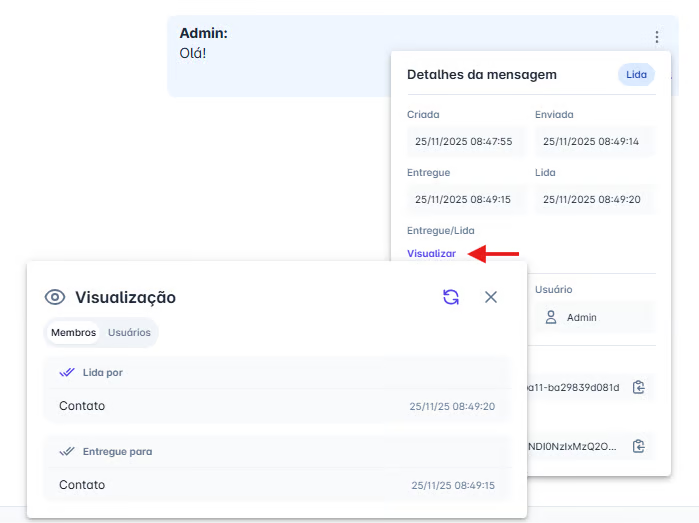
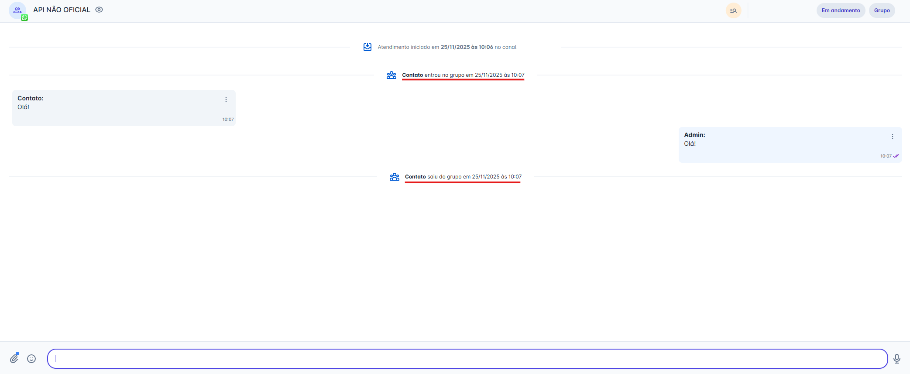

# Criar Grupos (API Não Oficial)

A utilização de grupos contribui significativamente para a eficiência da comunicação, permitindo uma organização mais estruturada e colaborativa entre equipes, setores e fluxos de atendimento.

::: tip Pré-requisitos
* Possuir acesso à plataforma com perfil de administrador.
* Ter a funcionalidade devidamente habilitada na plataforma.
:::

## Passo 1: Iniciar a criação de um novo grupo

1. Na tela **Atendimentos**, clique nos **três pontos** ( **⋮** ) localizados no topo da lista de conversas.
2. No menu exibido, selecione **"Novo grupo"**.

## Passo 2: Configurar o controle de acesso

Ao selecionar **"Novo grupo"**, será exibido um painel para definir quem poderá visualizar e interagir com o grupo na plataforma.

1. **Selecionar canal de atendimento:** Escolha o canal da **API Não Oficial** que será utilizado como criador do grupo.
2. **Acesso ao grupo:** Defina quem terá permissão para acessar o grupo:
   * Todas as equipes,
   * Equipes específicas, ou
   * Usuários selecionados individualmente.
3. **Moderadores do grupo:** Escolha quem poderá administrar o grupo (editar, adicionar/remover membros e excluir). A lista de moderadores disponíveis será filtrada conforme o acesso definido na etapa anterior.

## Passo 3: Definir as informações de identificação do grupo

Após configurar o controle de acesso e clicar em **Continuar**, será exibida um novo painel para definir os dados do grupo:

1. **Nome do grupo** - obrigatório.
2. **Foto do grupo** - opcional.
3. **Descrição do grupo** - opcional.
4. **Etiquetas do grupo** - opcionais.

## Passo 4: Definir as Configurações do Grupo

Na última etapa da criação, o sistema exibirá o painel **"Configurações do Grupo"**. Essa tela é essencial para definir as permissões e o modo de funcionamento do novo grupo.

No painel, você poderá configurar as seguintes opções:

1. **Permissão para envio de mensagens**
   Escolha quem poderá enviar mensagens no grupo:
   * **Todos os membros**, ou
   * **Apenas administradores**.

2. **Permissão para adicionar membros**
   Defina quem pode incluir novos participantes:
   * **Todos os membros**, ou
   * **Apenas administradores**.

3. **Permissão para editar o grupo**
   Determine quem poderá editar as informações do grupo (nome, imagem, descrição):
   * **Todos os membros**, ou
   * **Somente administradores**.

4. **Autorizar novos membros**
   Ative essa opção caso deseje que a entrada de novos participantes **exija aprovação de um administrador**, garantindo maior controle sobre a composição do grupo.

Após ajustar todas as configurações conforme sua necessidade, clique em **"Criar grupo"** para concluir o processo.

## Passo 5: Gerenciar um grupo existente

Após a criação do grupo, diversas opções de gerenciamento ficam disponíveis para controle e manutenção do seu funcionamento.

### Acessar os detalhes do grupo

Com a conversa do grupo aberta, clique no ícone **Ver detalhes do grupo**  no cabeçalho. Isso abrirá o painel lateral **"Dados do grupo"**, onde todas as ações de administração estarão centralizadas.

### Opções de gerenciamento no painel "Dados do grupo"

1. **Edição de informações**
   * Alterar **nome**, **foto**, **etiquetas** e **descrição** do grupo.

2. **Gestão do link de convite**
   * **Copiar link de convite** para envio a novos participantes.
   * **Redefinir link**, invalidando o atual e gerando um novo (recomendado para reforçar a segurança).

3. **Alterar Configurações do Grupo**
   * No topo do painel, clique no ícone  para reabrir o painel **Configurações do Grupo**, permitindo ajustar permissões e comportamentos definidos na criação.

4. **Alterar acessos e permissões**
   * Na parte inferior do painel, clique no ícone  **"Alterar Permissões"** para reabrir o painel de **Controle de Acesso**, onde é possível revisar quem pode visualizar e interagir com o grupo na plataforma.

5. **Ações de Arquivamento**
   No topo do painel, clique no ícone  **Ações de Arquivamento**, onde você poderá:
   * **Arquivar**
   * **Bloquear**
   * **Sair**
   * **Excluir**

### O que cada ação faz?

* **Arquivar:** Move a conversa para a seção **Concluídos**. Se novas mensagens forem enviadas no grupo, ele será reaberto automaticamente. *(A ação não afeta o grupo no WhatsApp, apenas na plataforma.)*
* **Bloquear:** Impede o envio e o recebimento de mensagens na plataforma. A conversa será movida para **Concluídos**, podendo ser desbloqueada posteriormente. *(Também não afeta o WhatsApp.)*
* **Sair:** Remove **somente o canal de atendimento** do grupo. A conversa será movida para **Concluídos**, ficando disponível apenas para consulta. *(Essa ação é irreversível e também será refletida no WhatsApp.)*
* **Excluir:** Remove o grupo para todos os participantes. A conversa será movida para **Concluídos** e ficará apenas para consulta. *(Essa ação é irreversível e também será refletida no WhatsApp.)*

### Gerenciando os membros do grupo

Para administrar os participantes, acesse a lista de membros no painel lateral e clique no menu de três pontos ( **⋮** ) ao lado de cada contato. As opções exibidas variam conforme o status do participante.

**Para membros com entrada *Pendente*:**
* **Visualizar contato:** abre os detalhes do contato.
* **Autorizar entrada:** aprova a solicitação e adiciona o membro ao grupo.
* **Remover:** recusa a entrada do contato.

**Para membros já participantes do grupo:**
* **Visualizar contato:** abre os detalhes do contato.
* **Promover a Admin de grupo:** concede permissões administrativas.
* **Remover:** exclui o membro do grupo.

**Para membros que já são administradores:**
* **Remover Acesso de Admin:** retira as permissões de administrador, convertendo-o em membro comum.

## Passo 5: Visualizar a entrega e a leitura das mensagens

Após o envio, é possível verificar para quem a mensagem foi entregue e quem já visualizou.

1. Na mensagem enviada, clique no menu de **três pontos** ( **⋮** ) ao lado direito.
2. Nas informações da mensagem, em **Entregue/Lida**, clique em **"Visualizar"**.
3. Será aberta a janela de **Visualização**, com duas abas:
   * **Aba "Membros":** Exibe o status da mensagem para os contatos finais no WhatsApp. Mostra quem recebeu (**Entregue para**) e quem leu (**Lida por**) a mensagem.
   * **Aba "Usuários":** Exibe o status dentro da plataforma, mostrando quais atendentes visualizaram a mensagem internamente.

### Notificações de Alteração de Membros

Para garantir total transparência, sempre que houver mudanças nos participantes do grupo, o sistema registrará automaticamente essas ações no histórico da conversa.

Uma mensagem de sistema será exibida informando quando um membro **entrou** ou **saiu** do grupo, conforme o exemplo abaixo:

::: warning Regras de Funcionamento para Grupos (API Não Oficial)
Ao utilizar a funcionalidade de Grupos em um canal conectado à **API Não Oficial do WhatsApp**, é importante conhecer as regras e limitações específicas desse modelo de integração:

**1. Limite de Participantes**
Cada grupo pode ter **até 1024 números participantes**, sendo:
* **1023 membros** (contatos)
* **1 número da sua empresa** (o canal conectado ao grupo)

**2. Método de Entrada no Grupo**
A entrada de novos membros ocorre **exclusivamente** por meio do **link de convite**.
* Não é possível adicionar participantes manualmente.

**3. Restrição Após Remoção**
Se um membro for removido do grupo por um moderador:
* **Ele não poderá retornar ao grupo**, mesmo que utilize o link de convite.
* A restrição é definitiva para aquele grupo específico.

**4. Sincronização Automática de Grupos**
Ao conectar um novo canal do WhatsApp à plataforma:
* Todos os grupos dos quais o número já participa são **sincronizados gradualmente em segundo plano**.
* Durante esse processo, esses grupos aparecerão na aba **"Novos"**. Eles permanecerão lá até que um administrador **configure as permissões e controles de acesso** do grupo na plataforma.
* Caso um canal de atendimento seja removido, todos os grupos associados a ele serão automaticamente arquivados.
* Quando um grupo de um canal for sincronizado, o link de convite não será criado automaticamente. Nesses casos, o usuário deverá clicar em "Redefinir link" para gerar um novo link de convite.
:::

::: info Funcionalidades em Conversas de Grupo
Ao interagir em grupos, o menu de ações (ícone de anexo 📎) possui comportamentos específicos:

* 🚫 **Indisponível:** Não é possível Agendar Mensagens, Solicitar Pagamentos ou Iniciar Chatbots.
* ✅ **Disponível:** O envio de mídias (imagens, vídeos, áudios, documentos), Modelos de mensagem, Respostas rápidas e Notas internas continua funcionando normalmente.
:::
