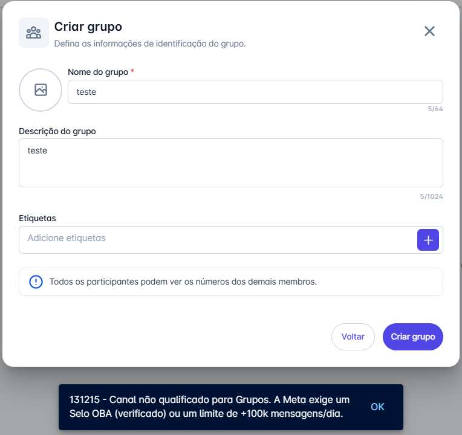
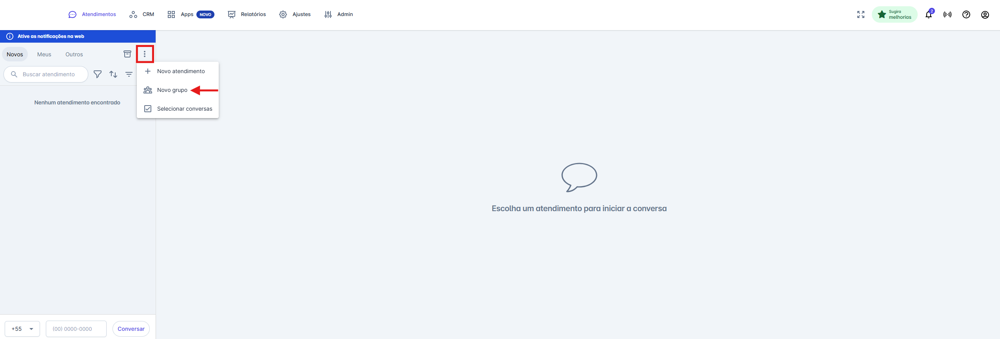
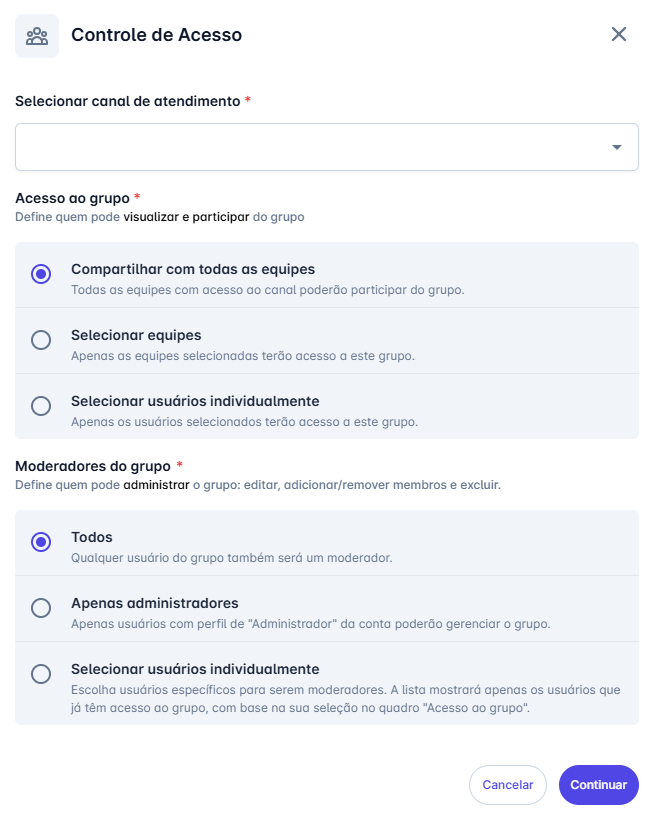
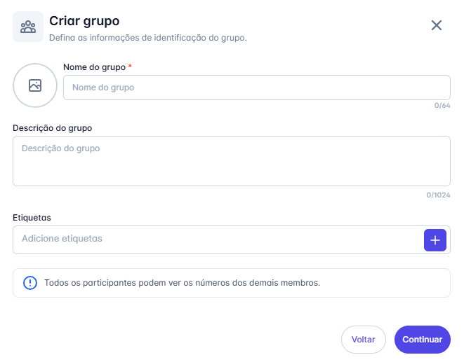
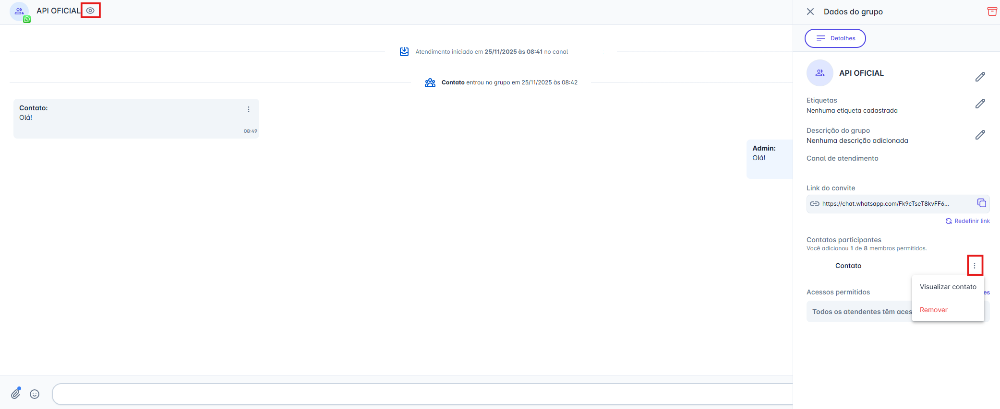
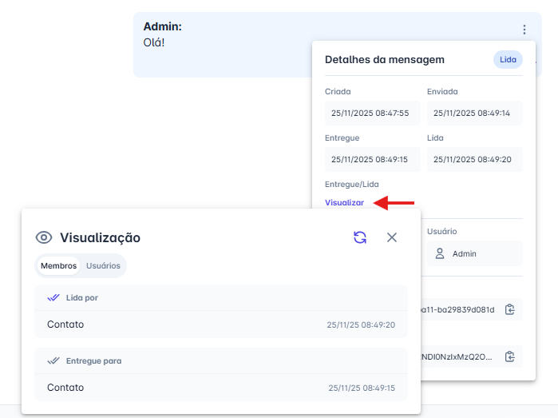
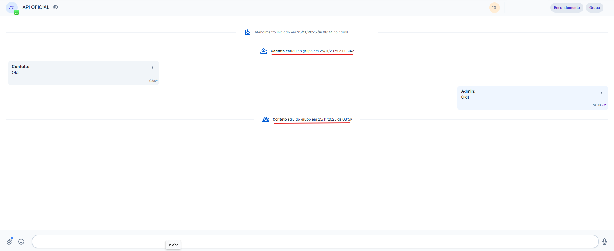

# Criar Grupos (API Oficial)

A utilização de grupos contribui significativamente para a eficiência da comunicação, permitindo uma organização mais estruturada e colaborativa entre equipes, setores e fluxos de atendimento.

::: warning Regra de Elegibilidade da Meta (Requisito Obrigatório)
A Meta estabelece critérios específicos para a criação de Grupos nos canais que utilizam a API Oficial do WhatsApp. Para que o grupo seja criado, o seu canal precisa atender a **pelo menos um** dos requisitos abaixo:

* **Possuir o Selo de Conta Verificada (OBA – Official Business Account)**.
* **Ter um alto volume de mensagens**, acima de **100.000 mensagens por dia**.

Caso o seu canal **não atenda a esses critérios**, a criação de Grupos **não poderá ser concluída**, e o sistema exibirá a seguinte mensagem de aviso:

:::

::: tip Pré-requisitos
* Possuir acesso à plataforma com perfil de administrador.
* Ter a funcionalidade devidamente habilitada na plataforma.
:::

## Passo 1: Iniciar a criação de um novo grupo

1. Na tela **Atendimentos**, clique nos **três pontos** ( **⋮** ) localizados no topo da lista de conversas.
2. No menu exibido, selecione **"Novo grupo"**.

## Passo 2: Configurar o controle de acesso

Ao selecionar **"Novo grupo"**, será exibido um painel para definir quem poderá visualizar e interagir com o grupo na plataforma.

1. **Selecionar canal de atendimento:** Escolha o canal da **API Oficial** que será utilizado como criador do grupo.
2. **Acesso ao grupo:** Defina quem terá permissão para acessar o grupo:
   * Todas as equipes,
   * Equipes específicas, ou
   * Usuários selecionados individualmente.
3. **Moderadores do grupo:** Escolha quem poderá administrar o grupo (editar, adicionar/remover membros e excluir). A lista de moderadores disponíveis será filtrada conforme o acesso definido na etapa anterior.

## Passo 3: Definir as informações de identificação do grupo

Após configurar o controle de acesso e clicar em **Continuar**, será exibida um novo painel para definir os dados do grupo:

1. **Nome do grupo** - obrigatório.
2. **Foto do grupo** - opcional.
3. **Descrição do grupo** - opcional.
4. **Etiquetas do grupo** - opcionais.

Ao clicar em **"Criar grupo"**, ele será adicionado automaticamente à sua lista de atendimentos.

## Passo 4: Gerenciar um grupo existente

Depois que o grupo estiver criado, diversas ações de gerenciamento estarão disponíveis.

1. **Acessar detalhes do grupo:**
   Com a conversa aberta, clique no ícone **Ver detalhes do grupo**  no cabeçalho para abrir o painel lateral **"Dados do grupo"**.

2. **Opções de gerenciamento no painel "Dados do grupo":**
   * Editar **nome**, **foto**, **etiquetas** e **descrição**.
   * **Copiar Link de Convite** para adicionar novos membros.
   * **Redefinir link de convite**, invalidando o anterior e gerando um novo para maior segurança.
   * **Gerenciar membros:** ao clicar nos três pontos ( **⋮** ) ao lado de cada participante, é possível visualizar detalhes do contato ou removê-lo do grupo.
   * **Alterar acessos e permissões:** use o ícone **"Alterar Permissões"** para reabrir o painel de controle de acesso.
   * Na barra superior do painel, acesse o ícone **Ações de Arquivamento** , onde você poderá:
     * **Arquivar**,
     * **Bloquear**,
     * **Excluir**.

### O que cada ação faz?

* **Arquivar:** move a conversa para a seção de Concluídos. Se novas mensagens chegarem, o grupo será reaberto automaticamente.
  *(Essa ação afeta apenas a plataforma, não o WhatsApp.)*
* **Bloquear:** impede o envio e o recebimento de mensagens na plataforma. O grupo vai para Concluídos, mas pode ser desbloqueado depois.
  *(Essa ação também não afeta o WhatsApp.)*
* **Excluir:** remove o grupo para todos os participantes. A conversa será movida para Concluídos e permanecerá apenas para consulta.
  *(Essa ação é irreversível e também será refletida no WhatsApp.)*

## Passo 5: Visualizar a entrega e a leitura das mensagens

Após o envio, é possível verificar para quem a mensagem foi entregue e quem já visualizou.

1. Na mensagem enviada, clique no menu de **três pontos** ( **⋮** ) ao lado direito.
2. Nas informações da mensagem, em **Entregue/Lida**, clique em **"Visualizar"**.
3. Será aberta a janela de **Visualização**, com duas abas:
   * **Aba "Membros":** Exibe o status da mensagem para os contatos finais no WhatsApp. Mostra quem recebeu (**Entregue para**) e quem leu (**Lida por**) a mensagem.
   * **Aba "Usuários":** Exibe o status dentro da plataforma, mostrando quais atendentes visualizaram a mensagem internamente.

### Notificações de Alteração de Membros

Para garantir total transparência, sempre que houver mudanças nos participantes do grupo, o sistema registrará automaticamente essas ações no histórico da conversa.

Uma mensagem de sistema será exibida informando quando um membro **entrou** ou **saiu** do grupo, conforme o exemplo abaixo:

::: warning Regras de Funcionamento para Grupos (API Oficial da Meta)
Ao utilizar a funcionalidade de Grupos em um canal conectado à **API Oficial do WhatsApp**, é fundamental conhecer as regras e limitações definidas pela Meta. Abaixo estão os principais pontos que impactam o uso e a operação dos grupos:

**1. Limite de Participantes**
Cada grupo pode ter **até 9 números participantes**, sendo:
* **8 membros (contatos)**
* **1 número da sua empresa** (o canal vinculado ao grupo)

**2. Método de Entrada no Grupo**
A **única forma** de um contato entrar no grupo é por meio do **link de convite**.
* Não é possível adicionar participantes manualmente.
* Não existe opção de aprovação do moderador para entrada.

**3. Restrição Após Remoção**
Se um participante for removido por um moderador:
* **Ele não poderá retornar ao grupo**, mesmo utilizando o link de convite.
* A restrição é permanente para aquele grupo específico.

**4. Regra da Janela de 24 Horas**
A política da Meta para reabertura de conversas também se aplica aos grupos:
* Se a última mensagem do contato no grupo for de **mais de 24 horas**, será necessário enviar um **modelo de mensagem (template)** para reiniciar a conversa.

**5. Modelo de Cobrança**
A tarifação segue o modelo por **conversa individual de 24 horas**, por membro:
* Uma única mensagem enviada pela empresa em um grupo com **8 participantes** gera **8 conversas tarifadas**.
* Cada membro representa uma sessão de cobrança separada.

**6. Acesso Direto via Link**
Diferente de grupos criados em APIs não oficiais:
* **Não existe fluxo de solicitação de entrada.**
* Se o contato tiver um link válido, ele **entra automaticamente**, sem aprovação.

**7. Restrição de Disponibilidade**
A funcionalidade de grupos **não está disponível** para:
* Contas WhatsApp Business (WABAs) configuradas no modelo de Coexistência **(Coexistence Users)**
* Números que utilizam **Multi-Solution Conversations**.
:::

::: info Funcionalidades em Conversas de Grupo
Ao interagir em grupos, o menu de ações (ícone de anexo 📎) possui comportamentos específicos:

* 🚫 **Indisponível:** Não é possível Agendar Mensagens, Solicitar Pagamentos ou Iniciar Chatbots.
* ✅ **Disponível:** O envio de mídias (imagens, vídeos, áudios, documentos), Modelos de mensagem, Respostas rápidas e Notas internas continua funcionando normalmente.
:::
