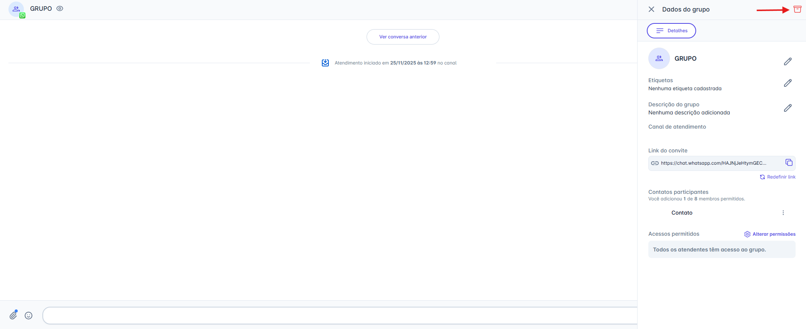
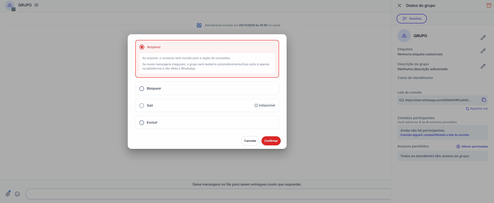
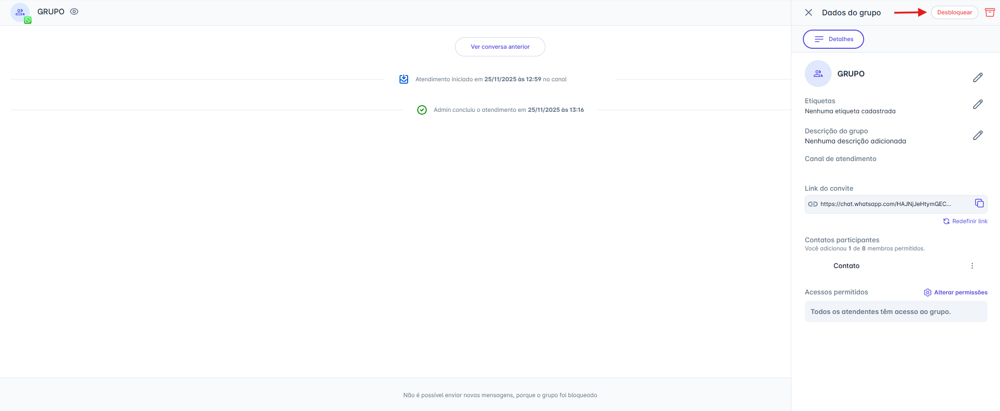
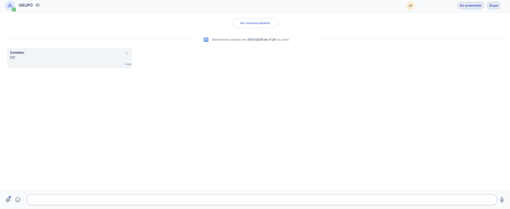

# Gerenciar Grupos (Arquivar, Bloquear, Sair, Excluir)

As **Ações de Arquivamento** permitem controlar a visibilidade, o status e o comportamento de um grupo diretamente pela plataforma. Siga os passos abaixo para gerenciar corretamente cada uma dessas opções.

## Passo 1: Acessar as ações de gerenciamento

1. Abra a conversa do grupo.
2. Clique no ícone **Ver detalhes do grupo**  no cabeçalho.
   Isso abrirá o painel lateral **"Dados do grupo"**, onde todas as opções de administração ficam centralizadas.

## Passo 2: Selecionar e visualizar a ação desejada

1. No painel lateral, clique no ícone **Ações de Arquivamento** .
2. Um painel com quatro opções será exibido.
   Por padrão, a ação **"Arquivar"** virá pré-selecionada.

Escolha a ação que deseja executar:

* **Arquivar:**
  Move a conversa para a seção **Concluídos**, encerrando o atendimento apenas na plataforma para fins de organização. O grupo é reaberto automaticamente caso novas mensagens sejam recebidas.
  *(Não afeta o grupo no WhatsApp.)*

* **Bloquear:**
  Move a conversa para a seção **Concluídos** e interrompe totalmente o envio e o recebimento de mensagens pela plataforma.
  *(Não afeta o grupo no WhatsApp.)*

* **Sair (apenas API Não Oficial):**
  Remove **somente o canal de atendimento** do grupo.
  A conversa é movida para **Concluídos** e a saída é **irreversível** no WhatsApp.

* **Excluir:**
  Remove o grupo **somente se o canal for o criador do grupo**:
  * **API Oficial:** o canal é sempre o criador, então a exclusão é sempre permitida.
  * **API Não Oficial:** o canal pode ser apenas participante. A exclusão só será permitida se ele for **criador do grupo**.
    A exclusão remove o grupo para todos os participantes e é **irreversível**, refletindo também no WhatsApp.

## Passo 3: Finalizar a ação

1. Certifique-se de que a ação desejada está selecionada.
2. Clique no botão **"Confirmar"** para aplicar a operação.

A ação será executada imediatamente e refletida conforme as regras descritas acima.

::: warning Regra de Acesso e Permissão
**Observação importante sobre permissões**

As ações **Arquivar, Bloquear, Sair e Excluir** possuem restrições específicas para garantir a **integridade dos dados** e o correto **fluxo de trabalho da equipe**.

**Perfis autorizados**
* Apenas **Administradores da Conta** e **Moderadores do Grupo** têm permissão para executar essas ações.

**Restrições para outros usuários**
* Perfis que não possuam essas funções verão as opções **desabilitadas**, sem possibilidade de execução.
:::

### Regras e Consequências de Cada Ação

Todas as ações listadas abaixo **movem a conversa para a aba "Concluídos"** na plataforma, alterando o status do grupo conforme descrito:

| Ação | Consequência | Observação Importante |
| :--- | :--- | :--- |
| **Arquivar** | Move a conversa para a seção **Concluídos**. Caso novas mensagens sejam recebidas, o grupo será reaberto automaticamente. | Ação interna: Não afeta o grupo no WhatsApp. |
| **Bloquear** | Bloqueia o envio e o recebimento de mensagens do grupo na plataforma. A conversa é movida para a seção **Concluídos**, mas pode ser desbloqueada a qualquer momento. | Ação interna: Não afeta o grupo no WhatsApp. |
| **Sair** | O canal da plataforma sai do grupo (somente o canal será removido). A conversa é finalizada e movida para a seção **Concluídos**, permanecendo disponível apenas para consulta. | Ação irreversível, refletida no WhatsApp. **Disponível** somente para canais conectados à **API Não Oficial.** |
| **Excluir** | Remove o grupo para todos os participantes. A conversa é finalizada e movida para a seção **Concluídos**, permanecendo disponível apenas para consulta, enquanto o grupo é excluído no WhatsApp. | Ação irreversível, refletida no WhatsApp. Deve ser executada com cautela. |

## Passo 4: Ações de Reversão (Desarquivar e Desbloquear)

Grupos que foram **arquivados** ou **bloqueados** podem ser reativados a qualquer momento, restaurando seu status normal na plataforma.

1. Acesse a conversa do grupo na aba **Concluídos**.
2. Clique no ícone **Ver detalhes do grupo**  no cabeçalho.
3. No painel lateral **"Dados do grupo"**, identifique o botão **"Desarquivar"** ou **"Desbloquear"**, conforme o status atual do grupo.
4. Clique no ícone correspondente e confirme a ação para reativar o grupo.

### Regras de Hierarquia entre Bloqueio e Arquivamento

É importante entender como as ações de **Bloqueio** e **Arquivamento** interagem, pois elas possuem uma hierarquia específica e impactam o status do grupo.

| Cenário | Regra de Precedência |
| :--- | :--- |
| **Arquivado e Depois Bloqueado** | Permitido. Um grupo que já está **arquivado** pode ser **bloqueado**. A conversa permanecerá na aba **Concluídos**, mas o **status de Bloqueio** impede qualquer nova interação. |
| **Bloqueado** | O **bloqueio tem prioridade** sobre o arquivamento. Se um grupo estiver **bloqueado**, a opção de arquivar **não estará disponível**. Ao ser desbloqueado, o grupo retornará automaticamente à aba **Meus**, pronto para novas interações. |

### Reativação de Grupos: Comportamento do Histórico

Quando um grupo é **concluído** (via Arquivar ou Bloquear) e posteriormente reativado (via Desarquivar ou Desbloquear), o sistema mantém o histórico e cria um novo ciclo de atendimento de acordo com as regras abaixo:

**1. Preservação do Histórico (Registro Concluído)**
* O registro da conversa anterior, incluindo o momento em que foi **Arquivado** ou **Bloqueado**, permanece na aba **Concluídos**.
* Ele não é alterado e serve como histórico daquele ciclo de atendimento.

**2. Criação de um Novo Ciclo (Atendimento Ativo)**
* Ao reverter a ação (**Desarquivar** ou **Desbloquear**), o sistema cria um **novo atendimento ativo** para o grupo.
* O grupo é exibido imediatamente na aba **Meus** do usuário responsável.

**3. Acesso ao Histórico Completo**
* No novo atendimento ativo, todo o histórico da conversa anterior está disponível.
* Para visualizar mensagens mais antigas, clique no botão **"Ver conversa anterior"** no topo da janela de chat.

