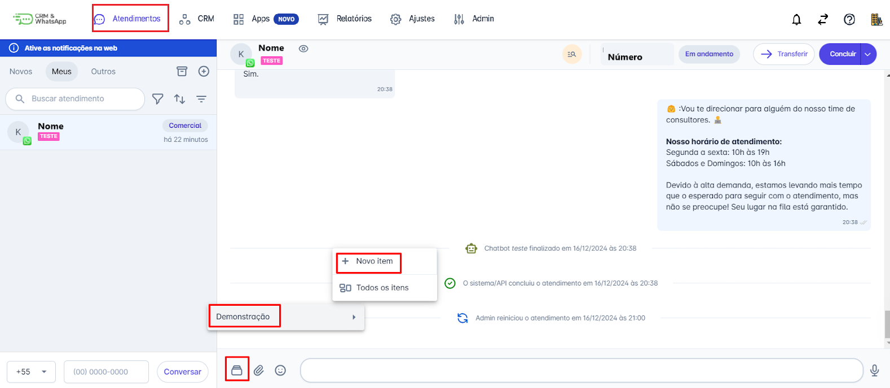
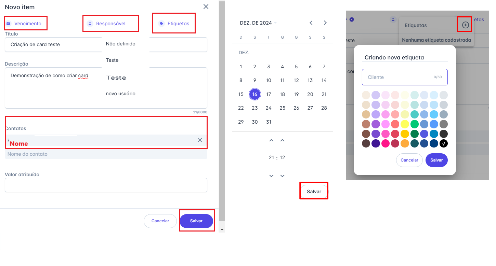
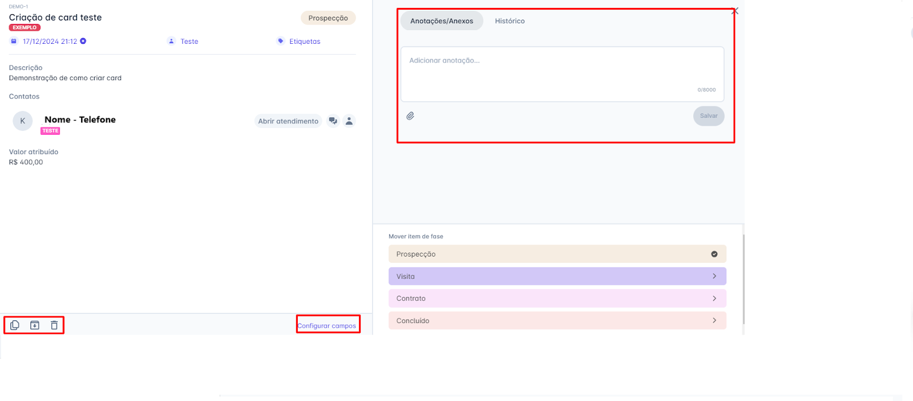
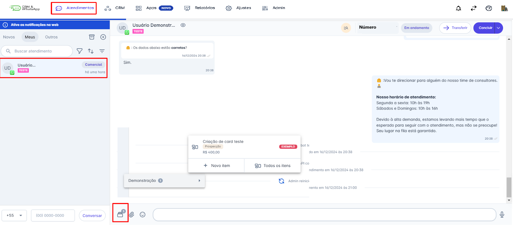

# Criar Cards no Painel

O painel da **plataforma** é uma ferramenta poderosa que permite gerenciar e visualizar informações de maneira organizada e eficiente. Uma das funcionalidades mais úteis é a capacidade de inserir **cards** no painel, que podem ser usados para destacar informações importantes, tarefas, métricas, entre outros.

Este artigo guiará você passo a passo no processo de inserção de um **card** no painel diretamente de um atendimento.

::: tip Pré-requisitos
* Acesso à conta na **plataforma**.
* Ter um **painel** (Funil) criado.
:::

## Passo 1: Acessar a Opção de Criação

1. Na tela inicial, acesse o menu **"Atendimentos"**.
2. Selecione o contato para o qual deseja inserir um **card** em um painel, para que a janela de conversa seja aberta.
3. Em seguida, clique no ícone correspondente ao CRM na barra de ações.
4. Um menu de opções será exibido. Escolha em qual painel deseja adicionar o **card** daquele contato e, em seguida, clique em **"+ Novo Item"**.

## Passo 2: Preencher as Informações do Card

Quando o **popup** se abrir, basta preencher com as informações pré-definidas no painel. No nosso exemplo, temos dados que já vêm **pré-definidos pela plataforma**, mas que podem ser **personalizados**.

Você pode:
* Inserir uma **data de vencimento** como lembrete de tarefas.
* Atribuir um **responsável** para o **card**.
* Cadastrar **etiquetas** que facilitem a classificação desses **cards** no painel.
* Informar o **título** do **card**.
* Inserir uma **descrição detalhada**.

::: info Associação Automática
Como o cadastro está sendo feito diretamente de um **atendimento**, o **contato** já fica automaticamente atrelado ao **card**. No entanto, é possível inserir mais **contatos**, se necessário.
:::

Por fim, também é possível atribuir um **valor monetário** ao **card**, caso seja uma situação de **vendas** ou **negociações**.

## Passo 3: Visualizar e Gerenciar o Card Criado

Após todo o preenchimento, o **Card** ficará disponível no painel.

* É possível, após a criação, inserir mais informações na **lateral direita**, incluindo a opção de **anexar arquivos**.
* No canto inferior direito, estão demonstradas as **fases** que este painel possui.
* No canto inferior esquerdo, são exibidos alguns ícones que permitem: **Duplicar**, **Arquivar** e **Excluir** o **card**, respectivamente.
* E logo ao lado dos ícones, existe a opção de **configurar campos**.

## Passo 4: Identificar Cards no Atendimento

Para visualizar um **card** atribuído a um **contato**, basta abrir o **atendimento** desse contato e clicar no ícone correspondente.

Note que, após a criação de um **card** para o contato, um número será exibido acima do ícone. Este número indica que o **contato** possui um ou mais **cards** associados a ele.

::: warning Considerações Adicionais
* Algumas funcionalidades da plataforma dependem do **plano contratado**.
* Somente os usuários com perfil de **Administrador** podem criar **painéis**.
* **Limite de Painéis** (funil): Cada plano possui uma quantidade limitada de **painéis**. Em caso de dúvidas, entre em contato com o **CS responsável** pela sua conta.
:::
