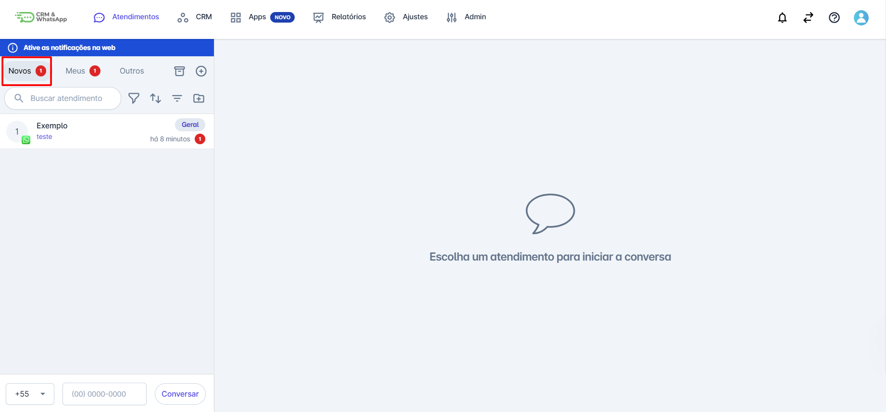
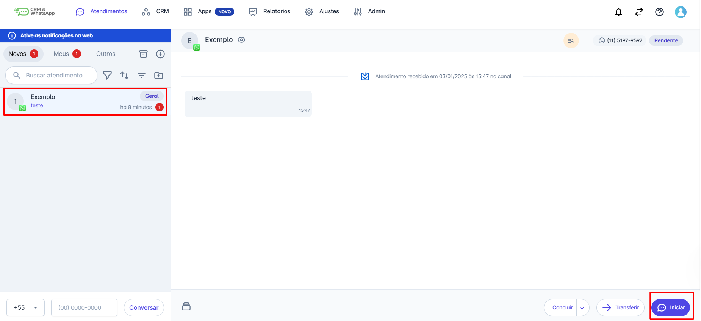
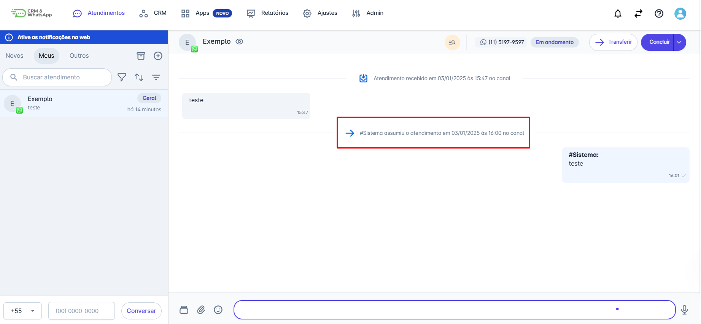

# Assumir Atendimento

Toda nova interação recebida é primeiramente direcionada à aba **'Novos'** da equipe responsável, onde a conversa aguarda. Para que a troca de mensagens possa ser iniciada, o usuário associado à equipe precisa **assumir o atendimento.**

::: tip Pré-requisitos
* **Associação à Equipe:** Você deve estar associado às equipes para as quais os novos atendimentos são encaminhados.
:::

## Passo 1: Localizar a Fila de Novos Atendimentos

1. Na barra superior, clique em "**Atendimentos**".
2. Clique na aba "Novos".
3. O contador numérico ao lado de "Novos" indica quantos atendimentos estão aguardando o início.

## Passo 2: Iniciar a Conversa

1. Na lista, clique no atendimento que você deseja assumir. Isso abrirá a visualização da conversa.
2. No canto inferior direito da tela, clique no botão "Iniciar".

## Passo 3: Atribuição e Movimentação

1. Após clicar em "Iniciar", a conversa é automaticamente assumida por você e é movida da aba "Novos" para a aba "Meus".
2. A plataforma registra a assunção do atendimento (usuário, horário e canal utilizado) no *feed* da conversa, e o *status* muda para "Em andamento".

::: info Regras e Considerações Importantes
* **Leitura da Mensagem:** Enquanto o atendente não clicar em "Iniciar" para assumir o atendimento, a leitura da mensagem não é sinalizada para o contato (o *tick* azul não aparece no WhatsApp).
* **Janela de 24 Horas (Meta):** Se o contato não interagir ou responder dentro de 24 horas após a última mensagem, a "janela de conversa livre" será encerrada pela Meta. Para reiniciar o atendimento após esse período, será necessário enviar um modelo de mensagem pré-aprovado.
:::
