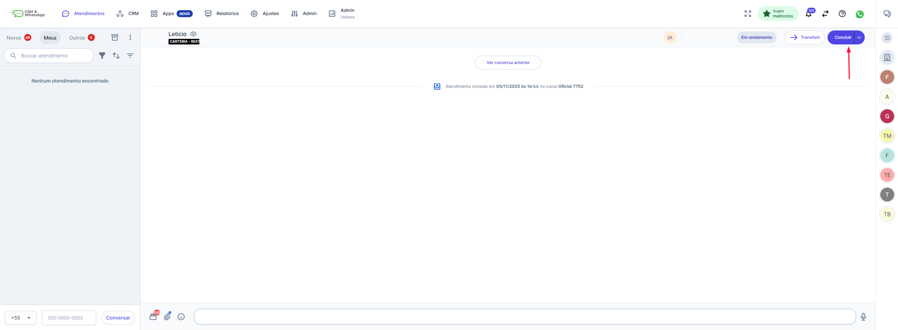
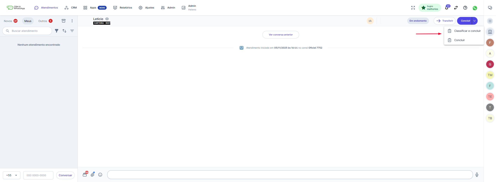
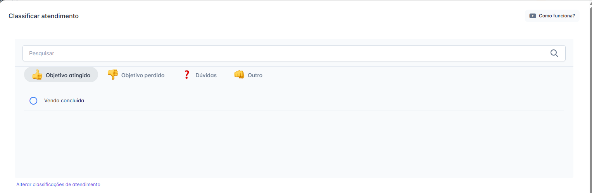
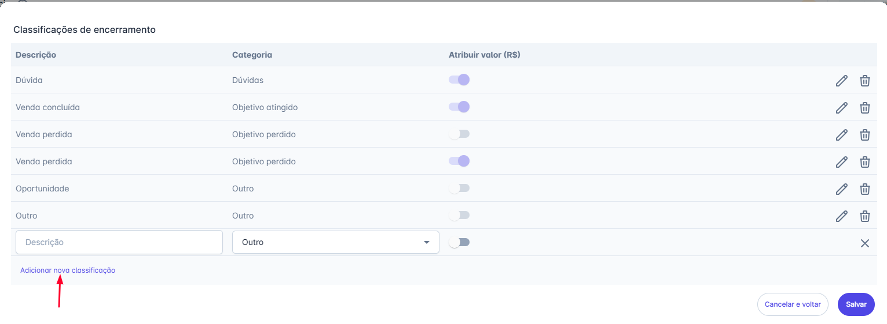
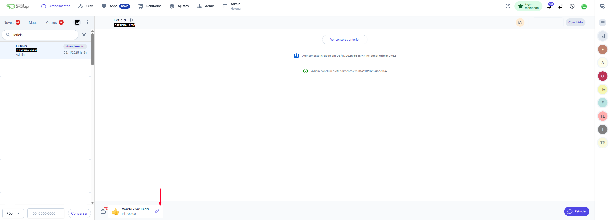

# Concluir e Classificar Atendimento

Concluir uma conversa após a finalização das tratativas é fundamental para manter a organização, evitar que contatos fiquem sem resposta e garantir a eficiência no gerenciamento de filas.

**Importante:** A conclusão do atendimento na plataforma é uma ação interna e não afeta a janela de 24 horas para troca de mensagens estabelecida pela Meta.

::: tip Pré-requisitos
* **Permissão:** Ser o usuário responsável pela conversa ou ser Supervisor da equipe.
* **Acesso:** Estar incluído nas equipes para as quais os atendimentos são direcionados.
* **Classificação (Opcional):** Para utilizar o recurso de classificação, o App Classificação de Atendimento deve estar ativo (Menu `APP` → `Mais Apps`).
:::

## Passo 1: Iniciar a Conclusão

1. Na tela de Atendimentos, selecione a conversa que deseja encerrar.
2. Clique no botão "Concluir".
   * **Para atendimentos em andamento:** O botão fica no canto superior direito.
   * **Para atendimentos na fila "Novos":** O botão fica no canto inferior direito.

## Passo 2: Escolher o Tipo de Encerramento

Ao clicar em "Concluir", um menu de opções será exibido:

1. Selecione "Classificar e Concluir" (se o App estiver ativo).
2. Ou selecione apenas "Concluir" (para finalizar sem classificação).

## Passo 3: Classificar (Se Necessário)

Se você escolheu "Classificar e Concluir", uma nova janela será aberta.

1. **Escolha a Categoria:** Selecione uma das quatro categorias pré-definidas (Objetivo Atingido, Objetivo Perdido, Dúvidas, Outro).
2. **Escolha a Descrição:** Selecione o motivo que melhor se adequa ao encerramento (Ex: "Teste" dentro de "Dúvidas").
3. Clique em "Concluir" no canto inferior direito para finalizar o processo.

## Passo 4: Gerenciando a Classificação e o Histórico

### 4.1 Cadastrar Novas Classificações (Administrador)

As quatro categorias principais não podem ser alteradas, mas os motivos dentro delas podem ser personalizados:

1. Na janela de classificação, clique em "Alterar classificações de atendimento".
2. Preencha a Descrição, escolha a Categoria e defina se o campo deve conter Valor Monetário.
3. Clique em "Salvar".

### 4.2. Recuperando Conversas Concluídas

Após a conclusão, o atendimento é movido para a pasta "Concluídos":

1. Clique no ícone de Concluídos na parte superior da lista de atendimentos.
2. Selecione o atendimento que deseja visualizar.
3. O motivo da conclusão aparecerá no rodapé da página.

### 4.3. Edição da Classificação

É possível editar a classificação de um atendimento já concluído, mas essa permissão é restrita aos atendimentos concluídos pelo próprio usuário.

## 5. Configurando Preferências de Arquivamento

Clique na seta (▼) ao lado do botão "Concluir" (na parte superior direita da tela) para definir o que deve acontecer quando o contato responder após a conclusão. Essa configuração é por usuário e será aplicada a todas as suas conclusões futuras.

| Opção de Arquivamento             | Comportamento                                                                                                                        |
| --------------------------------- | ------------------------------------------------------------------------------------------------------------------------------------ |
| **Arquivar em 12 horas (Padrão)** | Se o contato enviar uma nova mensagem dentro de 12 horas, o atendimento será reaberto para você.                                    |
| **Arquivar imediatamente**        | Se o contato enviar uma nova mensagem a qualquer momento, um novo atendimento será criado (e o *chatbot* será reapresentado a ele). |
