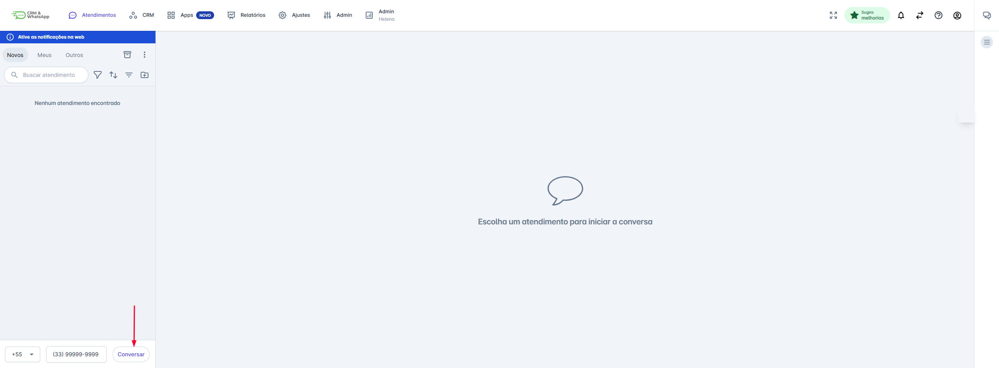
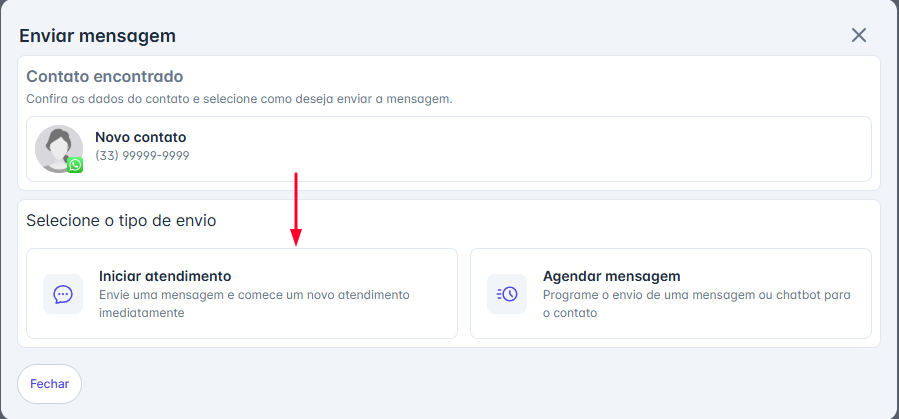
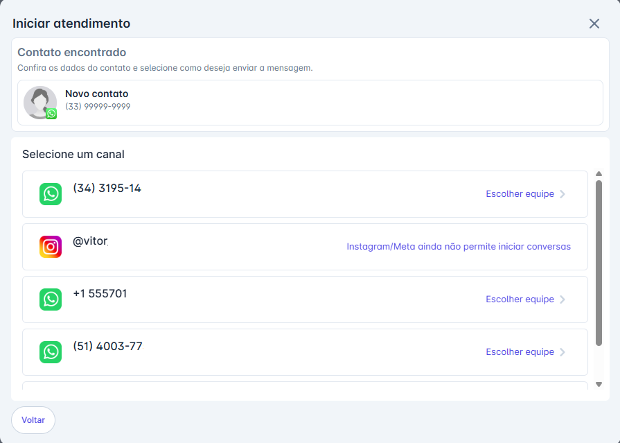
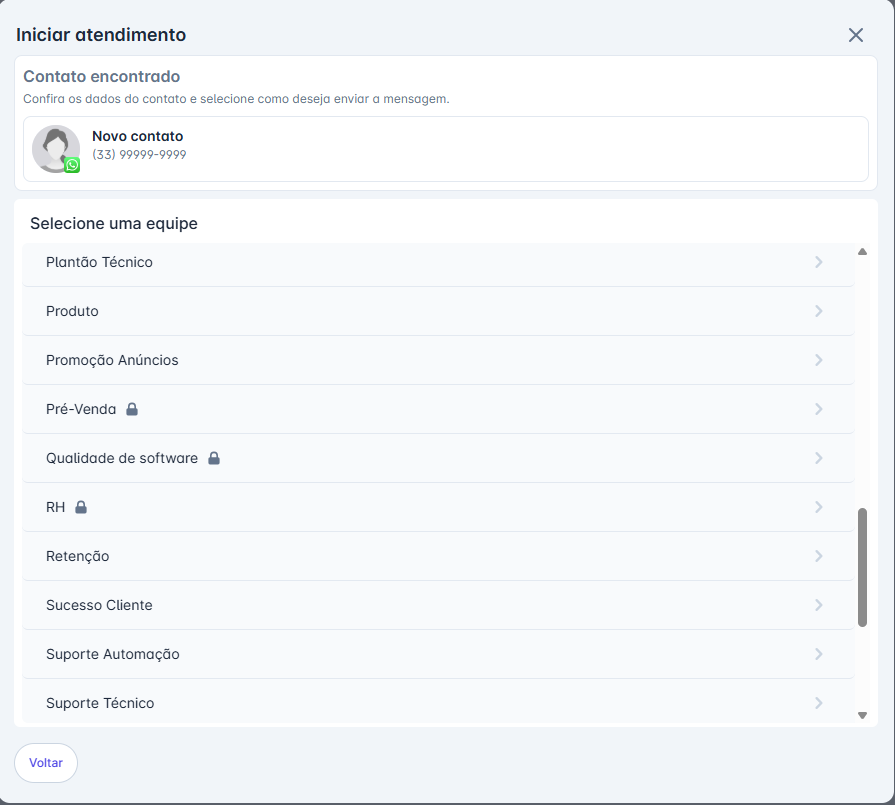
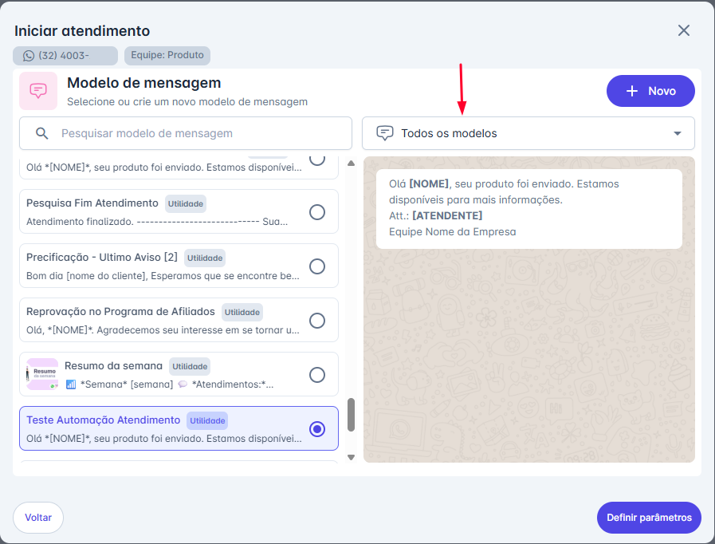
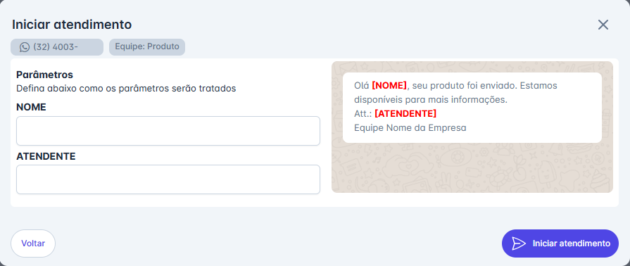
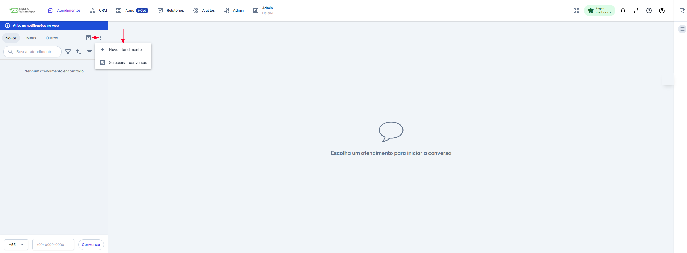
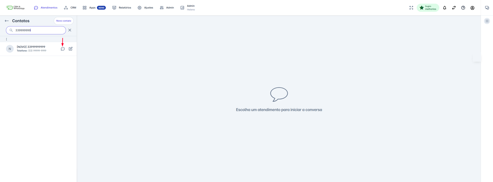
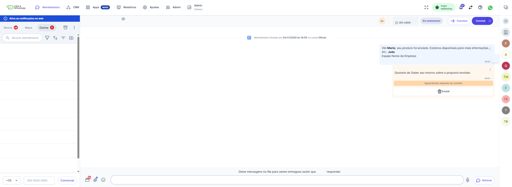

# Iniciar Atendimento

Os atendimentos na plataforma podem ser iniciados de duas maneiras principais:

* **Ativa:** Quando a sua empresa toma a iniciativa e inicia a conversa com o contato (via modelo de mensagem).
* **Receptiva:** Quando o contato envia a primeira mensagem, e a empresa apenas recebe e responde.

## Método 1: Iniciar pelo Campo de Conversa

### Passo 1: Iniciar o Contato

1. Na tela de Atendimentos, localize no canto inferior esquerdo o campo para inserir o número de telefone.
2. Digite o número do contato (com DDD).
3. Clique no botão "Conversar".

### Passo 2: Escolher o Tipo de Envio

Após o sistema localizar o contato, você verá a tela **"Enviar mensagem".**

1. Confirme os dados do contato encontrado.
2. Na seção **"Selecione o tipo de envio"**, clique na opção **"Iniciar atendimento"** para enviar uma mensagem imediatamente e começar a conversa.

### Passo 3: Selecionar o Canal e a Equipe

Se a sua conta tiver múltiplos canais de atendimento, você precisará selecionar por onde a mensagem será enviada e qual equipe será responsável pelo atendimento:

**1.** Na seção "Selecione um canal", escolha o canal desejado.

**2.** Em seguida, na seção "Selecione uma equipe", escolha a equipe que será associada ao atendimento.

### Passo 4: Selecionar o Modelo de Mensagem

Para iniciar um novo atendimento fora das 24 horas, você deve obrigatoriamente usar um modelo de mensagem pré-aprovado.

1. Na tela **"Modelo de mensagem"**, utilize o campo de pesquisa ou os filtros de categoria (ex: "Todos os modelos") para encontrar o modelo ideal.
2. Clique no modelo desejado para selecioná-lo.
3. Com o modelo selecionado, clique em "Definir parâmetros" no canto inferior direito.

### Passo 5: Definir Parâmetros e Finalizar

Se o modelo de mensagem escolhido contiver variáveis (campos como `[NOME]` ou `[ATENDENTE]`), você deve preenchê-las:

1. Na tela "Parâmetros", preencha o valor que substituirá cada variável (ex: 'João' para `[NOME]`).
2. Verifique a pré-visualização da mensagem à direita.
3. Clique em "Iniciar atendimento".

O atendimento será iniciado com a mensagem enviada, e você poderá dar continuidade à conversa na tela principal.

## Método 2: Iniciar pela Opção "Outras Opções"

Além de iniciar o atendimento pelo campo na barra inferior, você pode começar a conversa acessando o menu de opções.

### Passo 1: Acessar o Menu "Outras Opções"

1. Na tela de Atendimentos, clique no ícone de três pontos (⋮) ao lado da aba "Outros".
2. No menu que se abre, clique em "Novo atendimento".

### Passo 2: Localizar ou Criar o Contato

Na barra de pesquisa lateral que se abrirá, você pode:

1. **Pesquisar:** Digite o nome ou telefone do contato desejado para localizá-lo.
2. **Criar Novo:** Caso o contato não seja encontrado, clique no botão "Novo contato" para cadastrá-lo.

### Passo 3: Dar Continuidade ao Fluxo

Após selecionar (ou criar) o contato, a plataforma abrirá a janela de envio de mensagem, e você deve seguir os mesmos passos detalhados na seção anterior do guia:

* Escolher o tipo de envio ("Iniciar atendimento" ou "Agendar mensagem").
* Selecionar o Canal e a Equipe.
* Selecionar o Modelo de Mensagem pré-aprovado.
* Definir os Parâmetros e clicar em "Iniciar atendimento".

## Status do Atendimento Após a Mensagem Inicial

Após clicar em "Iniciar Atendimento", o sistema confirma o envio do Modelo de Mensagem e a tela da conversa será aberta, mas em um estado de espera.

**Importante:** O atendimento só é considerado ativo e a janela de conversa livre será liberada para troca de mensagens ilimitadas quando o contato responder à sua mensagem.

::: warning Considerações Adicionais

### 1. Mensagens na Fila de Espera

Enquanto o contato não responder e a janela de conversa não for ativada, você pode pré-digitar e enfileirar novas mensagens.

* As mensagens enfileiradas ficarão aguardando e serão enviadas automaticamente ao contato assim que a resposta dele chegar e a janela for liberada.

### 2. Implicações de Custo (API Oficial)

É fundamental estar atento ao modelo de precificação da API Oficial:

* Toda mensagem iniciada pela empresa (utilizando um Modelo de Mensagem após 24 horas) é classificada como uma "Conversa Iniciada pela Empresa" e gera uma cobrança.
* Para informações detalhadas sobre os valores e as regras de cobrança (tanto para conversas iniciadas pela empresa quanto para as iniciadas pelo usuário), recomendamos acessar o site oficial do provedor da API [(Meta/Facebook)](https://developers.facebook.com/docs/whatsapp/pricing) ou entrar em contato com nossa equipe de Suporte para auxílio.
:::
