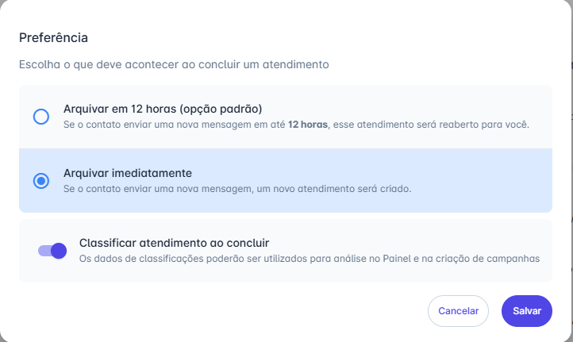

# Preferências de Arquivamento (12h vs. Imediato)

Este guia oferece uma visão detalhada sobre como configurar e **gerenciar os padrões de arquivamento** na plataforma. Com essas orientações, você poderá personalizar o sistema para definir o tratamento ideal para conversas concluídas, **garantindo a continuidade do atendimento pelo mesmo usuário** ou iniciando um novo fluxo, conforme as necessidades operacionais da sua equipe.

## Passo 1: Acessar as Preferências de Conclusão

1. Na tela de Atendimentos, selecione qualquer conversa para abrir a visualização.
2. Clique na seta (▼) ao lado do botão "Concluir" (localizado no canto superior direito) para exibir o menu de opções e abrir o modal "Preferência".

## Passo 2: Escolher o Padrão de Arquivamento

A plataforma oferece duas opções principais que definem o tratamento de novas mensagens do cliente:

| Opção de Arquivamento             | Comportamento se o Contato Responder                                                                                                                     | Consequência                                                                     |
| --------------------------------- | -------------------------------------------------------------------------------------------------------------------------------------------------------- | -------------------------------------------------------------------------------- |
| **Arquivar em 12 horas (Padrão)** | Se o contato enviar uma nova mensagem dentro de 12 horas, o atendimento será reaberto e retornado diretamente para você.                                 | Garante a continuidade do atendimento pelo mesmo responsável.                    |
| **Arquivar Imediatamente**        | Se o contato enviar uma nova mensagem (a qualquer momento), um novo atendimento será criado (e o fluxo do *chatbot* será reapresentado, se configurado). | Trata cada nova interação como um caso distinto, zerando o atendimento anterior. |

## Passo 3: Salvar a Configuração

1. Selecione a opção desejada.
2. Clique em "Salvar" para aplicar essa preferência a todas as suas futuras conclusões de atendimento.

::: info Considerações Adicionais
**Classificar Atendimento ao Concluir:** No mesmo modal de preferências, você pode habilitar a chave de "Classificar atendimento ao concluir". Ao ativá-la, a janela de classificação aparecerá automaticamente sempre que você concluir uma conversa, garantindo que os dados sejam registrados para análise no Painel e Campanhas.
:::
