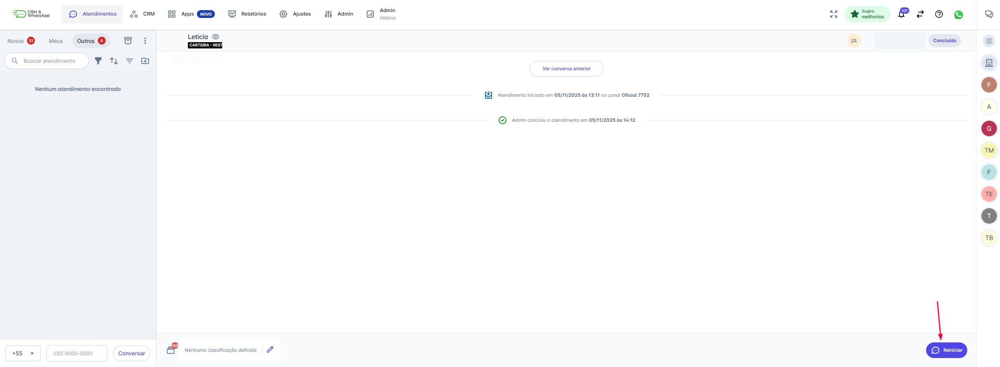
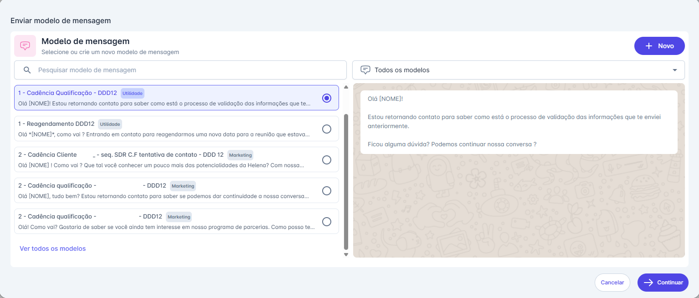
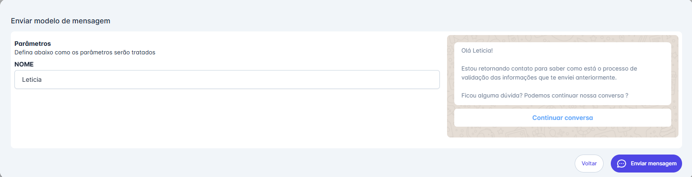
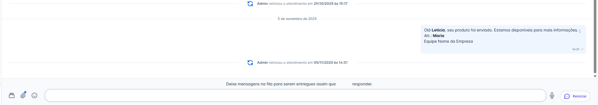

# Reiniciar Atendimento

A ação de 'Concluir' uma conversa na plataforma é um status interno e não afeta a janela de 24 horas da Meta. Por isso, conversas concluídas podem ser reiniciadas a qualquer momento.

**Atenção:** A reativação exige o envio de um Modelo de Mensagem pré-aprovado apenas se o canal estiver operando com a API Oficial. Canais com API Não Oficial não possuem essa restrição.

::: tip Pré-requisitos
* **Modelo de Mensagem:** É obrigatório ter um Modelo de Mensagem pré-aprovado ativo e cadastrado na plataforma.
* **Permissão de Acesso:** Estar associado à equipe na qual a conversa foi concluída, especialmente se essa equipe possuir restrições de visualização.
:::

## Passo 1: Localizar e Iniciar a Reativação

1. Na tela de Atendimentos, localize o atendimento concluído.
2. No canto inferior direito da tela, clique no botão "Reiniciar".

## Passo 2: Selecionar o Modelo de Mensagem

Ao clicar em "Reiniciar", será aberta a tela de seleção de modelos:

1. Selecione o Modelo de Mensagem que você deseja usar para reengajar o contato.
2. Clique em "Continuar".

## Passo 3: Preencher Parâmetros e Enviar

1. Se o modelo selecionado contiver variáveis (como `[NOME]` ou `[ATENDENTE]`), preencha os campos em "Parâmetros".
2. Clique em "Enviar mensagem".

## Passo 4: O Status de Espera (Fila de Mensagens)

Após o envio do modelo, o atendimento entra em status de espera:

* A plataforma indicará **"Aguardando resposta do contato".**
* A área de digitação mostrará a mensagem: "Deixe mensagens na fila para serem entregues assim que o contato responder."

::: info Regras e Fluxo de Continuidade

### 1. Reabertura da Janela de Conversa

A janela de conversa livre (que permite mensagens ilimitadas) será reaberta somente após a interação do contato. O contato precisa enviar qualquer tipo de mensagem (texto, emoji, vídeo ou arquivo) para ativar a janela.

### 2. Mensagens na Fila

* **Enquanto o contato não responder:** Você pode digitar e enviar novas mensagens. Elas não serão entregues imediatamente, mas sim enfileiradas, e enviadas automaticamente no momento em que a resposta do contato reabrir a janela.

### 3. Reengajamento

Se o contato demorar a responder, você pode enviar um novo Modelo de Mensagem para tentar um novo contato e reabrir a janela, repetindo os passos acima.

### 4. Janela de 24 Horas vs. Conclusão na Plataforma

* A conclusão de uma conversa na plataforma é uma ação interna e não interfere na janela de 24 horas da Meta.
* O encerramento da janela pela Meta só ocorrerá se não houver interação do contato por mais de 24 horas.

### 5. Restrições de Canal

* Até a última atualização, a Meta não permite reiniciar uma conversa (usando um modelo) em canais como Instagram ou Facebook Messenger se a janela de troca de mensagens já estiver fechada. O modelo de reinício é aplicável principalmente ao WhatsApp.
:::
