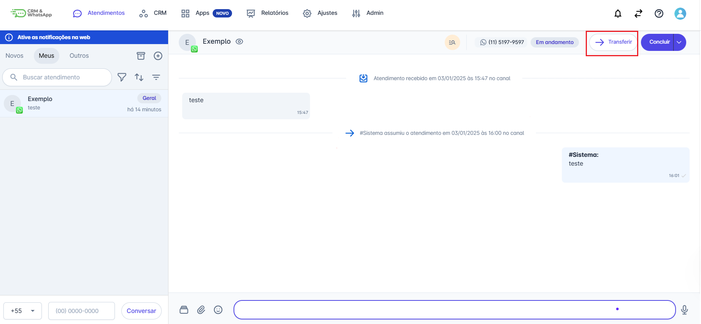
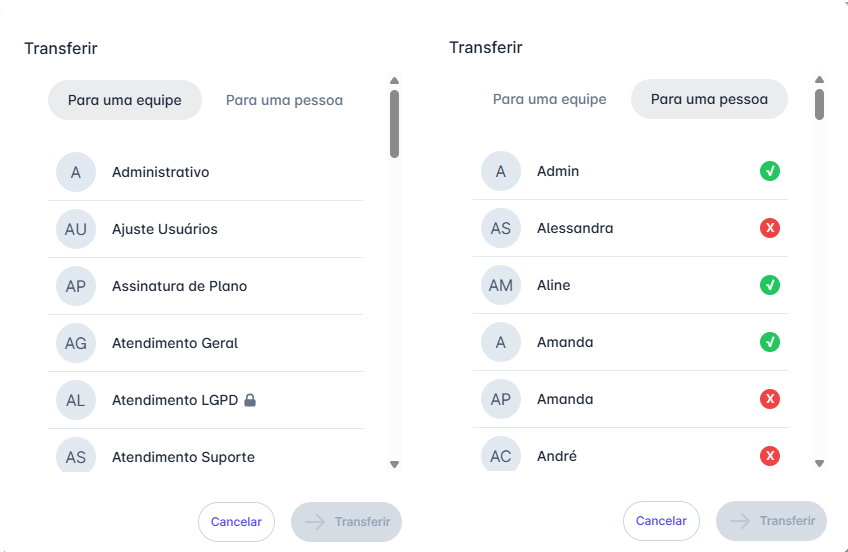

# Transferir Atendimento

Um atendimento pode ser **transferido** tanto antes de ser assumido quanto durante o atendimento. É possível transferi-lo para **outro usuário** ou para **outra equipe**, garantindo mais flexibilidade na gestão das conversas.

::: tip Pré-requisitos
* **Acesso à Fila:** Estar associado às equipes que recebem os atendimentos.
* **Permissão de Ação:** Ser o usuário atualmente responsável pela conversa (na aba "Meus") ou possuir o perfil de Supervisor na equipe.
:::

## Passo 1: Selecionar o Atendimento e Iniciar a Ação

1. Na tela de Atendimentos, selecione a conversa que deseja transferir em qualquer aba (Novos, Meus ou Outros).
2. Clique no botão "Transferir".
   * Para atendimentos em andamento (Meus/Outros): O botão fica no canto superior direito.
   * Para atendimentos na fila "Novos": O botão fica no canto inferior direito.

## Passo 2: Escolher o Destino da Transferência

A tela de opções será exibida, permitindo escolher o destino:

1. Selecione a opção desejada: "Para uma equipe" ou "Para uma pessoa".
2. Escolha o destino na lista.
3. Clique em "Transferir" para confirmar.

## Passo 3: Resultado da Transferência

| Destino             | Resultado da Conversa                                                                                    | Onde Aparece                                                                                         |
| ------------------- | -------------------------------------------------------------------------------------------------------- | ---------------------------------------------------------------------------------------------------- |
| **Para uma Equipe** | O atendimento é devolvido à fila de espera da nova equipe, pronto para ser assumido por qualquer membro. | Volta para a aba "Novos" da equipe de destino (se for a sua equipe, você verá o contador subir).     |
| **Para uma Pessoa** | O atendimento é atribuído diretamente ao usuário selecionado.                                            | Aparece na aba "Meus" do usuário de destino e na aba "Outros" dos demais membros da equipe original. |

::: info Considerações Adicionais
* **Escolha da Equipe (Se Transferir para Outra Pessoa):** Caso você transfira para um usuário que não faça parte da equipe atual do atendimento, o sistema solicitará que você escolha para qual equipe o atendimento será encaminhado. Se o usuário de destino estiver em múltiplas equipes, você poderá selecionar a mais apropriada.
* **Restrições de Visualização:** Ao transferir de uma equipe para outra, o atendimento passará a seguir as preferências de visualização da nova equipe (ex: se transferido para uma equipe restrita, as conversas finalizadas ficarão visíveis apenas para os membros dessa equipe).
:::
