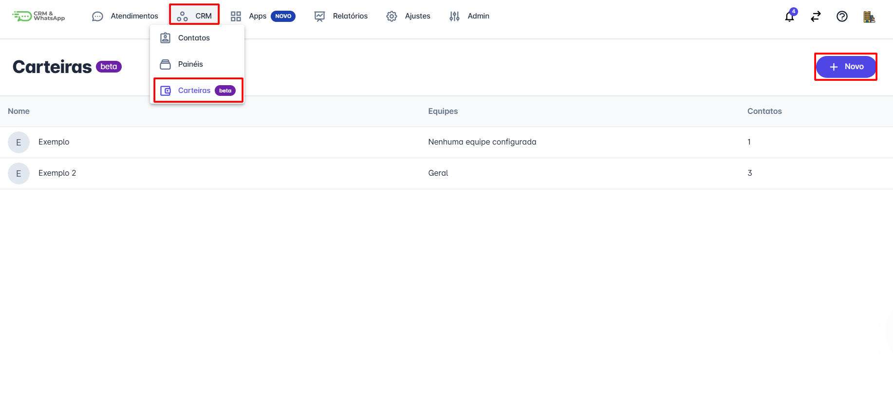
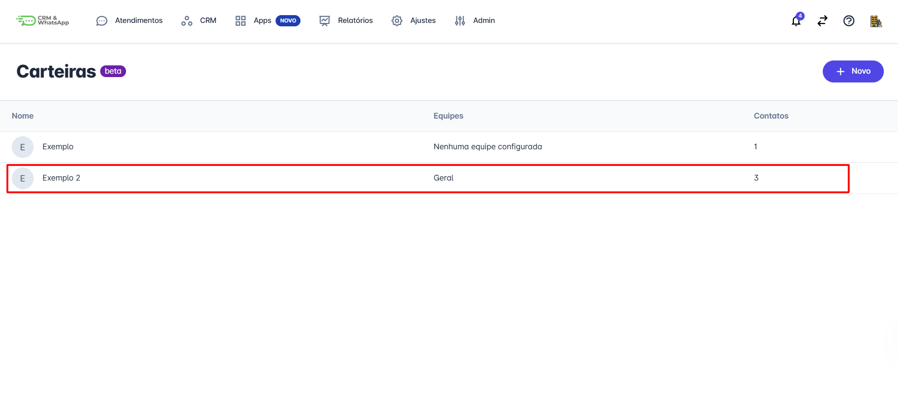
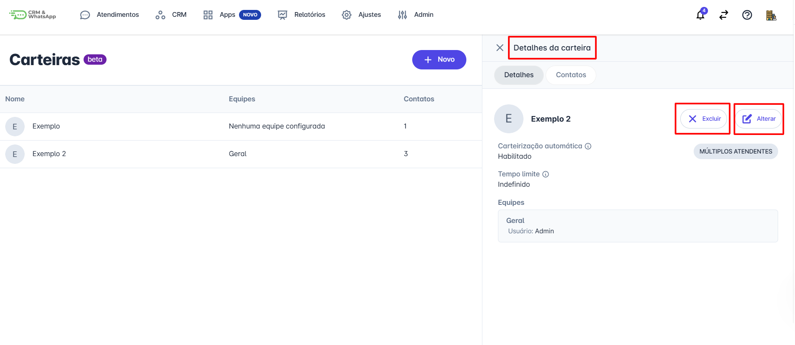
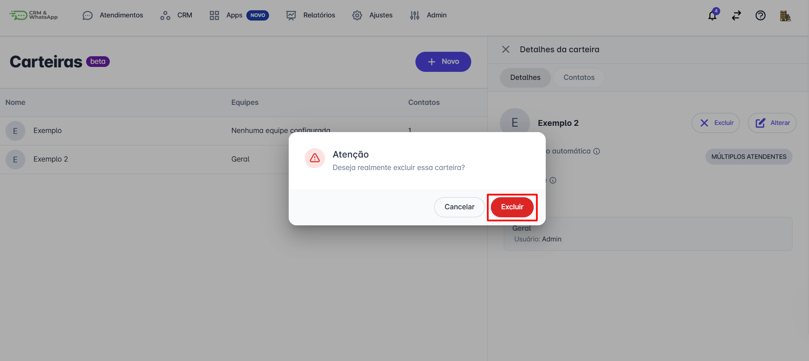
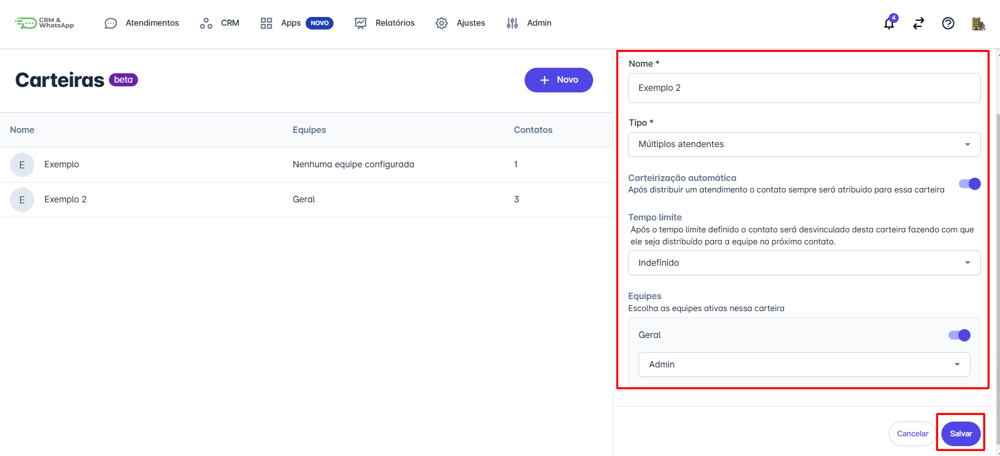

# Alterar ou excluir uma carteira

Gerenciar carteiras de contatos na **plataforma** inclui a capacidade de alterar ou excluir carteiras conforme necessário. Este processo é importante para manter a organização e garantir que as informações de contatos sejam sempre precisas e relevantes.

Este guia irá explicar como realizar essas alterações de forma eficiente.

::: tip Pré-requisitos
* **Ter acesso à conta da plataforma** com **perfil de administrador** para gerenciar carteiras de contatos.
* **Ter habilitado a função Carteirização de contatos**.
:::

## Passo 1: Acessar o menu de Carteiras

Na tela inicial da plataforma, clique na opção **CRM**. No menu de opções que se abrirá, clique em **Carteiras**.

## Passo 2: Selecionar a carteira

Uma tela com todas as carteiras criadas será exibida. Selecione a carteira que deseja alterar ou excluir e clique sobre ela.

## Passo 3: Escolher a ação

Uma nova tela se abrirá, exibindo as informações definidas da carteira. Ao lado do nome dado à carteira, serão exibidos dois ícones: um para **excluir** a carteira e outro para **alterar**.

## Passo 4: Excluir uma carteira

Para **excluir**, clique na opção **excluir** (ícone de lixeira). Uma mensagem de confirmação será exibida. Clique em **Excluir** e a carteira será removida com sucesso.

## Passo 5: Alterar uma carteira

Para realizar alterações na carteira, clique no ícone **Alterar** (ícone de lápis). Uma nova janela será aberta com os campos editáveis para que você possa realizar as alterações desejadas. Ao final, clique em **Salvar** para concluir.

::: warning Considerações finais
* Algumas funcionalidades da plataforma dependem do plano contratado. Por exemplo, a **carteirização de contatos** está disponível a partir do plano **Plus+**. Em caso de dúvidas, entre em contato com o CS responsável pela sua conta.
* A exclusão de uma carteira é uma ação que **não pode ser desfeita**.
* A criação de carteiras é ilimitada, permitindo uma gestão flexível e adaptável às suas necessidades.
:::
