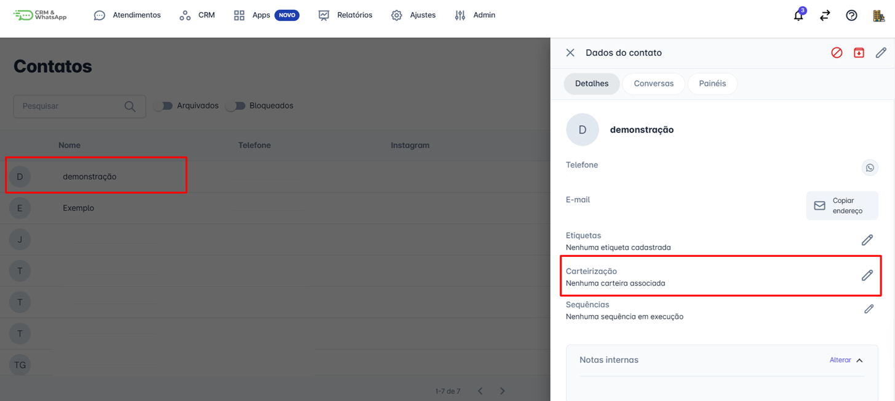
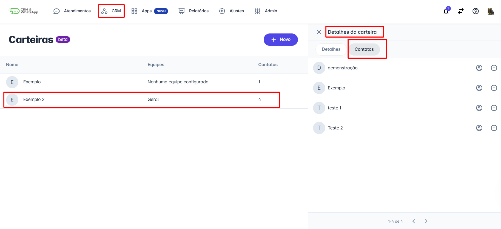
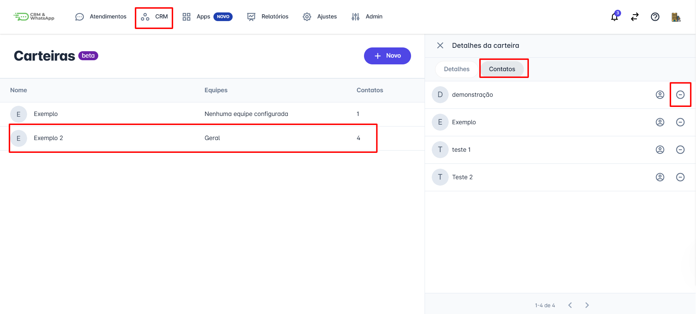

# Incluir contato na carteira

A inclusão de contatos em uma carteira na **plataforma** é uma maneira eficiente de organizar e gerenciar seus relacionamentos comerciais. Isso permite que você segmente e acompanhe suas interações com contatos específicos de forma estruturada, facilitando a execução de estratégias de comunicação e vendas.

::: tip Pré-requisitos
* Ter acesso à conta na **plataforma** com **perfil de administrador.**
* Habilitar a função **Carteirização de contatos**.
* Criar pelo menos uma carteira previamente.
:::

## Passo 1: Acessar a lista de contatos

Na tela inicial, clique no menu **"CRM"** e, em seguida, clique em **"Contatos"**.

## Passo 2: Selecionar o contato

Selecione o contato que deseja inserir em uma carteira e clique sobre ele.

Uma aba com os **detalhes do contato** será exibida na lateral direita.

## Passo 3: Selecionar a carteira

Clique no ícone ao lado da opção **"Carteirização"** e um popup será aberto, permitindo que você selecione a carteira desejada para o contato.

Selecione a **carteira** e clique em **"Salvar"**.

## Passo 4: Confirmar a inclusão

Para confirmar se o contato foi inserido na carteirização, basta clicar no menu principal **"CRM"** e, em seguida, clicar em **"Carteiras"**. A tela exibirá as carteiras criadas.

1. Clique na opção que foi usada para inserir o contato. Novamente, a tela de detalhes da carteira se abrirá.
2. Na parte superior, ao lado de **"Detalhes"**, clique em **"Contatos"**. Você verá todos os contatos atrelados àquela carteira.

::: info Considerações finais
* A inclusão de contatos nas carteiras pode ser feita de forma manual ou automática.
* A inclusão e exclusão de contatos em uma carteira também pode ser feita diretamente nos detalhes do contato, inclusive durante um atendimento.
* A exclusão de um contato de uma carteira também pode ser realizada nos detalhes da carteira, na aba **"Contatos"**, clicando no ícone de **"-"**.
:::

