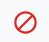
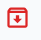
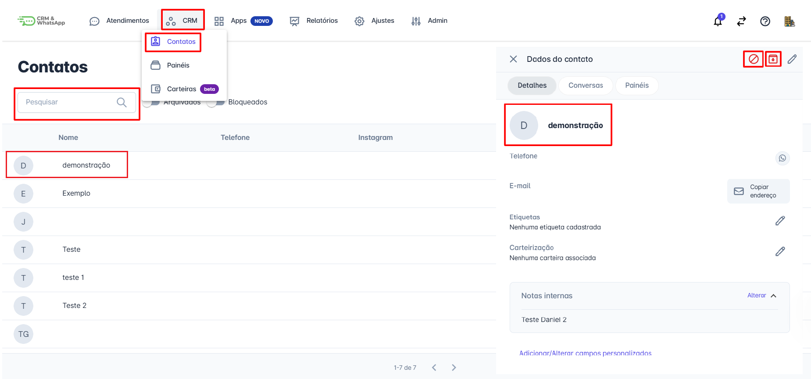
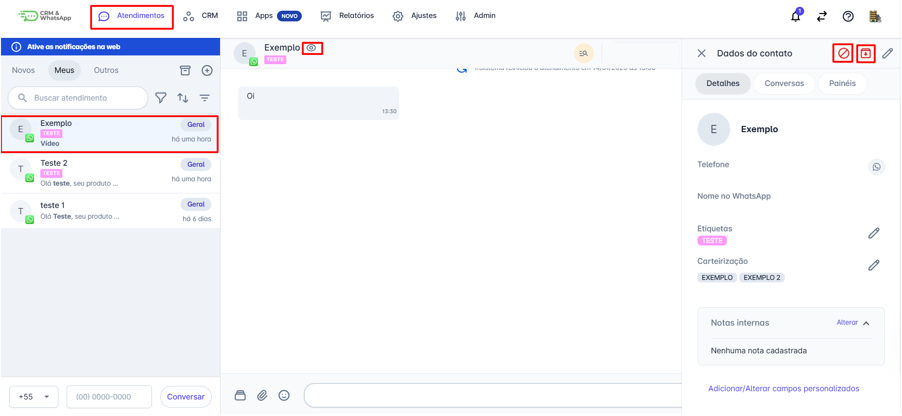
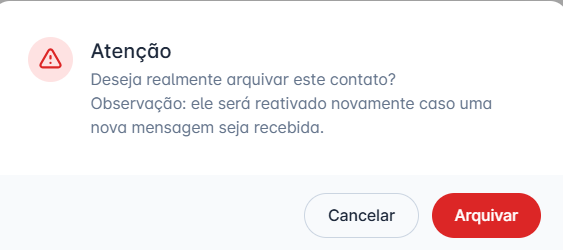
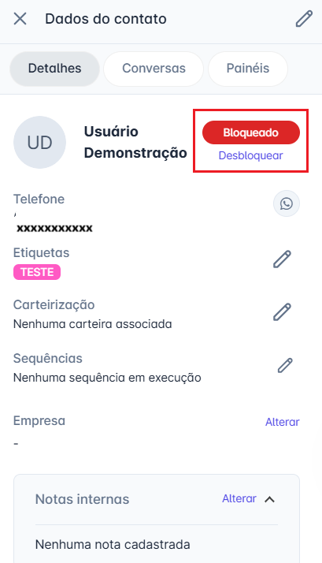
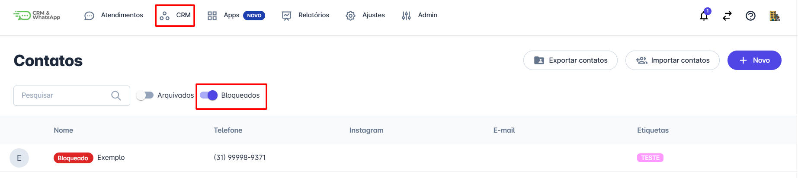

# Bloquear ou Arquivar contato

**Gerenciar contatos** de maneira eficiente inclui a possibilidade de **bloquear** ou **arquivar** contatos que não são mais ativos ou relevantes.

A **plataforma** oferece funcionalidades que permitem bloquear ou arquivar contatos, garantindo uma organização adequada do seu banco de dados. Este guia irá detalhar como realizar esses processos.

::: tip Pré-requisitos
* **Acesso à conta** na **plataforma**.
* Somente os usuários com **perfil de Administrador** podem **bloquear** um contato.
* **Qualquer usuário** pode **arquivar** um contato.
:::

## Passo 1: Acessar as opções de bloqueio/arquivamento

Temos duas formas de acessar os dados do cliente para realizar essas ações:

### 1ª Forma: Pelo menu CRM

1. Na tela inicial, clique no menu **CRM**, em seguida, na opção **Contatos**.
2. Pesquise pelo contato que deseja **bloquear** ou **arquivar** e clique sobre ele.
3. Uma janela com as **informações** do contato se abrirá na lateral direita.

* Para bloquear clique no ícone 
* Para arquivar clique no ícone 

### 2ª Forma: Pela tela de Atendimentos

1. Na tela inicial, acesse o menu **"Atendimentos"**.
2. Selecione o contato que deseja **bloquear** ou **arquivar** e clique sobre ele para que a janela de conversa seja aberta.
3. Em seguida, clique no ícone , e uma aba com os **dados** do contato será exibida na lateral direita da tela.

* Para bloquear clique no ícone 
* Para arquivar clique no ícone 

## Passo 2: Confirmar a ação

### Arquivar Contato

Se a opção for **arquivar** o contato, ao clicar no ícone , a plataforma abrirá automaticamente um **popup** de confirmação.

Clique em **arquivar** e o contato será imediatamente arquivado.

### Bloquear Contato

Se a opção for **bloquear** o contato, ao clicar no ícone , a plataforma abrirá automaticamente um **popup** de confirmação.

Clique em **Bloquear** e a tela será atualizada, sendo possível realizar o **desbloqueio** na mesma tela posteriormente.

## Passo 3: Visualizar contatos arquivados e bloqueados

Para visualizar os **contatos arquivados** e **bloqueados**:

1. Na tela inicial, clique no menu **CRM** e, em seguida, na opção **Contatos**.
2. Selecione a chave de **arquivados** ou **bloqueados**, e serão listados todos os contatos com esse status.

::: info Considerações Adicionais
* Quando um **contato é bloqueado**, novas mensagens que ele envie **não serão recebidas**.
* O **contato arquivado** é **reativado** quando ele enviar uma nova mensagem.
:::
