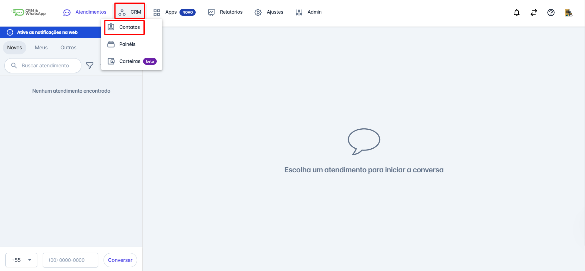
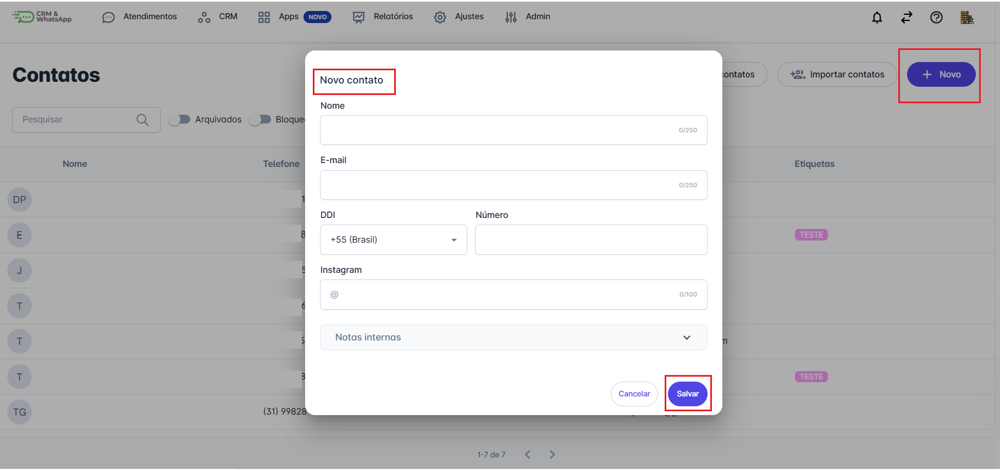

# Cadastrar contato

O cadastro de contatos é essencial para uma gestão eficiente de clientes e relacionamentos na **plataforma**. Ele permite organizar e centralizar informações importantes, otimizando o acompanhamento e as interações.

Este guia oferece instruções claras para realizar o cadastro de contatos, garantindo que **todas as informações essenciais** sejam registradas de forma **correta e eficiente**, contribuindo para uma gestão mais estratégica e produtiva.

::: tip Pré-requisitos
* Acesso à conta na **plataforma**.
:::

## Passo 1: Acessar o menu de Contatos

Na tela inicial, acesse o menu **CRM** e clique na opção **Contatos** para iniciar o processo de cadastro de contatos na **plataforma**.

## Passo 2: Preencher os dados do novo contato

Na tela que se abrirá, clique na opção **"+ Novo"**, localizada na lateral direita. Um popup será exibido para o preenchimento dos dados do novo contato.

* **Os campos de nome e telefone são obrigatórios**.
* Você pode adicionar outras informações, como e-mail, etiquetas e notas, conforme necessário.

Após concluir o preenchimento, clique no botão **Salvar** para registrar o contato.

::: info Considerações Adicionais
Se houver **campos personalizados cadastrados**, eles serão exibidos na tela de cadastro de novos contatos, permitindo que você insira informações específicas adicionais conforme as necessidades da sua operação.
:::
