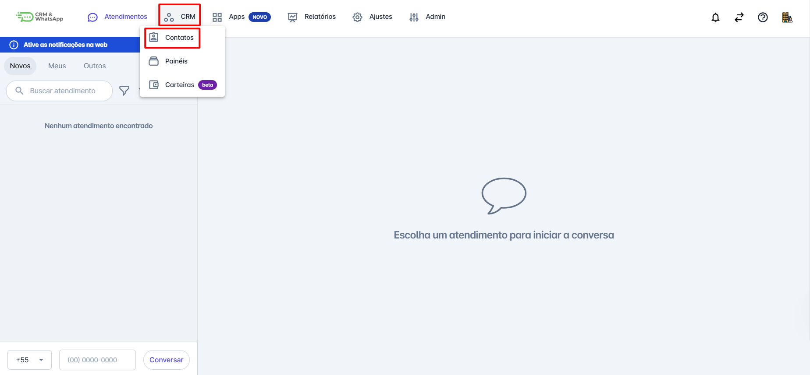
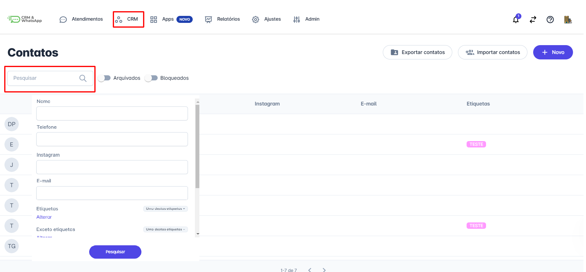
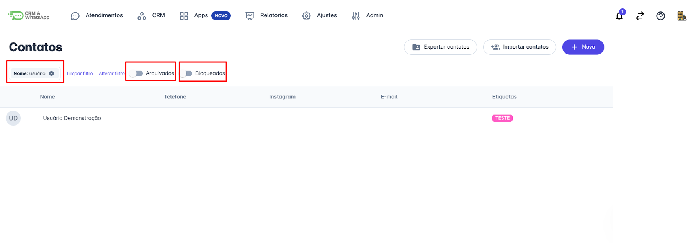

# Pesquisar contato

**Realizar pesquisas de contatos de forma rápida e eficiente é essencial** para garantir uma **gestão eficaz de clientes** na **plataforma**.

Este guia oferece **instruções claras e diretas** para ajudá-lo a encontrar contatos facilmente, permitindo **acesso imediato** às informações necessárias para suas **interações e tomadas de decisão**.

::: tip Pré-requisitos
* Acesso à conta na **plataforma**.
:::

## Passo 1: Acessar o menu de Contatos

Na tela inicial, clique no menu **CRM**, em seguida clique em **Contatos**.

## Passo 2: Realizar a busca

Na tela que se abrirá, clique na barra de **pesquisa** para realizar a busca desejada.

* Você pode pesquisar por **nome**, **e-mail**, **telefone** ou qualquer outra informação relevante cadastrada na plataforma.
* Para uma busca mais específica, utilize os filtros avançados, como **etiquetas**, **origem** e **carteiras**.

## Passo 3: Visualizar os resultados

Após clicar em **pesquisar**, a próxima tela irá mostrar o resultado da busca, e o **filtro** utilizado ficará aparente.

É possível pesquisar **contatos arquivados** e **bloqueados** também.

::: info Considerações Adicionais
Caso tenha **campos personalizados** cadastrados, eles aparecerão na tela de **pesquisa** também.
:::
