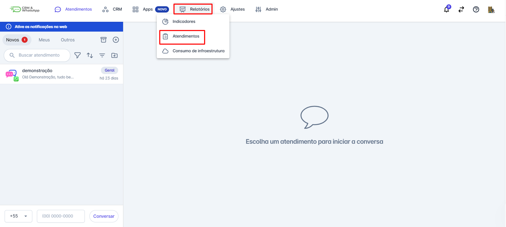
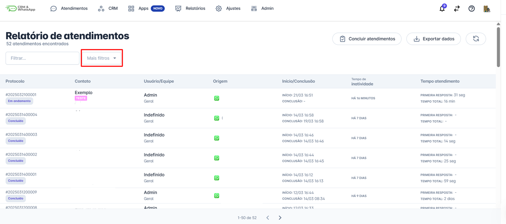
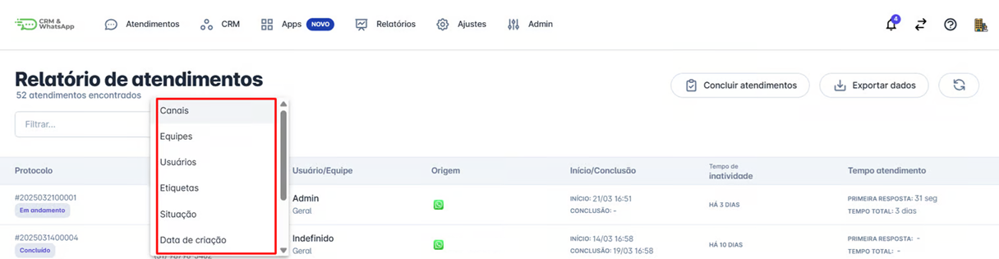
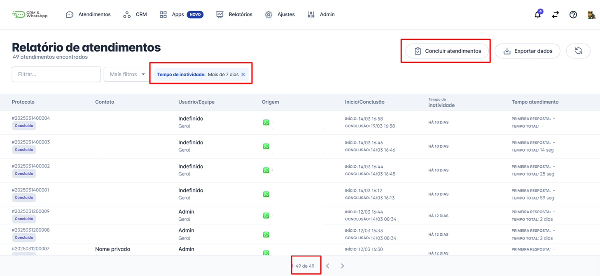
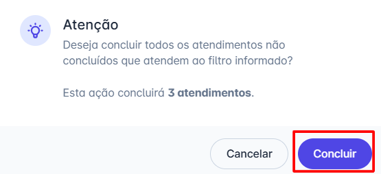
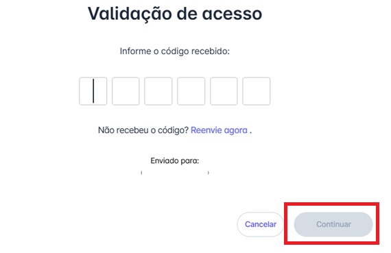

# Como concluir atendimentos em massa

Gerenciar um grande volume de atendimentos pode ser um desafio para as equipes. Para facilitar esse processo, a **plataforma** oferece a funcionalidade de **conclusão em massa**, permitindo que múltiplos atendimentos sejam finalizados de forma rápida e eficiente.

Neste artigo, vamos explicar como utilizar essa funcionalidade e quais são as melhores práticas para garantir que os atendimentos sejam encerrados corretamente.

A **conclusão em massa** permite que você selecione vários atendimentos de uma vez e os finalize simultaneamente. Isso economiza tempo, reduz a carga operacional e melhora a organização da equipe de suporte.

::: tip Pré-requisitos
* Acesso à conta na **plataforma**.
* Somente os usuários com perfil de Administrador podem concluir atendimentos em massa.
:::

### Passo 1: Acessar Relatórios

No menu principal clique em **“Relatórios”** e em seguida **"Atendimentos”.**

### Passo 2: Selecione os atendimentos desejados

Utilize os filtros disponíveis para encontrar os atendimentos que deseja finalizar.

**São eles**:

* Canais
* Equipes
* Usuários
* Etiquetas
* Situação
* Data de criação
* Data de conclusão
* Ativos no período
* Tempo de inatividade

### Passo 3: Clique na opção de conclusão em massa

Após definir quais atendimentos devem ser concluídos, clique em “**Concluir Atendimentos"**

### Passo 4: Confirmação de conclusão dos atendimentos

* O sistema irá solicitar uma confirmação antes de finalizar os atendimentos.
* Revise as informações e clique em **"Concluir"** para concluir o processo.

### Passo 5: Senha de Confirmação

O sistema enviará uma **senha** para permitir a conclusão dos atendimentos. Digite a senha e clique em **continuar**.

## 🎯 Boas Práticas na Conclusão em Massa

* **Verifique os atendimentos antes de concluir**
  * Certifique-se de que todas as interações foram resolvidas antes de encerrar o atendimento.
* **Use filtros para segmentar os atendimentos**
  * Utilize critérios como **status, tipo de solicitação ou responsável** para garantir que apenas os atendimentos corretos sejam finalizados.
* **Acompanhe o histórico de interações**
  * Antes de concluir, revise o histórico do atendimento para garantir que o cliente recebeu todas as respostas necessárias.
* **Automatize processos quando possível**
  * Se sua equipe lida com um alto volume de atendimentos recorrentes, avalie a possibilidade de usar **respostas automáticas e integrações** na **plataforma**.

## Considerações finais

* A **conclusão de atendimentos em massa** na **plataforma** é uma funcionalidade poderosa para otimizar o trabalho das equipes.
* Aplicando as boas práticas mencionadas, sua equipe poderá encerrar atendimentos de forma rápida e eficiente, mantendo a **qualidade do atendimento ao cliente**.
