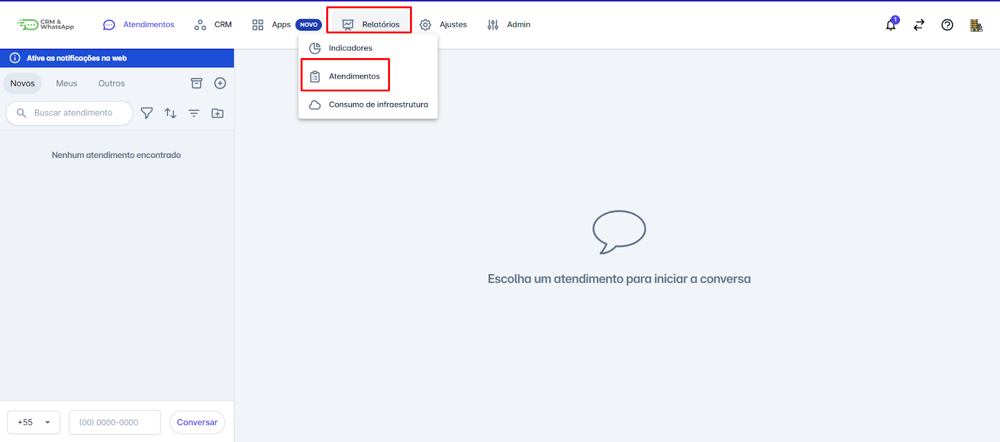
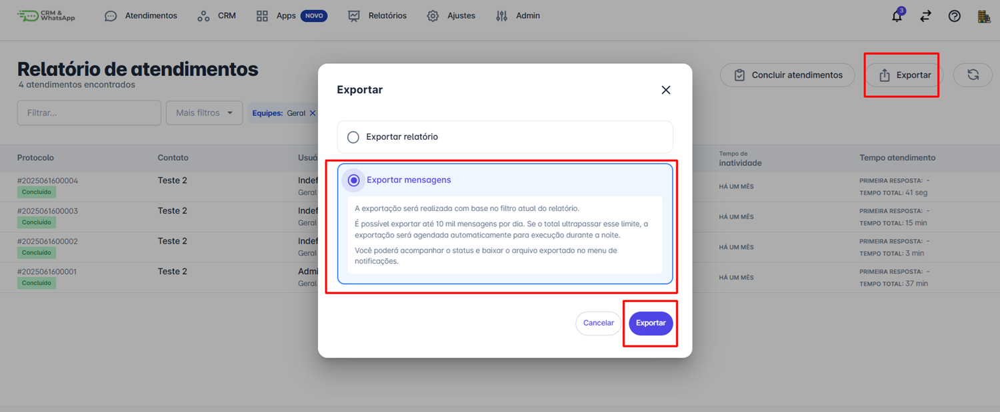
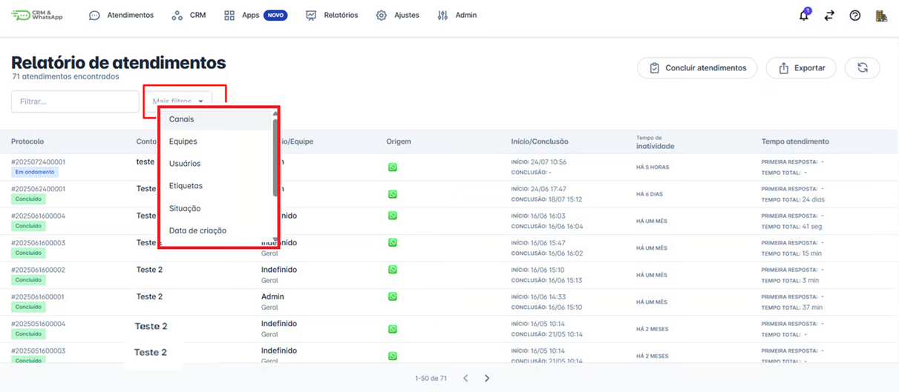

# Como exportar relatório na plataforma

A **exportação de relatório** é uma funcionalidade essencial para equipes que desejam registrar, analisar ou compartilhar interações realizadas na **plataforma**. Seja para fins de auditoria, treinamento, controle interno ou documentação, essa ferramenta permite gerar um arquivo com o histórico das conversas de forma simples e organizada.

::: tip Pré-requisitos
* Ter acesso à **plataforma** com **perfil de administrador** ou permissões adequadas para visualizar atendimentos.
* Saber o **período** e/ou **filtros** que deseja aplicar na exportação (ex: equipe, atendente, status).
:::

### Passo 1: Acessar Relatórios

Na tela inicial da plataforma, clique na opção **“Relatórios”**, o menu de opções se abrirá, clique em **Atendimentos**.

### Passo 2: Aplique os filtros desejados

Use os filtros disponíveis no menu da tela para refinar os dados que deseja exportar. É possível filtrar por:

* Canais
* Equipe
* Usuários
* Etiquetas
* Situação
* Data de criação
* Data de conclusão
* Ativos no período
* Tempo de inatividade

Isso garante que apenas as conversas relevantes sejam incluídas no relatório.

### Passo 3: Exportar

Após aplicar os filtros desejados, clique no botão **Exportar**, localizado no canto superior direito da tela. Um pop-up será exibido com duas opções de exportação:

* **Exportar relatório:** Gera um arquivo com informações resumidas dos atendimentos (como datas, atendentes, status, entre outros).
* **Exportar mensagens:** Gera um arquivo contendo o conteúdo completo das conversas realizadas nos atendimentos filtrados.

Selecione a opção **Exportar relatório** para obter informações resumidas dos atendimentos.

### Passo 4: Acesse o arquivo gerado

Assim que a exportação for solicitada, a plataforma iniciará o processo de geração do arquivo. Quando estiver pronto, uma notificação será exibida.

Para acessar o arquivo:

1. Clique no ícone do sino, localizado no canto superior direito da plataforma (onde ficam as notificações).
2. Localize a notificação de exportação.
3. Clique nela para fazer o download do arquivo.

O arquivo gerado será no formato .xls, ideal para ser visualizado em ferramentas como Excel, Google Sheets ou outros editores de planilha compatíveis.

## Considerações finais

* A exportação pode levar alguns minutos, dependendo do volume de dados.
* É possível repetir esse processo sempre que necessário.
* A funcionalidade ajuda no monitoramento da qualidade do atendimento, auditorias internas e análise de dados.
