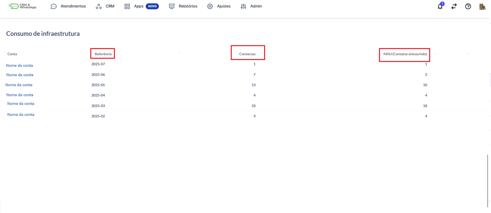

# Consumo de Infraestrutura

A funcionalidade de **Consumo de Infraestrutura** na **plataforma** permite que os administradores acompanhem, o uso dos recursos contratados, como conversas e quantidade de contatos únicos/mês. Essa visualização detalhada é fundamental para o controle de custos, planejamento de upgrades e garantia de continuidade operacional, permitindo decisões mais estratégicas e assertivas sobre o uso da plataforma.

