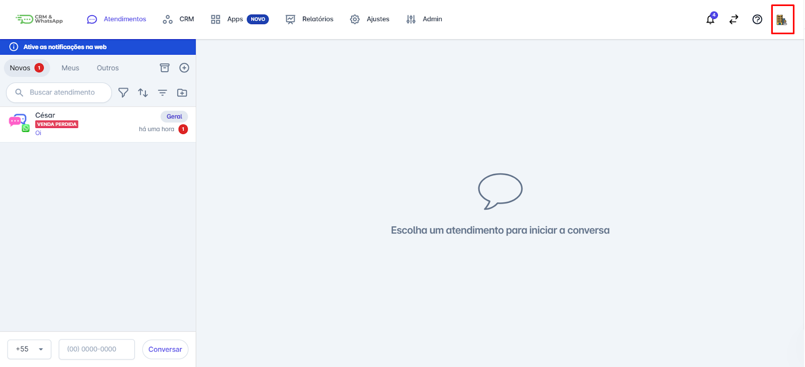
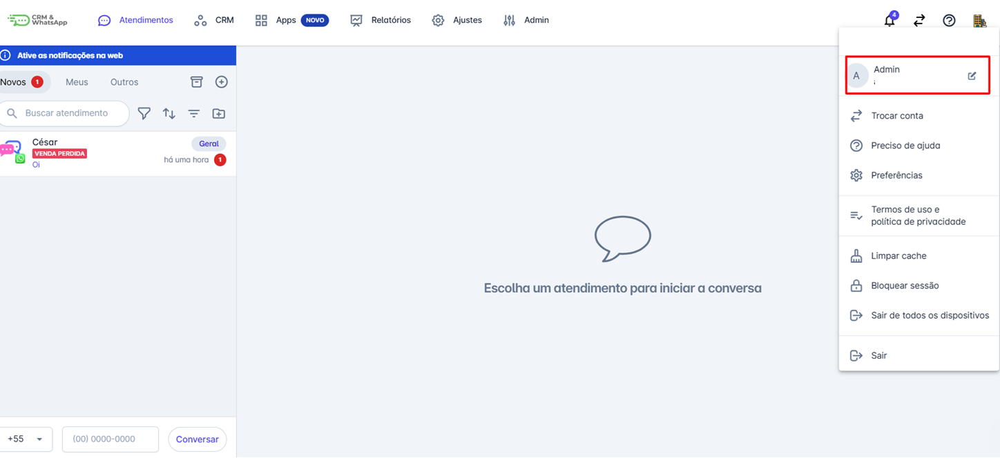
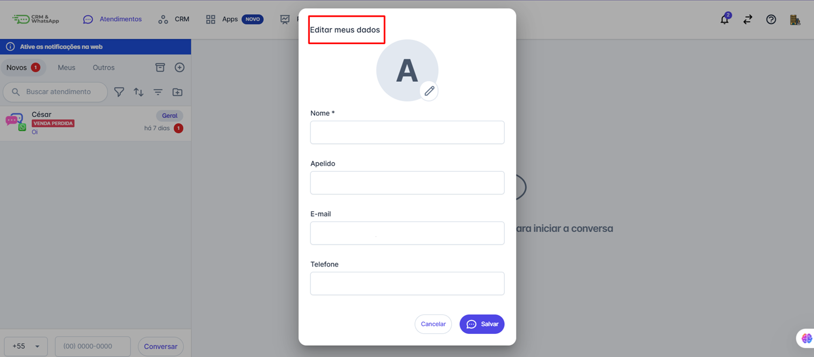

# Alterar Informações do Meu Usuário

Manter os dados do seu usuário atualizados na **plataforma** é essencial para garantir uma experiência personalizada e segura na plataforma. Neste artigo, explicaremos como você pode alterar suas informações de usuário de maneira rápida e simples.

::: tip Pré-requisitos
* Tenha acesso à sua conta na **plataforma**.
:::

### Passo 1: Acesse as Configurações do Usuário

Faça login na sua conta da **plataforma**. Na barra principal, no canto superior direito, clique no ícone com sua foto ou iniciais.

### Passo 2: Selecione "Meu Perfil"

No menu que aparecer, selecione **"Configurações"** ou **"Meu Perfil"**.

### Passo 3: Editar e Salvar

Um pop-up se abrirá e você poderá editar as informações do seu usuário, como: **Foto, Nome, Apelido, E-mail e Telefone**. Após realizar as alterações clique em **"Salvar"** no fim da tela.

## Considerações Finais

* Alterar as informações do seu usuário na **plataforma** é um processo simples que garante que seus dados estejam sempre atualizados e seguros.
* Seguindo esses passos, você pode gerenciar suas informações com facilidade e evitar problemas futuros no acesso à plataforma.
