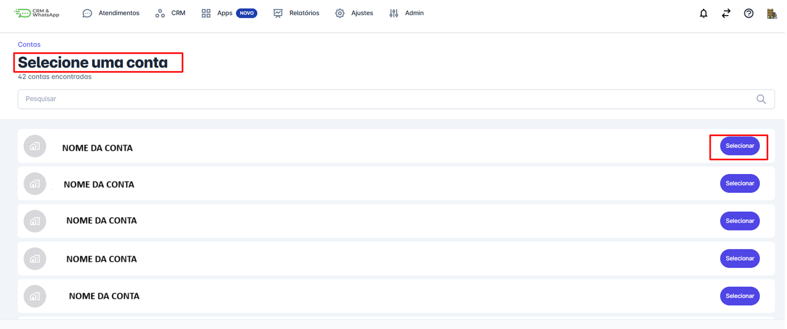

# Como Alternar Entre Contas na plataforma

Se você utiliza mais de uma conta dentro da **plataforma** — seja por atuar em múltiplos negócios, franquias ou unidades — é possível **alternar entre contas de forma rápida e prática**, sem precisar sair e entrar novamente no sistema.

::: tip Pré-requisitos
* Tenha acesso à(s) sua(s) conta(s) na **plataforma**.
:::

## O que são múltiplas contas na plataforma?

Na **plataforma**, cada **conta** representa um ambiente de trabalho com configurações, canais, contatos e fluxos próprios. Se você tem acesso a mais de uma conta, pode alternar entre elas sem perder suas informações ou histórico.

## Como alternar entre contas

### Passo 1: Acessar a opção "Trocar de conta"

Acesse sua conta atual normalmente. No canto superior direito da tela, clique no **ícone de usuário** (seu nome ou avatar).

No menu suspenso, você verá a opção **"Trocar de conta"**. Clique nesta opção.

### Passo 2: Selecionar a conta desejada

Será exibida a lista de contas às quais você tem acesso.

Selecione a conta desejada. A plataforma será recarregada automaticamente com os dados da nova conta.

## Considerações Finais

* **Permissões diferentes:** Lembre-se de que cada conta pode ter permissões e acessos diferentes. Você pode ser administrador em uma conta e apenas visualizador em outra, por exemplo.
* **Manutenção do login:** Não é necessário fazer logout ou inserir novamente seus dados de acesso. O sistema reconhece automaticamente os ambientes aos quais seu e-mail tem permissão.
* **Separação de dados:** Cada conta possui relatórios, contatos, mensagens e integrações próprias. Ao alternar, você verá apenas os dados daquela conta.
